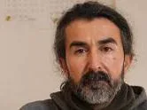
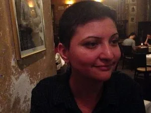

[Bilim ve Gelecek](https://bilimvegelecek.com.tr/index.php/2014/01/01/akademi-hapishane-duzenini-elestirmeli/) – Baha Okar – 1 Ocak 2014

_F tipi hücrelerin, Heidelberg Üniversitesi’nde bir grup profesörün duyumsal yoksun bırakma üzerine araştırmalarının bir parçası olarak kapalı mekân üzerinde yaptıkları deneylerin sonucunda kurgulandığını görüyoruz. Türkiye’de de egemenlerin cephesinden bakan, sorunların sisteme dokunmadan ve çatışmalar olmaksızın çözümü üzerine eğilen akademik çalışmalar var hapishaneler üzerine. Egemen olanın dışında, eleştirel bir akademik üretim mümkün mü, bunu düşünmeliyiz._

**Hapishaneler üzerine Çalışma Grubu**

_SUNUŞ: Geçen ay düzenlenen Sosyal Bilimler Kongresi’nde Türkiye’de hapishanelerin tarihi üzerine yaptığı sunumuyla tanıdığımız Mustafa Eren sayesinde, çalışmalarını hapishaneler üzerine yürüten bir genç akademisyenler topluluğunun varlığından haberdar olduk. Bu sayımızda, hem bu topluluktan Mustafa Eren, Yonca Güneş Yücel ve Hande Gülen ile çalışmaları üzerine söyleştik. Hem de Eren’in kısa bir süre sonra Kalkedon Yayınları tarafından kitap olarak yayımlanacak olan Türkiye’de hapishanelerin tarihi üzerine geniş çalışmasından özet bir bölüm yayımladık. Önemli ve yakıcı, ama genel olarak akademinin uzaktan bakmayı tercih ettiği bu toplumsal mesele üzerine dosyamızı ilgiyle okuyacağınızı umuyoruz._

**_Akademi için çok popüler bir konu olmadığı yargısından hareketle soruyorum. Nereden aklınıza geldi hapishaneler üzerine çalışmak?_**

**Mustafa:** Doktoramı hapishaneler üzerine yapıyorum, lisans ve yüksek lisansta da hapishaneler üzerine çalışmıştım. Benim ilgimin kişisel bir yönü de var. Üniversite ikinci sınıfta siyasi bir davadan tutuklanıp uzunca bir hapisliğin ardından üniversiteye dönmüştüm. Beni bu alana yönelten biraz da yaşadığımı duyurmak, 11 senelik gözlemlerimi akademik ortama aktarıp akademinin nesnesi haline getirebilmek ihtiyacıydı.

Öte yandan bu alanda bir boşluk da var. Bilimsel kaynaklar ne yazık ki yabancı dillerden Türkçeye çevrilmiş, bizdekiler ise çoğunlukla anı tarzı kitaplardan ibaret kalmış. Yakın zamana kadar akademik anlamda hapishaneleri irdeleyen çalışma neredeyse yok gibiydi. Lisans eğitimimde hapishanelere dair temel kanun olan Ceza İnfaz Kanunu’nu incelemiştim. Kanunda yazılı maddelerin ya yazıldığı kadarıyla etkisiz kaldığını ya da pratikte çok farklı uygulanabildiğini gösteren bir çalışmaydı bu. Yüksek lisansta ise Osmanlı’dan günümüze Türkiye hapishanelerini çalıştım.

Doktorada işin daha psikolojik boyutuna değinen bir çalışma yapmayı düşünüyorum. Bu noktada Stanford hapishane deneyi beni özellikle etkileyen, işin bu tarafına yönelten bir çalışmadır. Biri Alman, biri Hollywood yapımı olmak üzere iki kez filme de çekilmişti, belki bilirsiniz. Deneyden hareketle öngörüm; bir otoriteyi sorgulanamaz kılarsınız, özellikle de kapalı bir mekânda birine “sen otoritesin”, diğerine ise “sen de mutlak olarak otoriteye tabisin” derseniz, burada hiçbir zaman kanun uygulanmaz ve otorite bir süre sonra zıvanadan çıkar.

**_Baha: Kendisi kanun koymaya, kanun olmaya başlar…_**

**Mustafa:** Kesinlikle. Bu mekanizmanın kendisini irdeleyen bir çalışma yapmak istiyorum. Hapishaneler yine merkezinde yer alacak ama akıl hastaneleri, yurtlar gibi kurumları da inceleyeceğim.

**Hande:** Ben Mimar Sinan Sosyoloji’de yüksek lisans yapıyorum. Benim tezim Mustafa gibi tamamen hapishaneler üzerinden gitmiyor. Politik hareketler dolayımıyla hapishanelere yöneliyorum. Hem Türkiye’de hem de dünyanın çeşitli ülkelerinde politik hareketler bakımından hapishanelerin çok önemli ve özel bir yeri var. Hapishane işin içine girdiğinde politik hareketlerin dili ve kendi ürettiği mekanizmalar çok farklılaşıyor. Devletin ve iktidar biçiminin kendisiyle doğrudan karşı karşıya gelinen bir alan olarak kodlanan bir tarafı var hapishanenin. Bu boyutuyla iktidarın kendisini ve ilişki biçimini tartışabileceğimiz bir yer olarak da karşımıza çıkıyor hapishaneler. Ben aslında şu tartışmayı yapmak istemiştim. İktidar tamamen kendi kurguladığı gibi, karşısındakini tümüyle baskılayan mekanizmalar yaratabiliyor mu? Eğer iktidar gerçekten tamamen baskılayan, özneleri edilgenleştiren bir şeyse, orada tamamen kendi özneliğini, iradesini kaybetmiş bir bireyden bahsetmemiz gerekiyor. Hapishaneler bunun gerçekleştirilmesine en elverişli yerler bu bakımdan. Oysa burada direniş biçimleri devreye giriyor. Ortaçağdan itibaren bütün kapatılma biçimlerine karşı insanın çeşitli formlarda direnişler geliştirdiğini görüyoruz. Bu durumda karşısındaki iradeyi mutlak şekilde baskılayan bir iktidardan bambaşka bir şey çıkıyor karşımıza. İradeyi kırmaya çalışan ama bunu da bir türlü gerçekleştiremeyen bir yapıyla karşı karşıyayız. Buradan yola çıkarak hapishane içindeki dayanışma ilişkilerinden başlayıp açlık grevi gibi direniş biçimlerine varan bir çalışma yapmayı amaçlıyorum.

**Güneş:** Benim yüksek lisans tezim iki darbe arası dönemde Gırgır dergisi üzerineydi. Hâliyle, dergiyi incelerken önüme sürekli olarak ülkenin siyasi tarihi çıktı. Okumalarımda mizahın ve neşenin endişeyle iç içe, birbirinin üzerine katlanarak geliştiğini gördüm. Endişenin kendisi başlı başına direnişi getiriyor. Yine okumalarımda gördüm ki, memleketin cezaevleri tarihi siyasi tarihine çok paralel. Neredeyse cezaevinin tarifi yapılmadan, oraya dair direniş dili kurulmadan, siyasi söylemler geliştirmeden, dışarının, sokağın tarihini belirleyemiyorsunuz. Hapishane konusu üzerine çalışmak böyle gündemime girdi. Bu konudaki külliyata baktım. Ağırlıklı olarak mahkûmiyetler üzerinden ve direniş pratiklerine odaklanan bir birikim. Bir de edebiyat; şiiriyle, romanıyla…

**_Firar öyküleri ve de…_**

**Güneş:** Yani neşesi var direnişi var ama cezaevinin ekonomi politiğine dair pek bir şey yok. Oysa bu alanın bizzat kendisinin ciddi bir ekonomi ürettiği de bir gerçek. Cezaevleri yapılmaya devam ediyor, mahkûm sayısı artıyor ama bu alanın ekonomisi üzerine çalışmalar eksik. Dolayısıyla, bu alana nereden girebilirim sorusuyla başladım. Örneğin mahkûmların işliklerde çalıştırılması başlı başına bir ekonomik sisteme karşılık geliyor; bu konu olabilirdi. Ama ben mahkûmiyet üzerine çalışmaların daha fazla olduğunu düşünerek -akademi boşluklar arar, biliyorsunuz- gardiyanlara yöneldim. Çünkü onlara dair neredeyse hiç çalışma yok.

**_Böyle bir konuda saha çalışması yapma imkânı oluyor mu? Çekincelerle karşılaşıyor musun?_**

Mustafa Eren’in Osmanlı’dan günümüze hapishanelerin evrimini inceleyen çalışması yakında kitaplaştırılacak.

**Güneş:** Fazlasıyla. Sahası çok zor olan bir konu. Önce Adalet Bakanlığı’ndan geçmeniz gerekiyor. “Ben cezaevi personelinizin çalışma koşulları üzerine bir tez hazırlayacağım, çalışma koşullarını gün yüzüne çıkarmaya, sözü edilmeyen yönlerini, sorunlarını anlatmaya çalışacağım” diye bir dilekçe veriyorsunuz. Bizi merak edenler varmış diyerek, hoşlarına gidiyor başta. Bağırlarına basabiliyorlar. Bu taraftan kolay görünebiliyor.

Ama sonrasında bakanlık izin vermedi tabi. Derinlemesine mülakat yapmak yani yüz yüze görüşmek istiyordum cezaevi personeliyle. Ancak sadece bir anket görüşmesi olarak sorularımı içeriye sokabileceklerini söylediler. Benim de metodolojik olarak hiç yakın bulmadığım bir şeydi bu tezim için. Ama hiç yoktan iyidir diyerek, en azından derinlemesine mülakatta soracağım soruları derleyip toplayıp içeri göndermeyi kabul ettim.

Şimdi mülakatları dışarıda yapmaya çalışıyorum. Yirmiye yakın gardiyanla görüşmem var. Çekinceleri var tabi. Hemen hemen her saha çalışmasında olduğu gibi, isminin, çalıştığı kurumun hiçbir şekilde belirtilmeyeceği gibi sözlerle, bunun üzerine kurulu bir güven ilişkisiyle görüşmeleri yapıyorlar. Ama öte yandan, tahmin ettiğimden çok daha rahat olduklarını da söyleyebilirim. İş güvenceleri, çalışma koşulları gibi sorunları üzerine çok fazla şey söylemeye ihtiyaçları var ve çekinmiyorlar. Özlük haklarıyla, mesai süreleri içinde yaşadıklarıyla, toplum nezdinde tarif edilme biçimleriyle ilgili bir dolu şey söylemek istiyorlar. Bunun yayınlanmasını ve görünür olmasını istiyorlar. Ağızları kalabalık yani.

**_Akademi boşluk arar dedin ya, aslında hapishaneler üzerine boşluğa pek yönelmemiş gibi. Neden acaba?_**

**Güneş:** Aslında akademinin bu alana kör olduğu söylenemez bana kalırsa. Son on-on beş yılda yapılmış epey bir çalışma var bu alanda. Halk sağlıkçısından iletişimcisine, sosyologuna, epeyce çalışılıyor tezlere bakılırsa. Ama bu çalışmaların bir fotoğraf çekmenin dışında katkısı ne oluyor, bu önemli. Bu çalışmaların akademiden öteye gitmediği bir gerçek. Bir veri tabanı olarak tutulabilen, kümülatif şekilde bir şeylerin biriktiği, ama onun ötesinde bir şeyleri etkileme bakımından hiçbir amacı olmayan çalışmalar. Akademinin kendisinin kusuru bu bir yandan da.

**Hande:** Akademik çalışmaların ne için yapıldığı da önemli. F tipleri, hücre tipleri, bunların hepsi üniversitelerde yapılan çeşitli bilimsel deney ve çalışmaların sonucu olarak kurgulanıyor. Örneğin F tiplerinin ilk çıkışına baktığımızda, Heidelberg Üniversitesi’nde bir grup profesörün duyumsal yoksun bırakma üzerine araştırmalarının bir parçası olarak kapalı mekân üzerinde yaptıkları deneylerin sonucunda hücrelerin kurgulandığını görüyoruz. O açıdan bakınca, Türkiye’de de adalet, suç ve ceza üzerine yapılan bir sürü akademik çalışma var egemenlerin cephesinden. Sorunların temelde sisteme dokunmadan ve çatışmalar olmaksızın çözümü üzerinden giden, mahkûm-cezaevi yönetimi ilişkisi nasıl olabilir, nasıl dengede tutulabilir gibi sorulara eğilen çalışmalar var örneğin.

Gardiyanlar üzerinde hapishanelerin ekonomi politiğine eğilen Yonca Güneş Yücel, bu konuda saha çalışması yapmanın zorluğunu dile getirdi.

Bu açıdan akademi sistemin dışında ne yapabilir, bunu düşünmek gerekiyor. Hapishaneler üzerine çalışma grubunda yapmaya çalıştığımız da bu aslında, egemen olanın dışında, eleştirel bir akademik üretim. Akademizme düşmeden, bilimsel bir temeli ve yöntemi olan, ama kelimenin dar anlamıyla “bilimci” olmayan. Çünkü bilimin de iktidar ilişkilerinden bağımsız olmadığını görüyoruz. Mesela biz saha diye bir şeyden söz ediyoruz, saha dediğimiz şey aslında toplumsal ilişkiler alanının kendisi. Ama saha-araştırmacı diye bir ikilik, bir kurgu yaratıyoruz. Buradan bakınca bile, bunun kendisini yıkan bir ilişki biçimi kurmak gerekiyor.

Hapishaneler açısından da böyle düşünüyorum. Evet, çalışmalar yapılıyor. Ama bu çalışmalar bizi ne kadar tatmin ediyor ya da biz bunlara ne kadar karşı konumlanacağız, bunları düşünmek gerekiyor. Yapılan çalışmaların kendisine dair eleştirel bir çalışma dahi düşünülebilir.

**Mustafa:** Yaşamda yaptığımız şeyin bir karşılığı olmalı. Yani yazdığın tez üniversitenin kütüphanesinde kalıyorsa, senin üzerine çalıştığın insanlara bir geri dönüşü olmuyorsa, yaptığın şeyin aslında anlamı da kalmıyor. Sadece üniversiteyi bitirmek için yazman gereken bir yazı haline geliyor. Bizim amacımız yaşama dokunan, yaşama dair söz söyleyen ve geri dönüşünü de bekleyen çalışmalar yapabilmek. Özellikle hapishaneler gibi çalışma alanları bu konuda oldukça hassas. İnsanın yaşamını doğrudan etkileyen bir alana eğiliyorsun ve söz söylemeye çalışıyorsun. O sözün bir önemi olmalı…

**_Söz olmaktan ibaret kalmamalı yani…_**

**Mustafa:** Evet, o sözün ağırlığını taşıyabilmek, yapılan çalışmalarda bunu hedefleyebilmek önemli. Hapishaneler çalışma grubunda buna dikkat etmeye çalışıyoruz. Bu tarz çalışmaların azlığı konusunda şunu da ekleyebilirim. Biraz da hapishanelerin kendi tarihselliğiyle ilgili bu. Hapishaneler artık solla beraber anılmaya başladı. 60’larda 70’lerde de bu var ama esas 80 sonrası solla ilgili ciddi bir mesele haline geliyor hapishaneler. Bu meselenin olgunlaşması ve anı tarzının, direniş kültürünün dışına çıkabilmesi için belki biraz olgunluk süreci gerekliydi. 90’larda başladı ve 10 senedir böyle çalışmalar var ama daha ziyade Hande’nin söylediği gibi eleştirel içerikten yoksun, daha çok ceza infaz hukuku üzerine çalışmalar bunlar. Kanunu inceleyen ve kanunun nasıl daha iyi hale geleceğini irdeleyen çalışmalar. Bunların pek eleştirel olduğunu söyleyemeyiz. Aksine, var olan mekanizmayı nasıl daha işlevli hale getiririz üzerine eğiliyorlar.

**_Sizin çalışmalarınız için de akademi sınırlarında kalma tehlikesi yok mu? Bunun dışına çıkmak, toplumsal karşılığını üretmek yönünde nasıl çabalarınız var?_**

**Mustafa:** Bu noktada Foucault örnek olarak gösterilebilir. Hapishaneler üzerine yazmanın, akademik çalışmalar yapmanın ötesinde bir hapishane derneği kurulmasını sağlamıştır Foucault. Bu dernekte de özellikle mahpusların sesini dışarıya duyurmaya çalışmıştır. Bizim çalışmalarımız buraya doğru evrilebilir ileride, neden olmasın?

**_Hapishane ya da tutsak yakını dernekleriyle irtibatınız var mı?_**

**Mustafa:** Ben şu an bir hapishane derneğinde çalışıyorum. Özellikle hapishanelerde göz ardı edilen kesimler üzerine çalışan, Ceza İnfaz Sisteminde Sivil Toplum diye bir dernek bu. Daha çok gündeme gelen kesim, F tipleri dolayısıyla siyasi mahpuslar oluyor. Ancak şu an Kasım ayı itibarıyla 144 bin mahpus var; 2012’deki en son verilere göre Bakanlığın terör grubu diye nitelendirdiği siyasi mahpusların sayısı ise 8 bin civarında. 2012’den sonra bu rakam KCK gibi kitlesel tutuklamalarla hayli arttı. Ama iki katına çıktığını düşünsek bile geriye kalan 130 bin kişi adli mahpus ve adlilerle ilgili yapılan çalışmalar çok az.

Özellikle bunun içerisinde görünmeyen ve özel sorunları olan engelliler, yaşlılar, yabancı uyruklular, eşcinseller gibi bazı mahpus grupları var. Örneğin LGBT mahpusların çok ciddi sorunları var, insan hakları ihlallerinin en yoğun yaşandığı grup bunlar. Çocuklarıyla beraber hapishanede yaşayan kadınlar var. Özellikle bu gruplar üzerine çalışmaya ağırlık veriyoruz bu dernekte. Son yaptığımız çalışma bu mahpus grubu üzerineydi, Kasım ayında bunun raporunu açıkladık.

Sözümüzün geri dönüşünü bu tür derneklerde çalışarak, mahpusların kendisine değerek ve çözüm önerilerini kamuoyunun gündemine getirerek aşmaya çalışıyoruz. Akademiyle sınırlı kalmama yönünde böyle çabalarımız var.

**Hande:** Bir grup olarak bir araya gelişimiz daha yeni, birkaç aydır bir çalışma içindeyiz. Bu süre içinde bir hapishane semineri düzenledik. Kendi çalışmalarımızı sunduğumuz bir günlük bir etkinlik oldu. Eski mahpusların, mahpus yakınlarının, çeşitli sivil toplum kuruluşlarından ve İHD’den temsilcilerin, TAYAD, TUAD-FED gibi mahpus yakını derneklerinin, Tutuklu Öğrencilerle Dayanışma İnisiyatifi’nin ve siyasi örgütlerin hukuk gruplarından insanların katıldığı bir etkinlik oldu. Orada hem biz kendi yaptığımız çalışmaları, kendimizce söylemek istediklerimizi anlattık; hem de onlar da kendi deneyimlerini ve sorunlarını ki en önemli olan kısmı da burası.

**Mustafa:** Evet, bu akademideki insanlarla bu işin öznelerini ilk defa bir araya getiren çalışmalardan biriydi. Karşılıklı bir etkileşim oldu. Bizim yapmak istediğimiz şey biraz bu. Öznelere değen, onlara söz söyleyen, onların sözünü de dikkate alan çalışmalar yapmak istiyoruz.

**_Mustafa, senin kitaplaştırmakta olduğun, bizim de bir kısmına yer verdiğimiz çalışmanda Osmanlı’dan günümüze hapishanenin tarihini anlatıyorsun. Nereye doğru evriliyor sence hapishaneler?_**

**Mustafa:** Osmanlı’dan bugüne hapishanelerin tarihi Türkiye’nin tarihiyle çok iç içe aslında. Siyasi kırılmalardan hapishaneler de elbette etkileniyor, hapishane rejimleri değişime uğruyor.

Çalışmamda üç esas kriter belirlemiş ve bunun üzerinden hapishanelerin tarihini dönemlendirmeye çalışmıştım. O kriterlerden biri yasalar, diğeri mimari, üçüncüsü ise pratik uygulamalar. Bu üç kriter üzerinden yaşanan kırılmalara baktığımızda Osmanlı’dan günümüze Türkiye hapishanelerinin üç dönemini bulabiliyoruz. İlk dönem zindan-mahbes dönemi, sonra 19. yüzyıldan 1970’lere kadar olan hapishaneler dönemi ve sonrasında cezaevi dönemi gündeme geldi. Cezaevi dönemi mimari olarak koğuştan hücre tipine geçiş süreci olarak ilerliyor. Mahpusların bir kısmının “terör ve anarşiden mahkûm olanlar” diye nitelendirilmeye başlanması ve bu mahpusların cezasını 1-3 kişilik odalarda çekmesini öngören düzenlemelerin yapılması bu dönemin esas yasal dayanağı. Pratik olarak ise mahpusun yaşantısını ve kimliğini yeniden biçimlendirmeye çalışan bir düzen uygulanıyor. Mahpusun üzerine kapıyı kapatırım, kapının arkasında ne olduğu beni ilgilendirmez şeklindeki yaklaşım değişti. İçerideki mahpusu dönüştürme, yasalardaki ifadesiyle iyileştirme, topluma yeniden kazandırma çabaları ortaya çıktı.

Bir yandan bu yöndeki değişim sürüyor. Bir yanda bu çerçeveye uygun biçimde son dönemde kampüs türü hapishaneler açılıyor. Bu şöyle yorumlanabilir, en azından benim yaptığım çalışmalardan öyle görünüyor. Buralar çok büyük atölyelere dönüşebilir. 2010’la beraber devlet özel şirketlerle anlaşmalar imzalamaya başladı. Geçmişte de atölyeler vardı ve buralarda üretimler yapılırdı. Ancak bu üretimler DMO ya da resmi dairelerin kısmi ihtiyaçlarını karşılamaktan ibaretti. Ama bir süredir özel şirketlere mahpusları kiralıyorlar. Bu başka ülkelerde, örneğin ABD de epeydir işleyen ve artık vazgeçilen bir sistem.

Sayılara baktığımızda da bunu görmek mümkün, 2010’dan sonra yapılan anlaşmayla özel şirketler hapishanelerle, üstelik Adalet Bakanlığıyla değil hapishanenin müdürüyle anlaşıyor. Şirket makinelerini getirip hapishanenin gösterdiği bir odaya kuruyor, başlarına bir tane kalfa getiriyor, idare de mahpusları veriyor. O mahpusların ücretlerine baktığımızda, yevmiye olarak çıraklar 6 lira alıyor, kalfalar 6 lira 25 kuruş, ustalar 6,50 lira.

**_Bu uygulama yürüyor mu şimdi Türkiye’de?_**

**Mustafa:** Dediğim gibi 2010 sonrası başladı. İşyurtlarına ilişkin en son açıklanan 2012 raporuna göre tam zamanlı olarak çalıştırılan 8868 mahpus var. 27.387 mahpus da yarı zamanlı çalışıyor. Özel şirketlerle yapılan çalışma ise henüz yeni, şu an sadece 611 kişi görünüyor ama esas gelişme eğilimi de bu alanda. Örneğin biz 2013’te üç tane hapishane ziyareti yaptık, üçünde de bu faaliyet yeni başlamıştı.

Yapılan açıklamalar da bu yönde. Özel şirketlere çağrılar yaptılar, burada ucuz ve atıl bir işgücü var, gelin bunu değerlendirin diye. Şu an 140 bin mahpusun 36 bini günde 6 liraya, yani bir sigara parasına çalışıyor.

Mahpusların çalıştırılmasının mahpuslar için de olumlu bir şey olduğu söylenebilir elbette. Adli mahpuslar söz konusu olduğunda çoğunun zaten ailesi gelmiyor, sigara alacak paraya ihtiyacı olanlar var. Ancak burada önemli olan, o iş gücünü nasıl çalıştırıyorsunuz, insani ihtiyaçlarını karşılayabileceği asgari düzeyde bir ücret veriyor musunuz? Ayrıca çalışma zorunlu mu, sigortaları yatıyor mu, idare çalışan mahpusla çalışmayan mahpus arasında bir ayrıcalık gözetiyor mu, bunlara da bakmak lazım.

Hapishaneler konusunda gelecek dönemle ilgili bir de şu var. Adalet Bakanı geçenlerde bir açıklama yaptı. Türkiye’de önümüzdeki dört yıl içerisinde 213 yeni hapishane açılacakmış. Bu hapishanelerle birlikte hapishane kapasitesine 123 bin kişilik yeni kapasite eklenecek. Hapishanelerin kapasitesini iki katına çıkarmayı gerektiren bir suç patlaması mı var?

**_Aksine Bakanlık suç oranlarının düştüğünü söylemişti geçenlerde…_**

**Mustafa:** Evet, bu da bir tezat. Suç oranları düştü diyorlar ama son yıllarda mahpus sayısı çok arttı. 2000’den sonra iki katına çıktı. Şimdi kapasiteyi iki katına çıkarıyorlar. Demek ki o zaman iktidarın bir öngörüsü var, 120 bin yeni insanı dışarıdan alıp içeriye kapatmayı öngörüyor. Bu toplumsal mühendislik acaba kimler için işliyor. Diyarbakır’a dokuz yeni cezaevi yapacaklar örneğin.

**_Piyango kime çıkacak acaba?_**

**Mustafa:** Türkiye’de herkese çıkabilir. Bize çıkarsa, hapishaneler çalışma grubu olarak biz de pratik gözlem yapma şansı bulabiliriz belki.

**Hande:** Neoliberalizmin güvenlik paradigmasıyla da ilgili olduğunu düşünüyorum bu yeni hapishanelerin. Bu paradigma toplumsal ilişkiler içinde sürekli korku üretmek durumunda. Hapishaneler de bunun önemli bir boyutunu temsil ediyor. Devlet böylelikle gücünü hatırlatıyor.

**_“Daha 120 bin kişilik yerimiz var ha!” gibi bir tehdit yani… Yani sadece içeriye kapatılanlarla ilgili değil, toplumun bütününe bir mesajı var._**

**Mustafa:** Giddens “iktidarlar hapishaneleri iyi bir yer haline getirmek istemez” der. Orası bir cezalandırma yeridir ve orayı dışarıdakilerin gözünü korkutmak için kötü tutmak, işkenceyle anılır halini korumak zorundadır. Kafasını kaldırmaya çalışana orayı işaret eder. F tipleri biraz böyle işliyor.

**_Son olarak, Bilim ve Gelecek’in çok sayıda mahpus okuru var. Sizle irtibat kurabilmeleri için verebileceğiniz bir posta adresi var mı?_**

**Mustafa:** Çalıştığım derneğin adresine “Hapishaneler Çalışma Grubu” adına yazabilirler: Kamerhatun Mah. Hamalbaşı Cad. Üstündağ İş Merkezi, No: 14/139, Galatasaray – Beyoğlu / İstanbul. Bu konuyla ilgili akademisyenler ve okurlar da iletişime geçerlerse çok seviniriz. E-posta adresimiz; [[email protected]](/cdn-cgi/l/email-protection).

**Grubun Diğer Üyeleri Ne Çalışıyor?**

Hapishaneler üzerine çalışan akademisyenler grubunun söyleşimize katılamayan üyelerinin çalışmalarından da birkaç örnek verelim. Koç Üniversitesi’nde Karşılaştırmalı Tarih ve Toplum Çalışmaları alanında yüksek lisans yapan **Başak Gemici**, 1980-1987 yılları arasında Mamak ve Diyarbakır askeri hapishanelerinde materyal yoksunluk, kapatılma, yüksek risk ve devlet şiddetine rağmen siyasi mahpusların nasıl ve ne ölçüde kolektif hareket oluşturabildikleri üzerine çalışıyor. Siyasi ve etnik olanın dışında cinsiyete yönelik şiddetin özel bir biçimi olduğundan, kadın ve erkek mahpusların bu şiddeti nasıl farklı anlamlandırıp farklı taktikler ürettiklerine de eğiliyor. Onu bu alanda çalışmaya iten, Türkiye’de hapishane çalışmaları konusunda üniversitelerde henüz kapsamlı çalışmalar yapılmamış olması ve toplumsal hareketler incelenirken hapishanelerin rolünün yeterince incelenmediğini düşünmesi.
