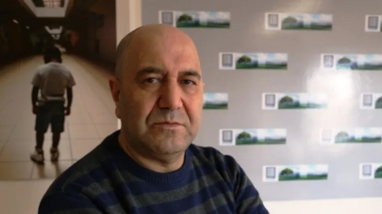
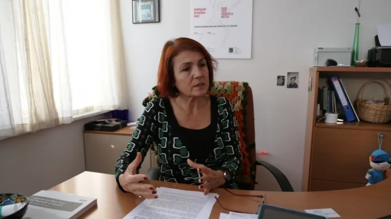
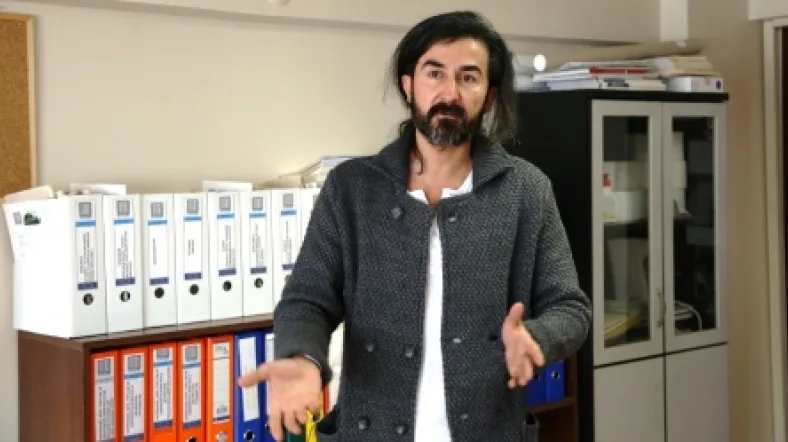
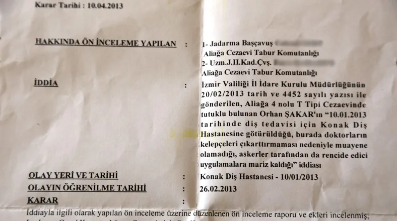

[Al Jazeera Turk](http://www.aljazeera.com.tr/imzali-haberler/hasta-mahkum-1-cezaevinde-agir-hasta) – Murat Utku – 30 Ocak 2014 Ağır hasta tutuklu ve hükümlülerin yaşadığı sorunlar zaman zaman gündeme geliyor ama tedavi süreçlerinden çok ölüm haberleriyle. Sivil Toplum Örgütlerine göre cezaevlerinde 550, Adalet Bakanlığı'na göre 334 ağır hasta var. Basına yansıyan son haber 4 Ocak tarihli: _Bitlis E Tipi Kapalı Cezaevi'nde tutulduğu tek kişilik hücrede kalp krizi geçiren, zamanında müdahale edilmeyen ve 18 gündür hastanede yaşam mücadelesi veren 45 yaşındaki Seyithan Taşkıran adlı mahkum hayatını kaybetti._  Seyithan Taşkıran, 6 yıl önce tutuklandı, yargılandı, ömür boyu hapse mahkûm oldu. Yakınlarının anlatımlarına göre hapishanede tutulduğu 6 sene boyunca Diyarbakır, Batman ve son olarak da Bitlis E Tipi hapishanelerinde kaldı. Bitlis'te 2 senedir tek kişilik bir hücrede tutuluyordu. 45 yaşındaki Taşkıran, 18 Aralık 2013 tarihinde tek kişilik hücresinde kalp krizi geçirdi. Geç müdahale edildiği için ağır bir durumda Van’da bir kliniğe kaldırıldı. Ama yoğun bakım ünitesinden sağ çıkamadı.

## Türkiye'de cezaevleri

*   Toplam 380 hapishane
*   5 bin 500 kadın tutuklu ve hükümlü
*   2 bin  çocuk tutuklu ve hükümlü
*   Toplam 140 bin 400 tutuklu ve hükümlü

**STK’lara göre 550 ağır hasta mahpus var** Hasta mahkûmlar konusunda iki farklı istatistik var. Bunlardan biri,  İnsan Hakları Derneği (İHD), Türkiye İnsan Hakları Vakfı (THİV), Mazlumder ve Ceza İnfaz Sisteminde Sivil Toplum Derneği'nin (CİSST) ortak yürüttüğü bir çalışma. Buna göre cezaevlerinde 544 mahpus ağır hasta var. Bunlar arasında kanser gibi ölümcül hastalıklarla mücadele edenlerin yanısıra, bedensel ya da mental engelleri nedeniyle kendi kendisine bakmakta zorluk yaşayanlar da var; felçli, çok yaşlı, yürüyemeyen, tek başına ihtiyaçlarını gideremeyen de. Bu kuruluşlara göre hasta mahpuslar arasında  sağlık durumu ağır olanların, yani hastalıklarının son aşamasında olanların sayısı ise 163. Diğeri de Adalet Bakanlığı’nın yaptığı çalışma. Bakanlığa göre ağır hasta mahkumların sayısı 334. Aşağı yukarı her hafta bir kişinin ölüm haberini alıyoruz. Bu rakamlar gittikçe yükseliyor, nerdeyse 1’den 5’e çıkıyor. **Avrupa Birliği Cezaevi Kuralları** CİSST Yönetim Kurulu Başkanı Zafer Kıraç, “Aşağı yukarı her hafta bir kişinin ölüm haberini alıyoruz. Bu rakamlar gittikçe yükseliyor, nerdeyse 1’den 5’e çıkıyor” diyor: CİSST Yönetim Kurulu Başkanı Zafer Kıraç \[Özgür Tekşen - AJT\] _Sonuç olarak Türkiyenin bu problemi aşması gerekiyor. 2006'da Türkiye “Avrupa Birliği Cezaevi kuralları”nı kabul etmiş bir ülke. Buna göre ağır hasta ve kendine bakamaz durumda olan mahkumların iyileşinceye kadar ya da bu eksikliklerini giderene, sağlıklarına kavuşuncaya kadar cezaları ertelenir. Maalesef Türkiye bunu uygulamıyor._ **Yasa değişikliği ve infazın ertelenmesi** Adalet Bakanlığı’nın Al Jazeera’ya yaptığı açıklamada, “Ceza infaz kurumlarında bulunan ağır, sürekli ve bakıma muhtaç hükümlü ve tutukluların sağlık sorunları nedeniyle konumlarına uygun olarak ceza infaz kurumlarından tahliyeleri veya ceza tehirleri ile ilgili olarak daha önceki düzenlemeler yetersiz görüldüğünden; 31/01/2013 tarihinde Resmi Gazetede yayımlanarak yürürlüğe giren 6411 sayılı Kanun Ceza Muhakemesi Kanunu ile Ceza ve Güvenlik Tedbirlerinin İnfazı Hakkında Kanunda değişiklik yapılmıştır” denildi. Bu kapsamda 5275 sayılı Ceza ve Güvenlik Tedbirlerinin İnfazı Hakkında Kanunun 16. maddesinin 6. fıkrasına "Maruz kaldığı ağır bir hastalık veya sakatlık nedeniyle ceza infaz kurumu koşullarında hayatını yalnız idame ettiremeyen ve toplum güvenliği bakımından tehlike oluşturmayacağı değerlendirilen mahkûmun cezasının infazı, üçüncü fıkradan belirtilen usûle göre iyileşinceye kadar geri bırakılabilir" hükmü getirildi. Adalet Bakanlığı yapılan bildirimler doğrultusunda Kanun'un yürürlüğe girdiği tarihten bugüne kadar 176 hükümlü ve tutuklunun ceza infaz kurumlarından tahliye edildiğini ifade etti. THİV İstanbul Şubesi Başkanı Dr. Şükran İrençin, 6411 Sayılı Kanun’a değinerek, “toplum güvenliği bakımından tehlike oluşturmayacağının değerlendirilmesi” ifadesine itiraz etti: _“Bu çok tehlikeli bir cümle. Burada devletin güvenliğini kişilerin sağlık hakkına erişiminin önüne koyuyorsunuz. Bu olmaması gereken bir şey. Üstelik de hastalar hakkında hekimlerin karar vermesi gerekirken, bir mahkûmun hastalığının gidişatı ile ilgili kararı, toplum güvenliği mazeretiyle onun cezaevinde kalması gerektiğini talep eden, sağlıkla ilgili bilgisi olmayan bir savcıya bırakıyorsunuz.”_ THİV İstanbul Şubesi Başkanı Dr. Şükran İrençin \[Özgür Tekşen - AJT\] **Kelepçeli muayene** Hapishanedeki hasta mahpusların yaşadığı başlıca sorunlardan biri de tedavi süreçlerinde önlerine çıkan zorluklar. Hastanın, revirde tedavisi mümkün olmayan hastalığı için hastaneye sevk edilmesi gerekiyor. Ancak hastanede de çok ciddi sorunlarla karşılaşabiliyorlar. Kendisi de cezaevinde 10 yılı aşkın bir süre tutuklu olarak kaldıktan sonra tahliye edilen CİSST Proje Koordinatörü Mustafa Eren, hastanelerde tutuklu ve hükümlülere kelepçeli muayene uygulamasının sürdüğünü belirtiyor: CİSST Proje Direktörü Mustafa Eren \[Özgür Tekşen - AJT\] _Jandarma,“biz kelepçesini çıkarmayacağız sizin için mahsuru var mı?” diye soruyor. Bazı doktorlar da “benim için bir mahsuru yok” diyor. Bu zaten tıp etiğine aykırı. Siz bir insanı kelepçeli olarak muayene etmezsiniz. Muayene odasına girildiğinde asker dışarıda durur çünkü hasta mahremiyeti diye birşey vardır. Siz belki askerin duymasını, görmesini istemediğiniz bir probleminizi anlatacaksınız. Bu sizin en doğal hakkınız. Bu bir insan hakları ihlali._  **“R Tipi” tedavi** Cezaevlerinde hasta mahkumlar ile ilgili sorunlar artınca, 30 Mart 2012 tarihinde Metris Cezaevi’nde bağımlı ve hasta mahkumların tedavilerinin sürdürülebilmesi için R Tipi Cezaevi kuruldu. 138 tutuklu ve hükümlünün kalabileceği ve “Rehabilitasyon”un baş harfiyle anılan bu “cezaevi-hastane”de 3 hekim ve 26 sağlık personeli çalışıyor. STK’lar Metris’teki R tipi cezaevine konusunda uzman hekimlerle gidip verilen sağlık hizmetini denetlemek için yaptıkları başvuruya Adalet Bakanlığı’ndan olumlu yanıt alamadı. **Hasta mahkûmların tahliyesi** İnsan Hakları Derneği, Sağlık Ve Sosyal Hizmet Emekçileri Sendikası (SES), Türkiye İnsan Hakları Vakfı ile Türk Tabipleri Birliği (TTB) tarafından 8 Ocak 2014 tarihinde bir basın toplantısıyla hasta mahkumların yaşadığı tedavi sorunununa dikkat çekti. Açıklamada, “Anayasa’nın 104. maddesine göre; Cumhurbaşkanı “sürekli hastalık, sakatlık ve kocama sebebi ile belirli kişilerin cezalarını hafifletmek ve kaldırmak” yetkisine sahiptir. Adlî Tıp Kurumu’nun sürekli hastalık, sakatlık ve kocama hallerinden birinin bulunduğuna karar vermesi halinde dahi Cumhurbaşkanı, af yetkisini kullanmama konusunda takdir yetkisine sahiptir. Cumhurbaşkanı Abdullah Gül bu yetkisini 2008 yılından 17 Mayıs 2012 tarihine kadar sadece 26 hasta için kullanmıştır” denildi.

## Cezaevinde son 13 yılda 2304 kişi öldü

\- 2000'de 193, - 2001'de 158, - 2002'de 89, - 2003'te 163, - 2004'te 54, - 2005'te 59, - 2006'da 157, - 2007'de 176, - 2008'de 211, - 2009’da 196, - 2010'da 252, - 2011'de 268, - 2012'de 260, - 2013 Nisan ayı itibarıyla 68. Ceza İnfaz Kanunun 116. maddesi “hükümlünün hastalığının hayatı için kesin tehlike teşkile ettiğine Adlî Tıp Kurumu'nca düzenlenen ya da Adalet Bakanlığınca belirlenen tam teşekküllü hastanelerin sağlık kurullarınca düzenlenip Adlî Tıp Kurumunca onaylanan rapor gereği karar verilen” kişilerin infazlarının ertelenebileceği düzenleniyor. Fakat, STK’lar ve meslek örgütleri, Adli Tıp’tan rapor almanın zorluklarına dikkat çekiyor. **Cezaevinde ölmek** Türkiye Büyük Millet Meclisi’nde cezaevlerinde hayatını kaybeden tutuklu ve mahkumlara dair verilen bir soru önergesine Adalet Bakanlığı’nın 3 Eylül 2013 tarihinde verdiği yanıta göre cezaevlerinde son 13 yılda 2304 tutuklu ve mahkûm yaşamını yitirdi: Eski İnönü Üniversitesi Rektörü Prof. Dr. Fatih Hilmioğlu’nun durumu da hasta mahkumlar ile ilgili yaşananlara bir örnek. 5 yıldır Ergenekon davasında tutuklu olarak yargılanan Hilmioğlu'nun tahliye talepleri, aldığı raporlara rağmen reddedildi. 15 Aralık 2013'te Anayasa Mahkemesi'ne bireysel başvuru yaptı. Fatih Hilmioğlu yüksek şeker, karaciğer ve kanser hastası. Cezaevlerinde Hilmioğlu gibi daha çok sayıda tutuklu ve hükümlü; önce adaletten şifa bekliyor.
