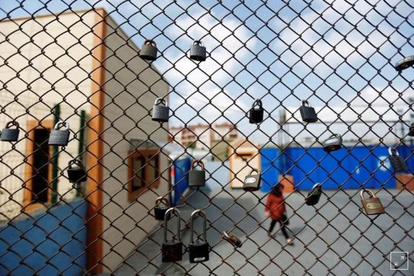
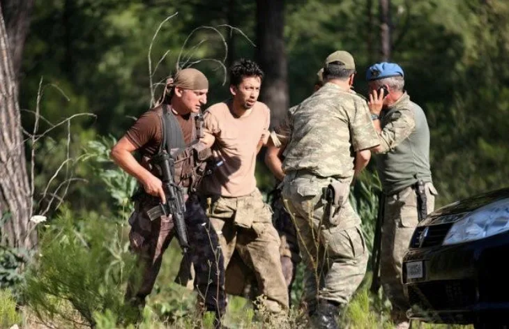
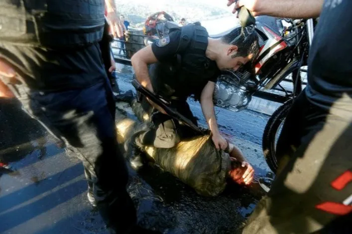

[Reuters](https://www.reuters.com/article/us-turkey-security-prison/coup-arrests-push-turkish-penal-system-to-breaking-point-idUSKCN10F1RV) – August 04, 2016

[Seda Sezer](https://www.reuters.com/journalists/seda-sezer), [Daren Butler](https://www.reuters.com/journalists/daren-butler)

ISTANBUL (Reuters) - Even before last month’s coup attempt, Turkey’s penal system was overstretched, with crowded prisons and backlogged courts. Now, it is struggling to cope with an influx of thousands who have been detained in the aftermath of the attempted putsch.

A woman walks behind a fence with padlocks left by prisoners, during a protest against the arrest of three prominent activists for press freedom, in front of Metris prison in Istanbul, Turkey, June 24, 2016. REUTERS/Murad Sezer/File Photo

The government says the situation is under control, but pictures of some alleged coup plotters handcuffed, stripped to their underpants and detained in sweltering rooms have raised concern among rights groups. There are reports that some jails are so crowded that prisoners have to sleep in shifts.

There are now so many alleged putschists that the government says it doesn’t have a courthouse big enough to try them all and will need to build new ones. Some 3,000 prosecutors and judges are among those who have been detained, making it even more difficult to find members of the judiciary to handle trials.

Turkey’s prison population has trebled since 2002 when the ruling AK Party founded by President Tayyip Erdogan came to power. Some are jailed in connection with the conflict in the mainly Kurdish southeast, which in the last year has seen some of the worst violence since the insurgency began in 1984.

There were 188,000 prisoners in Turkey as of March, around 8,000 more than the existing capacity. So far, 12,000 people have been jailed pending trial since the failed coup and thousands more detained for further questioning.

“In order to make space, they are piling people on top of each other,” said Mustafa Eren, chairman of the Civil Society in the Penal System Foundation, a rights group.

At the Tekirdag prison in northwest Turkey, authorities were cramming six people into three-man cells, he said. The Silivri prison west of Istanbul was so crowded that prisoners were being housed in its sports facilities, Eren said.

A government official told Reuters there wasn’t a prison problem.

“There is no shortage of prisons. We don’t think there will be any problems with this because we’ve been making on-going investments in our prison system,” the official said.

The July 15 abortive putsch saw a faction of the military commandeer tanks, helicopters and fighter jets in an attempt to topple the government. Turkey blames followers of Fethullah Gulen, a Muslim cleric who has lived in self-imposed exile in rural Pennsylvania since 1999. Gulen has denies the charges he was behind the failed putsch, and has condemned the coup.

**SLEEPING IN SHIFTS**

“Jails had already exceeded capacity before July 15, with prisoners sleeping in corridors and by toilets,” said Veli Agbaba, the deputy head of the main opposition, the secular Republican People’s Party (CHP), who has made hundreds of prison visits in the last five years for his work on a CHP commission investigating conditions in jails.

The overcrowding was such that prisoners were sleeping in shifts and in response new beds were being brought in, Agbaba said. The rooms are so crammed with beds that there is no floor space for walking, he said. “The severity of the prison problem is not one that can be solved by sending in new beds,” he said.

Slideshow (3 Images)

Turkish soldiers detain Staff Sergeant Erkan Cikat, one of the missing military personnel suspected of being involved in the coup attempt, in Marmaris, Turkey, July 25, 2016. REUTERS/Kenan Gurbuz/File Photo

A soldier beaten by the mob (C) is protected by plainclothes policemen after troops involved in the coup surrendered on the Bosphorus Bridge in Istanbul, Turkey July 16,2016. REUTERS/Murad Sezer/File Photo

A policeman checks a soldier beaten by the mob after troops involved in the coup attempt surrendered on the Bosphorus Bridge in Istanbul, Turkey July 16, 2016. REUTERS/Murad Sezer/File Photo

The pro-government Yeni Safak newspaper reported that authorities at Sincan prison in Ankara set up a large tent on the prison grounds to house coup-related detainees. The government has rejected the report, with a justice ministry official saying all suspects were held in prison buildings.

Rights groups say the overcrowding is another form of torture for the prisoners, some of whom have been shown in photos and television footage with bandages and bruises since their incarceration.

“Footage clearly shows those soldiers were beaten when they were under custody. This is torture. You don’t even need to go and investigate,” said Ozturk Turkdogan, head of the Turkish Human Rights Association. “This is such a vengeful mentality and it should be abandoned.”

Turkdogan said rights groups met with Deputy Prime Minister Numan Kurtulmus to air their concerns regards torture and detention conditions.

Justice Minister Bekir Bozdag said in a television interview this week that there is no torture in Turkish prisons.

Congo's opposition leader wins chaotic presidential election

**HOSTILE LAWYERS**

Bozdag has said no court in the country is capable of handling the number of defendants, which could total up to 30,000, and that new courthouses will be built for the trials.

He has said the putschists will be tried in Sincan - an Ankara district laden with symbolism, as it was the scene of an 1997 army show of strength months before it ousted an Islamist government.

Suspects are having trouble finding adequate counsel because expert lawyers are either afraid to be associated with the coup or are personally repulsed by the putsch, said Turkdogan of Turkey’s Human Rights Association.

In some cases, legal aid is provided, but those lawyers are often inexperienced and intimidated by the authorities, he said.

Illustrating the hostility for the accused, one lawyer entered a prison this week to speak to a suspect, a former air force commander portrayed in media as a coup leader, but tried to attack him before being taken away by jail guards, the prison authority said in a statement.

A decade ago, in a bid to reduce prison crowding, the government introduced a “supervised release” scheme, under which prisoners sentenced to less than 18 months are freed on parole.

The opposition CHP has called for this to be extended to sentences of up to two years, but justice Minister Bozdag rejected such a move earlier this year, saying it could hurt public order.

New prisons are planned. Speaking to parliamentary commission members in January, the head of the prisons’ directorate, Yavuz Yildirim, said Turkey planned to open 165 more prisons in the coming four years and close 131 old ones.

In the past, Turkey has used amnesties to reduce prison numbers. The last major amnesty, in 2000, was carried out on the proposal of the wife of then-Prime Minister Bulent Ecevit. It lowered the population by more than a quarter, but three years later the numbers had risen back to the pre-amnesty level.

Additional reporting by Gulsen Solaker and Ercan Gurses in Ankara and Ayla Jean Yackley in Istanbul; Writing by Daren Butler; Editing by David Dolan and Peter Graff

_Our Standards:[The Thomson Reuters Trust Principles.](http://thomsonreuters.com/en/about-us/trust-principles.html)_
