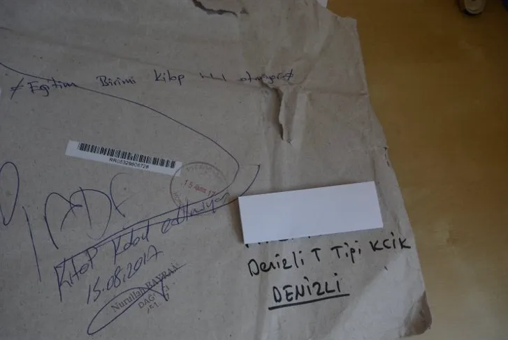

[Duvar](https://www.gazeteduvar.com.tr/gundem/2017/08/23/devlet-destegiyle-cikan-kitap-cezaevinde-yasak/) - Ahmet Külsoy - 23 Ağustos 2018 Türkiye İnsan Hakları Eşitlik Kurumu ve Avrupa Birliği’nin katkılarıyla hazırlanan, Mahpus Hakları El Kitabı, Denizli T Tipi Cezaevi Eğitim Birimi tarafından ‘sakıncalı’ bulundu. 23 Ağu 2017 07:25 [**Ahmet Külsoy**](https://www.gazeteduvar.com.tr/author/akulsoy/)  **akulsoy@gazeteduvar.com.tr** **DUVAR –** Ceza İnfaz Sisteminde Sivil Toplum Derneği Yönetim Kurulu Başkanı Mustafa Eren, Olağanüstü Hal kapsamında çıkarılan KHK’lar nedeniyle tutuklu hükümlülerin kitaba ulaşmakta ciddi sıkıntılar yaşadıklarını söyledi. Eren, cezaevine sokulması ‘sakıncalı’ bulunan kitaplardan birin de Türkiye İnsan Hakları Eşitlik Kurumu (TİHEK) ve Avrupa Birliği’nin katkılarıyla hazırlanan, Mahpus Hakları El Kitabı olduğunu belirtti. Eren, kitabın Denizli T Tipi Cezaevi ‘Eğitim Birimi’ tarafından, ‘sakıncalı’ bulunduğunu kaydederken karara tepki gösterdi. Mustafa Eren, Türkiye İnsan Hakları Eşitlik Merkezi’nin TBMM tarafından çıkarılan yasayla kurulduğunu hatırlattı ve  Denizli T Tipi Cezaevi ‘Eğitim Birimi’nin veya müdürünün keyfi davrandığını ifade etti. Mahpus Hakları El Kitabını, Türkiye Cumhuriyeti Devleti ve AB’liğin katkılarıyla hazırladıklarını aktaran Eren, şöyle dedi: “Projeyi yürüten grup olarak Proje Ct Group’un logosu kitapta var. Bu kitapları bütün hapishanelerin kütüphanelerine ve yazıştığımız mahpuslara yolluyoruz. Zaman zaman kitaplar konusunda sıkıntı yaşadığımız oluyor. 1 Ağustos tarihinde Denizli T Tipi Ceza İnfaz Kurumu’nda tutulan bir mahpusa, bir sayfalık mektupla beraber bu iki yayınımızı yolladık. Ancak 21 Ağustos günü mektubumuz geri geldi. Zarfın üstünde ‘Eğitim Birimi’ kitap kabul etmiyor yazıyordu.”  “Eğitim Birimi’nin kitabı kabul edilmemesinin hukuki dayanağı nedir?” diye soran Eren, Adalet Bakanlığı ve Ceza  ve Tevkif Evleri Genel Müdürlüğü’nün harekete geçip, keyfiliğe son vermesini istedi. **‘BİR CEZAEVİ MÜDÜRÜ TEŞEKKÜR ETTİ’** “Kitabı kabul etmeyen birimin adının ‘Eğitim Birimi’ olması ayrıca bir ironi” diyen Eren şunları söyledi: “Adında ‘eğitim’ geçen bir birimin kitapları alması yönünde ısrarcı olması gerekirken, kitaplara karşı olan bir birimle karşı karşıyayız bu hapishane özelinde. Ancak bu durumu tüm hapishanelerde genellememek gerekiyor. Bazı hapishaneler idareleri derneğimiz arayarak bizzat kendileri talep ediyor. Daha geçtiğimiz hafta bir hapishane müdürü doğrudan derneğimizi arayarak yayınlarımız için güzel sözler kullanarak talepte bulunmuştur.” Kabul edilmeyen kitapların TİHEK ortaklığı ile basıldığına vurgu yapan Eren konuşmasını şöyle sürdürdü: “TİHEK, Birleşmiş Milletler İşkenceye Karşı Sözleşmesi’nin kurulmasını öngördüğü Ulusal Önleme Mekanizması olarak kurulmuş, resmi bir kuruluştur. Onun logosunun olduğu kitaplar hapishaneye alınmamıştır. Kabul edilmeyen kitapların Mahpus Hakları El Kitabı ve Haklarım Başvuru Kılavuzu olması da ayrı bir durumdur. Bu kitaplar doğrudan teknik, hukuki yardım el kitaplarıdır. Mahpuslara haklarını anlatmakla ve hak ihlali ile karşılaşmaları durumunda hangi kurumlara, nasıl başvuracakları yapacakları dilekçe örnekleriyle beraber yazmaktadır. Bu kitapların engellenmesi mahpusların, haklarının ulaşmalarına doğrudan müdahaledir. Son dönemlerde bu tür engellemeler artış gösteriyor. Bazı hapishanelerde kitap sayısına sınırlama getirilirken (Örneğin Bolu F Tipi’nde mahpuslara 5 kitap sınırlaması getirilmişti) bazı hapishanelerde ise ailelerin getirdiği, postayla yolladığı kitaplar kabul edilmiyor. Adalet Bakanlığı keyfiyete varan bu tasarruf hakkına düzenleme getirmeli kitap sınırlandırılması kaldırılmalıdır.”
