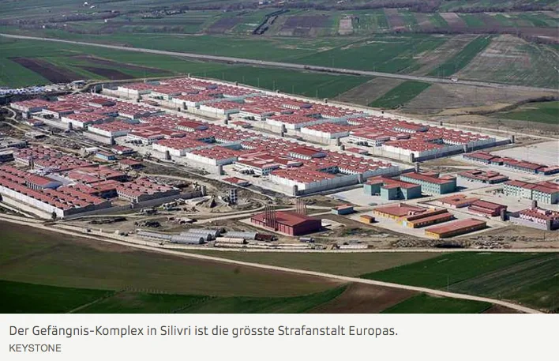
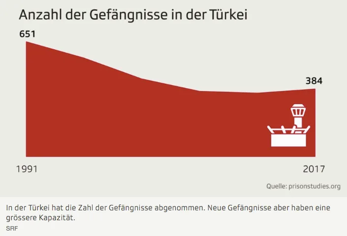
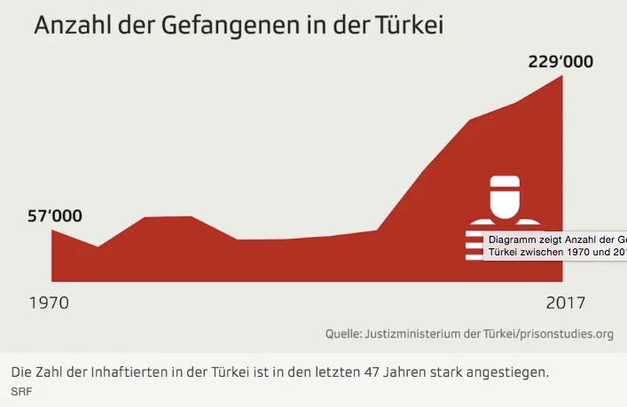
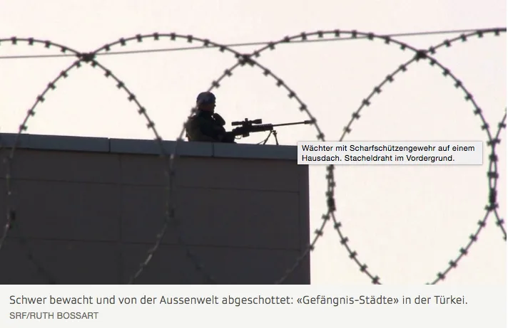

[SRF](https://www.srf.ch/news/international/ueberbelegte-strafkolonien-die-tuerkei-baut-gefaengnis-staedte) - Ruth Bossart - 05/02/2018 In der Türkei platzen die Gefängnisse aus allen Nähten. Offiziell sind sie zu über 110 Prozent belegt. Die Regierung will darum in den nächsten fünf Jahren mehr als 100’000 neue Plätze hinter Gittern schaffen. Autor: Ruth Bossart, Istanbul

Montag, 05.02.2018, 19:08 UhrAktualisiert um 19:12 Uhr

Die Türkei liebt Superlative. Nicht nur das grösste Gerichtsgebäude Europas steht dort, sondern auch das grösste Gefängnis. Die Haftanstalt in Silivri, rund 100 Kilometer ausserhalb von Istanbul, besteht aus 10 Gefängnissen und hat Zellen für 11'000 Gefangene. Silivri ist kein Einzelfall, sondern spiegelt den Trend des Strafvollzugssystems in der Türkei: Weg von kleineren Distriktgefängnissen hin zu Strafkolonien. 

## **Strafkolonien mit 20’000 Einwohnern**

Viele der neuen Gefängnisse werden weitab von bewohnten Gebieten erstellt. Sie bieten Kapazität für durchschnittlich 10’000 Häftlinge, 6000 Angestellte und ihre Familien. So entstehen veritable «Gefängnis-Städte» mit einer Einwohnerzahl von rund 20’000.  Die Angestellten und ihre Familien wohnen auf dem Gefängnisareal in Wohnhäusern. Sie haben dort eigene Schulen, Einkaufszentren, Moscheen, Kinos und Gesundheitseinrichtungen. Vielerorts sind auch Gerichtsgebäulichkeiten und Büros auf dem Areal integriert.

> Diese Gefängnisse bringen Arbeit in abgelegene Regionen. Ravza Kavakci Vize-Präsidentin AKP

## **Gravierende Folgen für die Insassen**

1991 gab es in der Türkei noch 651 Gefängnisse. Die meisten waren Distrikt-Einrichtungen mit insgesamt 45’000 Insassen. Seither ist die Zahl der Häftlinge massiv gestiegen, die der Anstalten hingegen stetig gesunken: Zur Jahrtausendwende waren 559 Gefängnisse in Betrieb, 2005 noch 441 und Ende 2017 zählte man 384 Haftanstalten mit einer Kapazität von 207’339 Plätzen. Doch diese reichen zurzeit bei weitem nicht aus.  Seit dem gescheiterten Putsch im Juli 2016 platzen die Gefängnisse aus allen Nähten. Gemäss Angaben des Justizministeriums vom November sind sie zu mehr als 110 Prozent belegt. Dies hat gravierende Folgen für die Insassen.

> ## **PASSEND ZUM THEMA**
> 
> In türkischer Haft [«Zuerst musste ich auf dem Fussboden schlafen» – Zwei Verhaftete schildern die grauenhaften Zustände in den türkischen Gefängnissen.](https://www.srf.ch/news/international/in-tuerkischer-haft-zuerst-musste-ich-auf-dem-fussboden-schlafen)

## **Impuls für strukturschwache Regionen**

Das Zentrum für Gefängnisstudien TCPS (Turkey Center for Prison Studies) ist eine NGO. Sie beschäftigt sich wissenschaftlich mit dem Strafvollzug in der Türkei. Die NGO schätzt, dass heute rund 235’000 Menschen inhaftiert sind. Darunter sind rund 55’000 Personen, die beschuldigt werden, in irgendeiner Form am gescheiterten Putsch 2016 beteiligt gewesen zu sein, einer Terrororganisation anzugehören, die Bevölkerung aufgewiegelt oder den Präsidenten beleidigt zu haben.  Die erste «Gefängnis-Stadt» bei Sincan bauten die Behörden bereits 2006 in der Nähe von Ankara. Heute gibt es zwölf weitere. Einige befinden sich in strukturschwachen Gebieten. Die regierende Partei für Gerechtigkeit und Entwicklung (AKP) von Präsident Erdogan argumentiert, dass viele der kleineren Distriktgefängnisse veraltet seien und geschlossen werden müssten. So grosse Anlagen hätten nicht nur betriebliche, sondern auch ökonomische Vorteile. «Diese Gefängnisse bringen Arbeit in abgelegene Regionen», sagt Ravza Kavakci. Sie ist Vize-Präsidentin der AKP. Im Interview sagt sie: «Obwohl ich natürlich unterstreichen muss, dass dies nicht der Hauptzweck solcher Anlagen ist. Aber viele Regionen sind froh, wenn wir dort ein Gefängnis bauen wollen.»

## **Mehr Menschenrechtsverletzungen in grossen Anstalten**

Scharfe Kritik an diesen Strafkolonien übt derweil das Zentrum für Gefängnisstudien in der Türkei TCPS. Anders als bei kleineren Distriktgefängnissen, wo die Angestellten in der nahen Umgebung wohnten, lebe das Personal dieser Strafkolonien auf dem Gefängnisareal, erklärt der Direktor von TCPS, Mustafa Eren. Dies berge Gefahren.

> Dies begünstigt die Wahrscheinlichkeit, dass Insassen misshandelt oder gefoltert werden. Mustafa ErenDirektor, Zentrum für Gefängnisstudien

«Wenn der Wärter des Distriktgefängnisses abends seine Schicht beendet und seine Uniform auszieht, kehrt er zurück in die zivile Welt. Er holt zum Beispiel seine Tochter von der Schule ab, spricht dort mit Menschen, die mit dem Strafvollzug nichts zu tun haben», sagt Eren. Zudem könne in kleineren Einrichtungen leichter Empathie zwischen den Aufsehern und den Insassen aufgebaut werden. Innerhalb dieser abgeschotteten Strafkolonien hingegen herrsche Anonymität, erklärt TCPS-Direktor Mustafa Eren weiter. Die Angestellten würden rund um die Uhr als Wärter oder Polizisten wahrgenommen – auch in ihrer Freizeit. Ihr gesamtes soziales Umfeld stehe in Bezug zur Arbeit. «Experten sprechen hier von fixierten Identität. Dies begünstigt die Wahrscheinlichkeit, dass Insassen misshandelt oder gefoltert werden», sagt Eren. Der TCPS-Direktorbezieht sich dabei auf mehrere Studien aus den USA, einem der wenigen westlichen Länder, in dem ebenfalls solche Grossanlagen für den Strafvollzug genutzt werden.

## **Gegenläufige Entwicklung in Europa**

Ein weiterer gravierender Nachteil solcher zentralisierteren Kolonien sei, dass sie vielfach weit entfernt vom Wohnort der Familienangehörigen der Häftlinge liegen. Besuche würden so zu logistischen und finanziellen Bürden, sagt Eren. In Europa gehe darum die Tendenz bei neuen Gefängnisbauten seit vielen Jahren klar in Richtung kleinerer Einrichtungen, hält Mustafa Eren fest. Auch seien die Zahl der Gefängnisinsassen in Europa (ohne Russland) stark rückläufig. Seine Organisation hat berechnet, dass sich die Zahl der Sträflinge hinter Gittern seit 2000 um rund 20 Prozent verringert hat. Anders als in der Türkei, wo auch ein Ladendieb oder ein säumiger Steuerzahler seine Strafe im Gefängnis verbringe, würden in europäischen Ländern alternative Strafmethoden bevorzugt, wie beispielsweise die elektronische Fussfessel. «Dies ist nicht nur viel billiger, sondern erleichtert auch die soziale Integration eines Verurteilten erheblich.»
