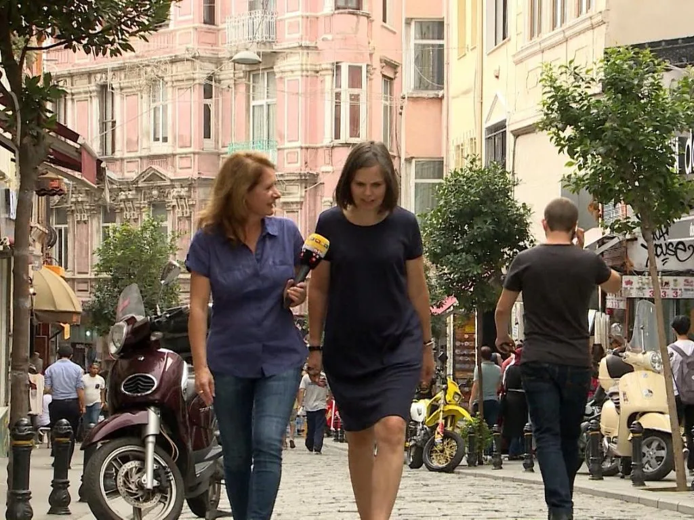

**[ntv](https://www.n-tv.de/politik/Selbst-Autokennzeichen-machen-verdaechtig-article18600236.html) –** _Von Nadja Kriewald, Istanbul – 9 September 2016_

Autos mit Türkei-Flaggen im Fenster sind gern gesehen, Nummernschilder mit den Buchstaben F und G überhaupt nicht. REUTERS

**Rechtstaat adé. In der Türkei reichen Lappalien, um unter Terrorverdacht zu geraten. Tausende landen im Gefängnis. Auch, weil Anwälte sich nicht mehr trauen, mutmaßliche Putsch-Unterstützer zu verteidigen.**

Ein Konto bei der "falschen" Bank, ein Autokennzeichen mit den Initialen des Staatsfeindes Nummer eins – in der Türkei reichen mittlerweile Lappalien, um unter Terrorverdacht zu geraten und im Gefängnis zu landen.

Immer absurder wird die Jagd nach Anhängern von Fethullah Gülen. Der im US-Exil lebende Prediger gilt in der Türkei als Staatsfeind Nummer 1. Für Präsident Erdogan ist er der Drahtzieher des Putschversuchs vom 15. Juli. Und jetzt sollen alle Autobesitzer mit einem "FG" im Kennzeichen, also den Initialen von Fethullah Gülen überprüft werden, ob sie irgendeine Verbindung zum Feto-Netzwerk haben. Das hört sich lachhaft an, ist aber ernst.

Ein Autofahrer in einem silbergrauen Peugeot 205 ist alarmiert. "Ja, natürlich habe ich Angst", sagt er. Hastig fügt er hinzu: "Nein, bitte kein Foto. Das macht doch alles nur noch schlimmer." Schnell fährt er weiter.

Glücklich sind jetzt die, die beweisen können, dass ihre Kinder zum Beispiel Fatima und Gül heißen oder ihre eigenen Namen mit F. und G. beginnen. Alle anderen geraten unter Terrorverdacht.

## **100.000 suspendierte Angestellte**

Präsident Erdogan hat angekündigt, dass er die sogenannten "Säuberungsaktionen" mit aller Härte fortführen will: "Manche sagen, wir hätten 10.000 oder 20.000 entlassen. Aber wir werden Zehntausende entlassen – wer auch immer sie sind."

Gesagt, getan: Mehr als 100.000 Angestellte und Beamte im Öffentlichen Dienst wurden bereits suspendiert. Oft reicht auch ein Konto bei der falschen Bank, Gülen Bank Asia. Alle Filialen sind geschlossen worden. Auf einem Zettel steht, dass die Regierung das erwirkt hat. Wegen eines Kontos bei dieser Bank wurde auch der Istanbuler Sportlehrer Uygar Özdemir suspendiert.

Am Anfang wusste er nicht, was los war. Erst langsam begriff er, dass sein Konto bei Bank Asia schuld war. Dabei hatte er das nur, weil deren Filiale ganz nah an seiner Wohnung lag.

"Als ich mit Kollegen sprach, die auch entlassen worden sind, merkte ich, dass deren Geschichte genauso war. Sie hatten auch ein Konto bei der Bank aus welchen Gründen auch immer.

## **"Niemand kann dir helfen"**

Wie Özdemir wurden zehntausende Lehrer, Dozenten und Professoren seit dem Putschversuch entlassen. Eine Hexenjagd, die zu einem unglaublichen Mangel an Lehrkräften an den Schulen und Universitäten führt. In vielen Bereichen wird das Land dadurch lahmgelegt.

Im Fall Özdemir hat es eine Online-Petition gegeben. Der Sportlehrer wollte die Suspendierung nicht hinnehmen. Und er hat Glück gehabt, seit Anfang September darf er wieder unterrichten.

Nadja Kriewald im Gespräch mit Emma Sinclair-Webb von Human Rights Watch.

Noch schlimmer sieht es bei den Verhaftungen aus. Auch hier reicht ein Verdacht. Das musste die Journalistin Tugba Tekerek feststellen. Auf dem Weg zu einem Einkaufszentrum kam sie an einer Polizeiwache vorbei. Draußen warteten Männer, Frauen und Kinder. Sie wollten erfahren, was mit ihren festgenommenen Angehörigen war, was man ihnen vorwirft.  
  
Tugba Tekerek machte zwei Fotos mit ihrem Handy. Wenig später landete sie selbst hinter Gittern. Zunächst wegen angeblicher Planung eines Bombenattentats. Dann warf man ihr Beleidigung des Präsidenten vor. Die Polizisten hatten herausgefunden, dass sie eine regierungskritische Journalistin ist.

"Der Polizist schlug die Tür zu und dann mit der Faust auf den Tisch," sagt Tekerek. "Wir haben hier Notstandsgesetze, ich kann dich hier stundenlang festhalten, ich kann dich hier festhalten so lange ich will. Niemand kann dir helfen!"

Dann wurde sie abgeführt in eine völlig überfüllte Zelle. Es stank erbärmlich, Frischluft gab es so gut wie keine, erzählt sie. Sie war geschockt: "Da waren 28 Menschen in den drei kleinen Zellen. Die Frauen lagen auf dem Boden, versuchten zu schlafen. Aber es war nicht genug Platz um die Beine auszustrecken."

Eine Frau, im achten Monat schwanger, weinte, erzählt Tekerek. Sie hatte noch ein dreieinhalbjähriges Kind. Seit sieben Tagen war sie in der Zelle ohne Kontakt zu ihrer Familie.  
  
Tugba Tekerek hatte Glück, weil ihr Anwalt intervenierte, kam sie nach 15 Stunden frei. Doch wie sie wurden inzwischen Zehntausende Türken verhaftet seit dem Putschversuch und der Ausrufung des Notstandes.

## **Anwälte haben Angst, Gülen-Fälle zu übernehmen**

Eine sehr beunruhigende Situation, sagt Emma Sinclair-Webb, die Türkeibeauftragte der Menschenrechtsorganisation Human Rights Watch. Zumal die Polizei jetzt Verdächtige bis zu 30 Tage in Untersuchungshaft behalten kann. Und oft hätten die Verwandten keinerlei Kontakt, nicht einmal über Anwälte, sagt sie: "Viele Anwälte haben Angst diese Fälle zu übernehmen. Sie wollen nicht mit Putsch-Verdächtigen in Verbindung gebracht werden. Sie befürchten, dass ihnen das selbst schaden könnte."  
  
Die Gefängnisse sind inzwischen völlig überfüllt. Mitte August wurden deshalb 38.000 "normale" Häftlinge entlassen. Es sind Diebe, Betrüger, Gewaltverbrecher, denen ein Teil der Strafe erlassen wurde. Und noch mehr sollen folgen. Doch das wird nicht reichen.

Denn bereits in den ersten sechs Wochen nach dem Putschversuch wurden 37.000 Menschen verhaftet, sagt Mustafa Eren. Immer mehr alarmierende Briefe von Gefangenen und Angehörigen erreichen seine Stiftung Zivilgesellschaft in der Strafjustiz. "Die Gefangenen schlafen in Schichten," sagt Eren. "Manche am Morgen, manche am Nachmittag, manche in der Nacht. Viele schlafen direkt auf dem Boden, ohne Betten, ohne Matratzen."

Chronisch Kranken wie Diabetikern werde die Medizin verweigert, erzählt Eren. Direkten Kontakt hat seine Stiftung nicht zu den Gefängnisinsassen. Nur über Anwälte oder Angehörige würden sie erfahren, dass es immer häufiger zu Gewalt und Missbrauch komme.

Schon vor dem Putsch waren die türkischen Gefängnisse überfüllt, doch jetzt gibt es jeden Tag neue Verhaftungen.

_Mehr von Nadja Kriewalds Recherchen in der Türkei gibt es im_ **_Auslandsreport bei n-tv_** _an diesem Freitag um 15.10 Uhr, am Samstag um 7.30 und 18.30 Uhr sowie am Sonntag um 9.30 Uhr._

_Quelle: n-tv.de_
