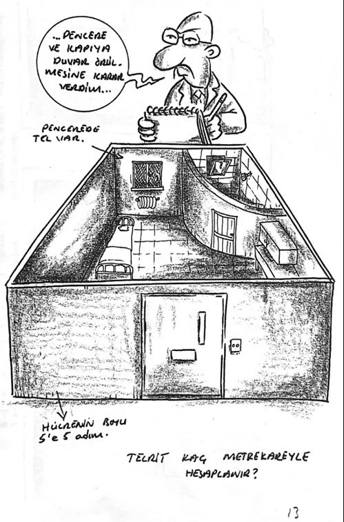

**[BirGün](https://www.birgun.net/haber/gunesle-kose-kapmaca-727495) – 5 Ağustos 2026**
# Güneşle köşe kapmaca

> Komedyen Göktaş’ın mektubu, "kuyu tipi" cezaevlerini gündeme taşıdı. Hukukçular bu cezaevlerinin hukuka aykırı olduğunu vurgularken sosyolog Mustafa Eren, "Adına 'havalandırma' denilen bir kuyunun dibindesiniz" dedi.

**Meral Danyıldız**

Komedyen Deniz Göktaş'ın sevk edildiği Çorlu Karatepe Yüksek Güvenlikli Cezaevi'nden gönderdiği 1'inci ay mektubu, "kuyu tipi" tartışmalarını yeniden alevlendirdi. Kamuoyunda "kuyu tipi" olarak adlandırılan Yüksek Güvenlikli Cezaevlerindeki (YGC) ağır koşullar, hem tutuklu yakınlarının hem de hukukçuların tepkisini çekmeye devam etti.

Göktaş, gönderdiği mektupta, "Güneşsizlik, havasızlık ve sosyal izolasyonun kalıcı fizyolojik ve psikolojik zararlar vermesi kaçınılmaz. Sayımlar dışında insan sesi duymadan haftaları geçen mahpuslar var" diye yazdı.

Göktaş ayrıca, öğlen 7 metrelik duvarları olan avluda yüzüne gelsin diye güneşle köşe kapmaca oynadığını söyledi. Kuyu tipinde tutulan Ekrem İmamoğlu’nun tutuklu avukatı Mehmet Pehlivan’ın şu sözleri de gündeme geldi:

> "Güneş temmuz ayında bile avluda zemine düşmüyor, sadece duvara yaslanıyor. Etrafındaki o uzun duvarlar nedeniyle kendinizi hep kuyunun dibinde hissediyorsunuz."

Konuya ilişkin değerlendirmelerde bulunan Çağdaş Hukukçular Derneği (ÇHD) İstanbul Şube Yöneticisi Avukat Yağmur Kavak, yüksek güvenlikli cezaevlerindeki idarenin keyfi uygulamalarına dikkat çekti:

> "Hükümlü ve tutuklu seçiyorlar havalandırma hakkını kullandırmak için. Havalandırmanın duvarlarının çok daha yüksek olduğunu anlatıyorlar bize. Güneşi görmek çok zor, belki havalandırmanın sadece bir köşesinde... O da nerede durduğunuza bağlı; güneşe ulaşamıyorlar."

Yüksek güvenlikli cezaevlerindeki tek kişilik hücre uygulamasının mevzuattaki yerini hatırlatan Kavak, henüz kesinleşmiş bir cezası dahi olmayan tutuklulara bu koşulların dayatıldığının altını çizdi.

## 7 metrelik kuyunun dibi

Cezaevlerindeki tecrit uygulamasını anlatan Türkiye Hapishane Çalışmaları Merkezi ve Hapishane Çalışmaları Kütüphanesi Kurucusu sosyolog Mustafa Eren, sosyalleşme imkânının ortadan kaldırılmasıyla insanın önce psikolojik, ardından da fiziki olarak çöktüğünü belirtti:

> "Bu yeni hapishaneler üç katlı, çoğunlukla tek kişilik hücrelerden oluşuyor ve hücrelerin kendilerine ait havalandırmaları yok. 'Kuyu tipi' denmesinin nedeni de şu; adına 'havalandırma' denilen 7 metre derinliğindeki bir kuyunun dibindesiniz."

Eren ayrıca, AKP iktidara geldiğinde 50 binlerde olan mahpus sayısının bugün 427 bin 500’ü aştığını, 497 bin aşkın denetimli serbestlikteki yurttaşla birlikte ceza infaz sisteminin doğrudan kapsadığı insan sayısının 925 bine ulaştığını ekledi.

---

## Kuyu tipi cezaevi nedir?

**Gündem Hapishane**, 10 maddede "kuyu tipi" hapishaneleri ele aldı. Yapılan derlemeden bazıları şöyle:

### Adını nereden aldı?

Hücre pencerelerinin yüksek duvarlı, güneş görmeyen dar alanlara bakması, çelik fens telleri ve gökyüzünün kapatılması mahpuslarda "kuyunun dibinde tutulma" hissi yarattığı için bu ismi aldı.

### Sağlığa etkileri neler?

Güneşsizlik ve hareketsizlik D vitamini eksikliğine, kas-iskelet hastalıklarına, kemik erimesine ve tansiyona; nem ise KOAH ve astıma yol açar.

### Kimler tutuluyor?

Mevzuata göre bu kurumlarda "ağırlaştırılmış müebbet hapis cezası" alan hükümlüler ile "terör ve örgütlü suçlardan" hüküm almış olanların tutulması gerekir. Ancak uygulamada, henüz hüküm giymemiş tutuklular da barındırılıyor.
Haberin orijinali için [BirGün](https://www.birgun.net/haber/gunesle-kose-kapmaca-727495) sayfasına bakılabilir.
