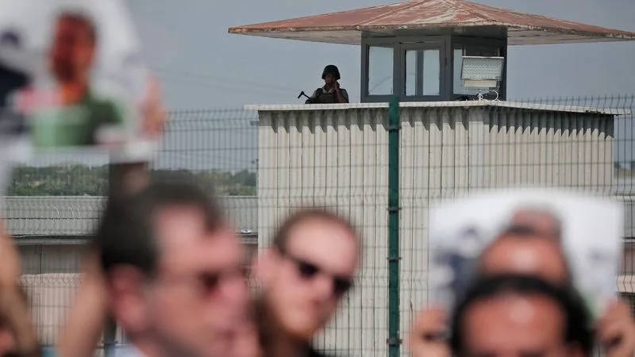

[RTS](https://www.rts.ch/info/monde/7922500-le-systeme-carceral-en-turquie-est-au-bord-de-la-rupture.html) - Modifié le 06 août 2016 à 10:59

Manifestation devant la prison de Metris, à Istanbul. \[Keystone\]

L'afflux de milliers de détenus accusés de sédition depuis le putsch manqué du 15 juillet pousse le système carcéral et judiciaire turc au bord de la rupture. Le gouvernement, lui, nie tout problème.

La surpopulation dans les prisons a atteint de nouveaux records. Les tribunaux sont débordés, sans compter que 3000 procureurs et magistrats figurent parmi les suspects interpellés. La population pénitentiaire en Turquie a triplé depuis l'arrivée au pouvoir du Parti de la justice et du développement (AKP) en 2002.

En mars, le pays comptait 188'000 détenus, soit 8000 de plus que la capacité existante. Depuis la tentative de coup d'Etat, 12'000 personnes ont été placées en détention provisoire en attendant d'être jugées. Des milliers d'autres sont encore en garde à vue, dont la durée a été étendue de quatre à trente jours par décret présidentiel.

"Pour faire de la place, ils les empilent les uns sur les autres", déclare Mustafa Eren, président du CISST (Société civile pour le système pénal), un groupe de défense des droits. A la prison de Tekirdag, dans le nord-ouest du pays, six détenus s'entassent dans des cellules prévues pour trois. Dans la prison de Silivri, à l'ouest d'Istanbul, des détenus dorment dans le gymnase, détaille-t-il.

## **Pas de problème**

Pour le gouvernement, il n'y a pas de problème dans les prisons. "Il n'y a pas de pénurie. Nous n'arrêtons pas d'investir dans notre système carcéral", explique un responsable.

D'après le numéro deux du principal parti d'opposition (CHP, Parti républicain du peuple) Veli Agbaba, pourtant, "les prisons avaient déjà dépassé leur capacité avant le 15 juillet".

"Des détenus dorment dans les couloirs ou les toilettes", accuse cet opposant. Veli Agbaba a effectué des centaines de visites dans les prisons au cours des cinq dernières années en tant que responsable d'une commission d'enquête du CHP sur la condition des détenus.

## **Se relayer pour dormir**

La surpopulation est telle que des prisonniers sont obligés de se relayer pour dormir. Dans certaines cellules, des nouveaux lits ont été apportés, mais il n'y a plus d'espace pour marcher.

Aux yeux des mouvements de défense des droits de l'homme, la surpopulation carcérale constitue une nouvelle forme de torture pour des détenus. Et certains d'entre eux ont déjà subi des mauvais traitements, comme l'ont montré des photos de prisonniers couverts d'hématomes ou portant des bandages.

"Les images montrent clairement que ces soldats ont été battus pendant leur garde à vue. C'est de la torture. Ce n'est même pas la peine d'aller enquêter. C'est un esprit de vengeance auquel il faut mettre un terme", déclare Ozturk Turkdogan, directeur de l'Association turque des droits de l'homme.

**\>> Lire aussi:** [Des détenus seraient torturés en Turquie après le coup d'Etat manqué](https://www.rts.ch/info/monde/7898548-des-detenus-seraient-tortures-en-turquie-apres-le-coup-d-etat-manque.html)

Le ministre de la Justice Bekir Bozdag a répondu cette semaine dans une interview à la télévision que la torture n'existait pas dans les prisons turques.

## **Pénurie d'avocats**

Les suspects ont du mal à trouver des avocats pour les défendre. D'une part, parce que les membres du barreau redoutent d'être associés aux putschistes. D'autre part, parce qu'ils sont personnellement révoltés contre la tentative de coup d'Etat, qui a fait au moins 246 morts.

Lors d'une récente visite en prison, un avocat s'en est pris ainsi à son client, un ancien commandant de l'armée de l'air, qu'il a tenté d'agresser. Il a ensuite été maîtrisé par les gardiens, a déclaré l'autorité pénitentiaire dans un communiqué.

ats/fme

Publié le 06 août 2016 à 08:43 - modifié le 06 août 2016 à 10:59
