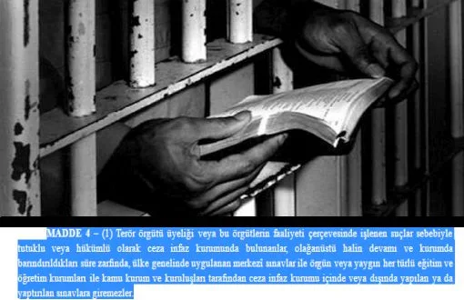

[Bianet](https://bianet.org/haber/prisoners-right-to-education-obstructed-through-statutory-decree-180983) / Beyza Kural, 22.11.2016

Statutory Decree (KHK) No.667 has brought obstruction to prisoners’ right to enter exams.

4th clause of the KHK states that those who are in penal institution due to crimes committed within the scope of illegal organization membership and activities can’t enter exams.

Emphasizing that right to education is an inalienable right defined in law and Constitution, Turkey Prison Studies Center Board Chair and sociologist Mustafa Eren stated that the legislation obstructs the right to education.

Constitution’s Article 42 states that “No one can be deprived of their right to education”.

## “Their lives will be frozen”

There are as many as 400 university students in prisons and most of them are charged with “\[illegal\] organization membership”, according to a data by Arrested Students Solidarity Network.

As of April 1, of 187,609 prisoners 11,745 are aged between 12-20 and 118,928 are aged between 21-39 and the number of juvenile prisoners is 2,106, according to a data by Ministry of Justice General Directorate of Prisons and Detention Houses.

Eren underlines a significant portion of prisoners will be deprived of their right to education with this legislation.

“Prisoners’ lives will be frozen during their jail term with the legislation. They will be able to resume their educational life only after they come out of prison”. (BK/TK)
