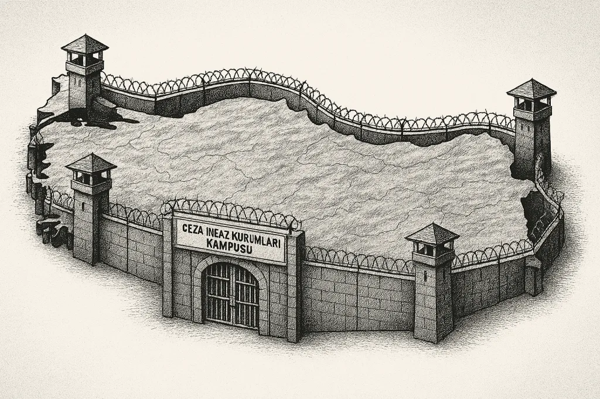

[Bianet](https://bianet.org/yazi/akp-kriminalizasyon-ve-kampus-hapishaneler-cumhuriyeti-306454) - 15 Nisan 2025

## MAHPUS SAYISI RESMİ OLARAK 400 BİNİ AŞTI

AKP rejiminin hapishane politikaları, yalnızca bir cezalandırma mantığının değil; aynı zamanda bir siyasal ve toplumsal düzen kurma pratiğinin ürünüdür. Bu nedenle hapishaneler üzerine düşünmek yalnızca mahpusları değil, özgürlük sınırlarımızı da konuşmaktır.

Türkiye’de infaz rejimi, son 20 yılda yalnızca mahpus sayısındaki artışla değil, bu artışın arkasındaki ideolojik yönelimle de dönüşüme uğradı. AKP iktidarında hapishaneler, ceza adaleti sisteminin “cezalandırma” amaçlı bir parçası olmanın ötesinde, bir yönetim ve toplumsal disiplin mekanizmasına dönüştü. 1970’lerden itibaren başlayan bu yeni dönem, F Tipi hapishanelerin açılışıyla beraber yeni bir evresine taşınmış ve AKP iktidarında daha da boyutlandırılarak neredeyse bütün karakteristik özellikleri görünür hale getirilmiştir.[\[1\]](https://bianet.org/yazi/akp-kriminalizasyon-ve-kampus-hapishaneler-cumhuriyeti-306454#_ftn1)

### Mahpus sayısında patlama: 50 binden 400 bine

AKP’nin iktidara geldiği 2002 yılında Türkiye’de 524 hapishane vardı ve bu hapishanelerin toplam kapasitesi 73 bin 725, aynı yılın mahpus mevcudu ise 59 bin 512’ydi. Yani hapishanelerde yaklaşık 15 bin boş yatak vardı. AKP iktidarının üzerinden 23 sene geçti ve Nisan 2025 tarihi itibarıyla Türkiye’de toplam kapasitesi 299 bin 940 olan 395 hapishane bulunuyor. Mahpus mevcudu ise yaklaşık 400 binin üzerine çıkmış durumda (7 Nisan 2025’te mahpus mevcudu 403 bin 60’tı. Yani kapasite beş katından fazla artırılmış olmasına rağmen 100 binden fazla mahpus yerlerde yatmak zorunda kalıyor).

Bu sayılara, Türkiye’de 2005 yılında faaliyetlerine başlamış olan Denetimli Serbestlik yükümlülerini de eklediğimizde daha gerçekçi bir tablo ortaya çıkar. 31 Mart 2025 tarihi itibarıyla Türkiye’de 448 bin 790 Denetimli Serbestlik yükümlüsü bulunuyor. [\[2\]](https://bianet.org/yazi/akp-kriminalizasyon-ve-kampus-hapishaneler-cumhuriyeti-306454#_ftn2) Yani 2025 yılı başında Türkiye’de tutuklu, hükümlü ve yükümlü toplam sayısı yaklaşık 850 binin üzerindedir. AKP’nin 23 yıllık iktidarının Türkiye’de yarattığı kriminalizasyonun en açık örneğidir bu. Mahpus sayısı yüzde 577 artmıştır. Bu artışa Denetimli Serbestlik yükümlülerini de dâhil ettiğimizde sayı yüzde 1331’e çıkmaktadır.

Aşağıdaki grafik, 2002-2025 yılları arasında mahpus sayısında ve kapasitede yaşanan değişimi dramatik biçimde ortaya koymaktadır.

### Mahpus emeği: Görünmeyen emek sömürüsü

İnsan hakları merkezli bir perspektifle bakıldığında bu dönüşümün özellikle iki yönüne dikkat çekmek gerekmektedir. Bunlardan ilki, AKP iktidarının hapishaneleri bir mahpus emeği sömürüsü mekânı haline getirmiş olmasıdır. 2024 yılı içinde Türkiye hapishanelerinde 58 bin 193 mahpus çalıştırılmış ve bu mahpusların çalıştırılması sonucu İşyurtları Kurumu Taşra Teşkilatı 25 milyar 913 milyon 39 bin 882 TL gelir elde etmiştir. Bu gelirin yevmiye olarak mahpuslara verilen kısmı sadece 756 milyon 817 bin 630 TL’dir. Buna sigorta primi olarak yatırılan 69 milyon 41 bin 598 TL’yi eklesek bile, gelirin sadece yüzde 3,18’ünün mahpuslara geri döndüğünü görüyoruz.[\[3\]](https://bianet.org/yazi/akp-kriminalizasyon-ve-kampus-hapishaneler-cumhuriyeti-306454#_ftn3)

Hapishaneler, mevcut iktidar için ciddi bir üretim ve emek sömürüsü mekânı haline getirilmiştir. Ancak bu mesele, bu yazı açısından tali bir konu olduğu için, bu emek sömürüsü tespitini ortaya koyduktan sonra dikkat çekilmesi gereken ikinci konuya ağırlık verebiliriz.

### Yeni ceza infaz rejimi: Tecrit ve “kampüsleşme”

AKP’nin iktidara geldiği 2002 yılında, 73 bin 725 kapasiteli 525 hapishane varken; 2025 yılı Mart ayı itibarıyla 395, yani çok daha az hapishane olmasına rağmen kapasite yaklaşık 300 bine ulaşmıştır. Bu değişikliğin nedeni, düşük kapasiteli kaza hapishanelerinin kapatılması ve yüksek kapasiteli, büyük oranda hücre sistemi esasına dayalı yeni hapishanelerin açılmış olmasıdır.

Bu tablonun da ortaya koyduğu gibi, Mart 2025 tarihi itibarıyla var olan 395 hapishanenin 307’si, AKP’nin iktidara geldiği 2002 yılı ve sonrasında açılmıştır.[\[4\]](https://bianet.org/yazi/akp-kriminalizasyon-ve-kampus-hapishaneler-cumhuriyeti-306454#_ftn4) Bu hapishanelerin üç temel özelliğine dikkat çekilebilir:

1.  Yeni hapishaneler, eski hapishanelere oranla daha yüksek kapasiteye sahiptirler.
2.  Büyük bir çoğunluğu hücre sistemine göre inşa edilmişlerdir.
3.  Bu hapishanelerin önemli bir bölümü, başka hapishanelerle beraber şehir dışında birçok hapishaneyi içeren kompleksler olarak faaliyete geçirilmişlerdir (Adalet Bakanlığı bunları “kampüs” olarak adlandırmaktadır).

Mart 2025 tarihi itibarıyla var olan 395 hapishanenin tiplerine göre dağılımı şöyledir:[\[5\]](https://bianet.org/yazi/akp-kriminalizasyon-ve-kampus-hapishaneler-cumhuriyeti-306454#_ftn5)

Tabloya dikkat edilirse, AKP iktidarının son yıllarında açılan yeni tip hapishanelerin üçü de (Yüksek Güvenlikli, S Tipi, Y Tipi), mevzuatta “Yüksek Güvenlikli Kapalı Ceza İnfaz Kurumları” olarak adlandırılan tecride dayalı hücre tipi hapishanelerdir. Bu hapishanelere, 2003 yılında açılan D Tipi ve 2000-2007 yılları arasında açılan F Tipi hapishaneler de eklendiğinde tecrit esasına dayalı hücre hapishanelerin sayısı 57’ye ve güncel kapasitesi ise 36 bin 721’e ulaşmaktadır.

### Otoriterleşen rejim ve özgürlüklerimiz

Hücre tipi bu hapishaneler, mevzuatta da belirtildiği gibi;

*   “Örgütlü suçlar” yani siyasi mahpuslar ve “organize suçlar”,
*   Ağırlaştırılmış müebbet hükümlüsü mahpuslar,
*   “Tehlikeli suçlular” için kullanılmaktadır.

Son yıllarda inşa edilen yeni tip hapishanelerin tamamının hücre tipi hapishanelerden oluşması hükümetin infaz rejimini “örgütlü muhalefete” yönelik bir baskı ve sindirme aracı olarak kullandığının açık ifadesi olarak görülebilir. Mahpus sayısının 50 binlerden 400 binlere çıkarılmış olması, “kampüs” adı verilen ve kapasiteleri 10 binleri aşan ceza şehirleri oluşturulması da bu baskı ve sindirme çabasının boyutlarını göstermektedir.

Mevcut rejimin giderek otoriterleşen yapısı, bu gidişatın tırmanacağının işareti olduğu gibi; infaz rejiminin bu hali, aynı zamanda rejimin otoriterleştiğinin de göstergesidir. Aksi yönde bir işaret ise bulunmamaktadır.

AKP rejiminin hapishane politikaları, yalnızca bir cezalandırma mantığının değil; aynı zamanda bir siyasal ve toplumsal düzen kurma pratiğinin ürünüdür. Bu nedenle hapishaneler üzerine düşünmek yalnızca mahpusları değil, özgürlük sınırlarımızı da konuşmaktır.

_(İçerisinde toplam yaklaşık 20 bin kapasiteli 11 hapishanenin bulunduğu, eski adıyla “Silivri”, yeni adıyla “Marmara Ceza İnfaz Kurumları Kampüsü”. Türkiye’nin neredeyse her ilinde bu büyüklükte olmasa da, benzer ölçekte “ceza infaz kurumları kampüsü” adıyla birer “ceza kasabası” inşa edilmiş durumdadır.)[\[6\]](https://bianet.org/yazi/akp-kriminalizasyon-ve-kampus-hapishaneler-cumhuriyeti-306454#_ftn6)_

**Dipnotlar:**

[\[1\]](https://bianet.org/yazi/akp-kriminalizasyon-ve-kampus-hapishaneler-cumhuriyeti-306454#_ftnref1) Türkiye’nin ceza infaz sisteminin bu dönüşümüne ilişkin Kapatılmanın Patolojisi / Osmanlı’dan Günümüze Hapishanelerin Tarihi kitabıma bakılabilir. Kalkedon Yayıncılık, İstanbul, Mayıs 2014

[\[2\]](https://bianet.org/yazi/akp-kriminalizasyon-ve-kampus-hapishaneler-cumhuriyeti-306454#_ftnref2) Veriler Ceza ve Tevkifevleri Genel Müdürlüğü’nün sitesinden alınmıştır. [https://cte.adalet.gov.tr/Home/BilgiDetay/22](https://cte.adalet.gov.tr/Home/BilgiDetay/22) Erişim Tarihi: 13 Nisan 2025

[\[3\]](https://bianet.org/yazi/akp-kriminalizasyon-ve-kampus-hapishaneler-cumhuriyeti-306454#_ftnref3) Veriler Ceza İnfaz Kurumları İle Tutukevleri İşyurtları Kurumu’nun 2024 yılı Faaliyet Raporu’ndan alınmıştır. [https://iydb.adalet.gov.tr/Home/BilgiDetay/6](https://iydb.adalet.gov.tr/Home/BilgiDetay/6) Erişim Tarihi: 13 Nisan 2025

[\[4\]](https://bianet.org/yazi/akp-kriminalizasyon-ve-kampus-hapishaneler-cumhuriyeti-306454#_ftnref4) Bu tablo, Ceza ve Tevkifevleri Genel Müdürlüğü’nün (CTE) sitesinde açıkladığı veriler kullanılarak oluşturulmuştur. [https://cte.adalet.gov.tr/Home/SayfaDetay/cik-genel-bilgi](https://cte.adalet.gov.tr/Home/SayfaDetay/cik-genel-bilgi) Erişim Tarihi: 13 Nisan 2025

[\[5\]](https://bianet.org/yazi/akp-kriminalizasyon-ve-kampus-hapishaneler-cumhuriyeti-306454#_ftnref5) Bu tablonun ilk iki sütunu CTE’nin internet sitesindeki 10 Nisan 2025 tarihli veriler temel alınarak hazırlanmıştır. [https://cte.adalet.gov.tr/Home/haritaliste](https://cte.adalet.gov.tr/Home/haritaliste) Erişim Tarihi: 13 Nisan 2025

Tabloda kendi müdürlüğü olmayan, bir başka hapishaneye “bağlı” hapishaneler de listelendiği için hapishane sayısı 472 olarak geçmektedir. 76 “bağlı” hapishane çıkarıldığında kalan hapishane sayısı 396’dır. Tablonun son iki sütunu ise birçok farklı kaynaktan yararlanılarak oluşturulmuştur.

[\[6\]](https://bianet.org/yazi/akp-kriminalizasyon-ve-kampus-hapishaneler-cumhuriyeti-306454#_ftnref6) Görsel, Google Maps’ten alınmıştır. Erişim Tarihi 13 Nisan 2025

(ME/VC)

📄 15 Nisan 2025 tarihde Bianet'te yayınlanan bu yazının PDF versiyonuna buradan ulaşabilirsiniz:

[📥 Yazının PDF Versiyonu](/pdf/akp-kriminalizasyon-ve-kampus-hapishaneler-cumhuriyeti.pdf)

[🇩🇪 Yazının Almanca Versiyonu](/de/yazilar/die-akp-und-der-strafvollzug-kriminalisierung-und-die-republik-der-gefangniscampus/)

[🇬🇧 **Yazının İngilizce Versiyonu**](/en/yazilar/akp-criminalization-and-the-republic-of-campus-prisons/)
