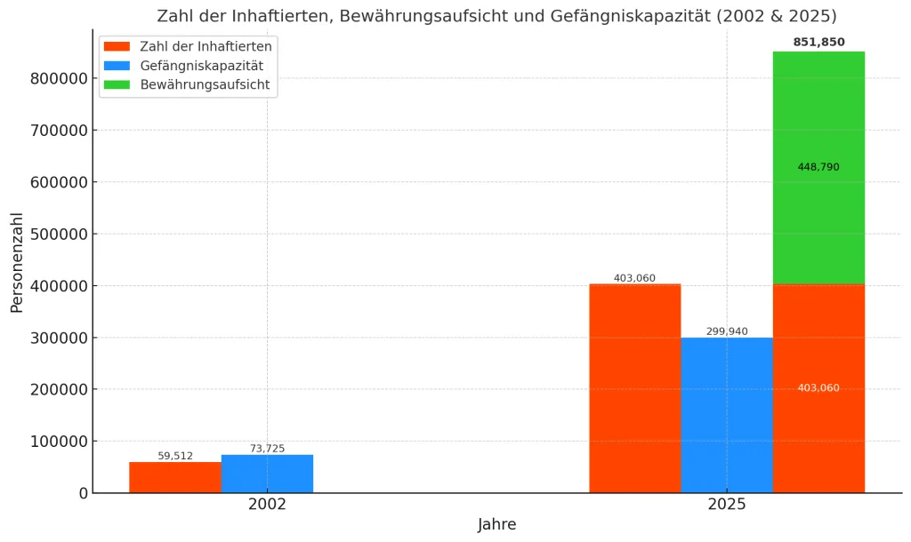
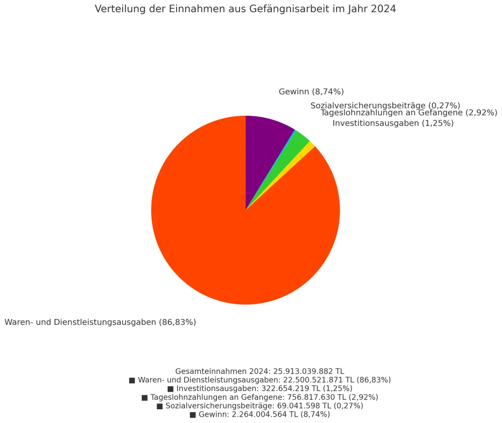
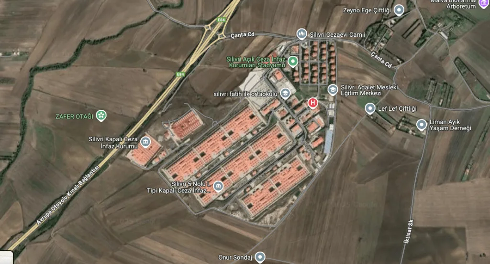

**Die Zahl der Inhaftierten übersteigt offiziell 400.000**

Dieser Text wurde ursprünglich am 15. April 2025 auf der Website von [Bianet](https://bianet.org/yazi/akp-kriminalizasyon-ve-kampus-hapishaneler-cumhuriyeti-306454) auf Türkisch veröffentlicht. Die vorliegende deutsche Übersetzung wurde mit Unterstützung von ChatGPT angefertigt.

Das Strafvollzugsregime in der Türkei hat sich in den letzten zwanzig Jahren nicht nur durch den Anstieg der Gefangenenzahlen gewandelt, sondern vor allem durch die ideologische Ausrichtung, die diesem Anstieg zugrunde liegt. Unter der Herrschaft der AKP sind Gefängnisse über ihre traditionelle Rolle als Instrumente der Strafjustiz hinausgewachsen und haben sich zu einem Mittel staatlicher Kontrolle und gesellschaftlicher Disziplinierung entwickelt. Diese Entwicklung, die in den 1970er Jahren begann, erreichte mit der Einführung der sogenannten F-Typ-Gefängnisse eine neue Phase und wurde unter der AKP-Regierung weiter ausgebaut – so weit, dass heute nahezu alle charakteristischen Merkmale dieses neuen Strafvollzugsregimes deutlich sichtbar geworden sind.[\[i\]](#_edn1)

**Explosion der Gefangenenzahlen: Von 50.000 auf über 400.000**

Im Jahr 2002, als die AKP an die Macht kam, gab es in der Türkei 524 Gefängnisse mit einer Gesamtkapazität von 73.725 Plätzen. Die Zahl der Inhaftierten belief sich im selben Jahr auf 59.512 – es gab also rund 15.000 freie Betten in den Anstalten. 23 Jahre später, im April 2025, existieren in der Türkei nur noch 395 Gefängnisse, deren Gesamtkapazität jedoch auf 299.940 gestiegen ist. Die Zahl der Inhaftierten liegt mittlerweile bei über 400.000 (am 7. April 2025 waren es genau 403.060). Trotz einer Verfünffachung der Kapazitäten sind über 100.000 Menschen gezwungen, unter unzumutbaren Bedingungen zu leben. Zählt man die Personen hinzu, die sich im Rahmen der seit 2005 bestehenden „Kontrollierten Freiheit“ (Denetimli Serbestlik) befinden, ergibt sich ein noch realistischeres Bild: Zum 31. März 2025 sind 448.790 Personen unter diesem Regime registriert.[\[ii\]](#_edn2) Damit liegt die Gesamtzahl der Inhaftierten, Verurteilten und unter Aufsicht stehenden Personen Anfang 2025 bei über 850.000. Dies stellt eines der deutlichsten Beispiele für die umfassende Kriminalisierung dar, die die AKP in ihren 23 Jahren an der Macht vorangetrieben hat. Die Zahl der Gefangenen ist um 577 Prozent gestiegen; unter Einbeziehung der unter Aufsicht stehenden Personen beläuft sich der Anstieg sogar auf 1.331 Prozent.

Die folgende Grafik verdeutlicht auf eindrückliche Weise die dramatischen Veränderungen bei der Zahl der Inhaftierten und der Gefängniskapazitäten in den Jahren 2002 bis 2025.

**Gefängnisarbeit: Unsichtbare Ausbeutung von Arbeitskraft**

Aus einer menschenrechtszentrierten Perspektive betrachtet, verdienen zwei Aspekte dieser Transformation besondere Aufmerksamkeit. Der erste betrifft die Tatsache, dass die AKP-Regierung Gefängnisse in Orte systematischer Ausbeutung von Häftlingsarbeit verwandelt hat. Im Jahr 2024 wurden in türkischen Gefängnissen insgesamt 58.193 Inhaftierte zur Arbeit herangezogen. Durch ihre Beschäftigung erzielte das Arbeitsbetriebssystem der Strafvollzugsanstalten (İşyurtları Kurumu) Einnahmen in Höhe 25.913.039.882 TL. Der Anteil dieses Betrags, der den Gefangenen als Tagelohn ausgezahlt wurde, belief sich lediglich auf 756.817.630 TL. Selbst wenn man die als Sozialversicherungsbeiträge eingezahlten 69.041.598 TL hinzurechnet, ergibt sich, dass lediglich 3,18 % der Einnahmen an die arbeitenden Häftlinge zurückflossen.[\[iii\]](#_edn3)

Gefängnisse sind unter der aktuellen Regierung zu bedeutenden Produktionsstätten und Schauplätzen massiver Ausbeutung von Arbeitskraft geworden. Da diese Problematik jedoch im Rahmen dieses Textes nur eine untergeordnete Rolle spielt, wollen wir uns nach dieser Feststellung dem zweiten zentralen Aspekt widmen.

**Ein neues Strafvollzugsregime: Isolation und „Campus-Strukturen“**

Im Jahr 2002, als die AKP an die Regierung kam, gab es in der Türkei 525 Gefängnisse mit einer Gesamtkapazität von 73.725 Plätzen. Bis März 2025 sank die Zahl der Anstalten auf 395 – also deutlich weniger –, während die Gesamtkapazität auf fast 300.000 anstieg. Diese Entwicklung ist vor allem darauf zurückzuführen, dass kleinere Bezirksgefängnisse mit niedriger Kapazität geschlossen und stattdessen neue, großflächige Haftanstalten eröffnet wurden, die überwiegend auf einem Zellenunterbringungssystem basieren.

**Jahr**

**Geschlossen**

**Eroffnet**

**2002**

15

5

**2003**

6

3

**2004**

61

2

**2005**

6

4

**2006**

20

7

**2007**

51

8

**2008**

16

13

**2009**

22

8

**2010**

6

7

**2011**

3

2

**2012**

8

14

**2013**

21

10

**2014**

22

14

**2015**

15

18

**2016**

13

38

**2017**

10

12

**2018**

7

15

**2019**

45

26

**2020**

11

23

**2021**

14

32

**2022**

6

22

**2023**

16

16

2024

4

8

2025

10

**GESAMT**

**408**

**307**

Wie die folgende Tabelle zeigt, wurden von den 395 existierenden Gefängnissen bis März 2025 insgesamt 307 nach dem Machtantritt der AKP im Jahr 2002 errichtet.[\[iv\]](#_edn4) Drei Hauptmerkmale dieser neuen Einrichtungen stechen hervor:

*   Sie verfügen im Vergleich zu älteren Gefängnissen über deutlich höhere Kapazitäten.
*   Der Großteil von ihnen wurde nach dem Zellenprinzip gebaut – das heißt, auf Einzelhaft ausgerichtet.
*   Viele dieser Anstalten wurden als Gefängniskomplexe außerhalb der Städte geplant, die mehrere Haftanstalten an einem Ort bündeln. Das Justizministerium bezeichnet sie offiziell als „Gefängniscampus“.

Die nachfolgende Tabelle zeigt die Verteilung der insgesamt 395 Gefängnisse nach Typen, Stand März 2025.[\[v\]](#_edn5)

**Typ**

**Anzahl**

**Kapazität**

**Bauzeit**

**A1**

2

24 - 70

1950er – 1960er

**A2**

1

45

1950er – 1960er

**A3**

4

60 - 72

1950er – 1960er

**B**

2

40 - 80

1950er – 1960er

**K1**

4

42 - 60

1970er – 1980er

**K2**

3

60 - 80

1970er – 1980er

**E**

33

319 - 1382

1960er – 1990er

**H**

5

316 - 1562

1980er – 1990er

**M**

18

262 - 1154

1980er – 1990er

**D**

1

694 - 1044

2003

**F**

14

368 - 532

2000 – 2007

**L**

36

1322 - 2796

ab 2005

**T**

82

200 - 1644

ab 2007

**R**

2

150 - 254

ab 2010

**Hochsicherheitsgefängnis**

22

487 - 514

ab 2016

**S**

7

552 - 732

ab 2020

**Y**

13

1135

ab 2021

**Geschlossener Vollzug**

16

70 - 800

**Offener Vollzug**

98

100 - 1920

**Jugenderziehungsheim**

4

37 - 150

**Jugendstrafvollzugsanstalt**

9

288 - 472

**Offene Frauenstrafvollzugsanstalt**

8

122 - 1260

**Geschlossene Frauenstrafvollzugsanstalt**

12

298 - 1451

**An geschlossenen Vollzug angegliederte Anstalt**

74

**An offenen Vollzug angegliederte Anstalt**

1

**R-Typ (angegliedert, geschlossen)**

1

**GESAMT**

472

Wie aus der Tabelle ersichtlich ist, gehören die in den letzten Jahren der AKP-Regierung errichteten neuen Gefängnistypen – Hochsicherheits-, S- und Y-Typ-Anstalten – allesamt zu den in der Gesetzgebung als „Hochsicherheits-Geschlossene Strafvollzugsanstalten“ definierten Einrichtungen. Es handelt sich dabei um zellenbasierte Gefängnisse, die auf Isolationshaft ausgelegt sind. Zählt man zu diesen auch das im Jahr 2003 eröffnete D-Typ-Gefängnis sowie die zwischen 2000 und 2007 errichteten F-Typ-Anstalten, so ergibt sich eine Gesamtzahl von 57 Isolationsgefängnissen mit einer aktuellen Gesamtkapazität von 36.721 Plätzen.

**Das autoritärer werdende Regime und unsere Freiheiten**

Diese zellenbasierten Gefängnisse sind laut geltender Gesetzgebung insbesondere für folgende Gruppen vorgesehen:

*   Personen, die wegen „organisierter Kriminalität“ oder „organisierter oppositioneller Tätigkeiten“ inhaftiert sind (einschließlich politischer Gefangener),
*   Gefangene mit lebenslanger Freiheitsstrafe ohne Aussicht auf Bewährung,
*   sogenannte „gefährliche Straftäter“.

Dass sämtliche in den letzten Jahren errichteten neuen Gefängnisse auf Einzelhaft ausgelegt sind, ist ein deutliches Indiz dafür, dass das Strafvollzugsregime gezielt als Repressionsinstrument gegenüber organisierter Opposition eingesetzt wird. Die Erhöhung der Gefangenenzahl von 50.000 auf über 400.000 sowie der Bau großflächiger Strafanstaltensiedlungen („Gefängnisstädte“) – die als Campus bezeichnet werden und Kapazitäten von über 10.000 Personen aufweisen – belegen die Dimension dieser Repressionsstrategie.

Die zunehmend autoritäre Ausrichtung des derzeitigen Regimes lässt sich sowohl als Ursache wie auch als Folge dieser Entwicklung lesen. Der Kurs des Strafvollzugs weist klar auf eine weitere Zuspitzung autoritärer Tendenzen hin – und es gibt derzeit keinerlei Anzeichen, die auf das Gegenteil hindeuten würden.

Die Gefängnispolitik des AKP-Regimes ist nicht bloß Ausdruck eines strafenden Denkens, sondern Teil einer umfassenden politischen und gesellschaftlichen Ordnungsstrategie. Über Gefängnisse nachzudenken heißt daher nicht nur, über Inhaftierte zu sprechen – sondern auch über die Grenzen unserer Freiheit.

_(Das sogenannte „Marmara Strafvollzugskomplex“, vormals bekannt als „Silivri“, umfasst heute insgesamt 11 Gefängnisse mit einer Gesamtkapazität von rund 20.000 Insassen. In fast jeder Provinz der Türkei wurde – wenn auch in kleinerem Maßstab – ein vergleichbarer „Strafvollzugscampus“ errichtet: ein Gefängnisdorf unter staatlicher Kontrolle.)[**\[vi\]**](#_edn6)_

* * *

[\[i\]](#_ednref1) Für eine detaillierte Analyse des Wandels im türkischen Strafvollzugssystem siehe:  
**„Kapatılmanın Patolojisi – Osmanlı’dan Günümüze Hapishanenin Tarihi” (Die Pathologie der Einschließung – Geschichte der Gefängnisse vom Osmanischen Reich bis heute)**, Kalkedon Verlag, Istanbul, Mai 2014.

[\[ii\]](#_ednref2) Die Daten stammen von der Website der Generaldirektion für Straf- und Untersuchungshaftanstalten (Ceza ve Tevkifevleri Genel Müdürlüğü): [https://cte.adalet.gov.tr/Home/BilgiDetay/22](https://cte.adalet.gov.tr/Home/BilgiDetay/22) **Zugriffsdatum:** 13. April 2025

[\[iii\]](#_ednref3) Die Daten stammen aus dem Tätigkeitsbericht 2024 des Arbeitsbetriebs der Strafvollzugs- und Untersuchungshaftanstalten (Ceza İnfaz Kurumları İle Tutukevleri İşyurtları Kurumu): [https://iydb.adalet.gov.tr/Home/BilgiDetay/6](https://iydb.adalet.gov.tr/Home/BilgiDetay/6) **Zugriffsdatum:** 13. April 2025

[\[iv\]](#_ednref4) Diese Tabelle wurde auf Basis der von der Generaldirektion für Straf- und Untersuchungshaftanstalten (Ceza ve Tevkifevleri Genel Müdürlüğü – CTE) veröffentlichten Daten erstellt:  
[https://cte.adalet.gov.tr/Home/SayfaDetay/cik-genel-bilgi](https://cte.adalet.gov.tr/Home/SayfaDetay/cik-genel-bilgi) **Zugriffsdatum:** 13. April 2025

[\[v\]](#_ednref5) Die ersten beiden Spalten dieser Tabelle basieren auf den Daten der Generaldirektion für Straf- und Untersuchungshaftanstalten (Ceza ve Tevkifevleri Genel Müdürlüğü – CTE), veröffentlicht am 10. April 2025 auf der offiziellen Website: [https://cte.adalet.gov.tr/Home/haritaliste](https://cte.adalet.gov.tr/Home/haritaliste) **Zugriffsdatum:** 13. April 2025

Da in der Tabelle auch Haftanstalten aufgeführt sind, die keine eigene Leitung haben und organisatorisch an andere Gefängnisse „angegliedert“ sind, wird die Gesamtzahl mit 472 angegeben. Zieht man die 76 angegliederten Anstalten ab, ergibt sich eine verbleibende Anzahl von 396 eigenständigen Gefängnissen.

Die letzten beiden Spalten der Tabelle wurden unter Rückgriff auf zahlreiche unterschiedliche Quellen zusammengestellt.

[\[vi\]](#_ednref6) Das Foto stammt aus Google Maps. **Zugriffsdatum:** 13. April 2025

📄 Dieser Artikel ist auch als PDF verfügbar:

[📥 _PDF-Version herunterladen_](/pdf/die-akp-und-der-strafvollzug-kriminalisierung-und-die-republik-der-gefangniscampus.pdf)

[📎 Die Originalversion dieses Artikels auf Türkisch finden Sie hier](/yazilar/akp-kriminalizasyon-ve-kampus-hapishaneler-cumhuriyeti/)
