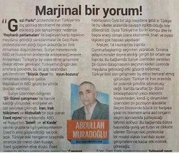
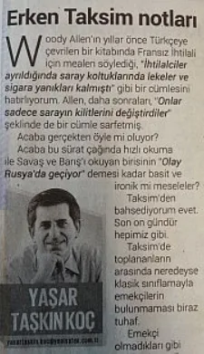
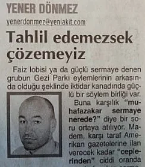
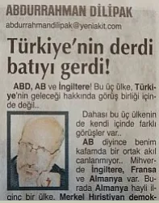
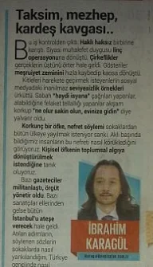

Akıldane Komplo Teorisyenlerinin Körlüğü

Ve “kökü dışarıda” söylemine “teorik” olarak açıklama getirmeye çalışan köşe yazarları.

[Bianet](https://m.bianet.org/biamag/siyaset/147600-akildane-komplo-teorisyenlerinin-korlugu) - [Mustafa Eren](https://m.bianet.org/yazar/mustafa-eren?sec=biamag) - 15 Haziran 2013

**Yeni Şafak ve Akit Gazetelerinin, Taksim Gezi Parkı İsyanındaki Tutumu -2**

Bir önceki yazımızda “yabancı parmağı”, “dış güçler” söylemlerinin polisin söylemleri dışında bir kaynağı olmadan, sorgulanmadan aktarıldığını örnekleriyle açıklamıştık. Bu yazımızda ise “kökü dışarıda” söylemine “teorik” olarak açıklama getirmeye çalışan köşe yazarlarını değerlendireceğiz.

**Abdullah Muradoğlu – Yeni Şafak 11 Haziran 2013**

Eğer Gezi Parkı protestolarının 'bölgesel oyun politikaları' üzerinde bir etki meydana getireceği düşünülmüş ise, amaç hasıl olana kadar gerilimin kontrollü şekilde bir süre daha devam edeceğini öngörebiliriz. Müslüman Ortadoğu'ya bir 'rol model' olarak sunulan Türkiye'yi dizginlemek isteyen güçler açısından, amacını taşan bu protestolar acaba bir imkan mı sundu diye düşünmeden edemiyor insan.

Bu yazarların önemli bir kısmı “Burada Gezi Parkı yok, burada hükümet karşıtlığı ya da siyasi muhalefet de yok. Burada başka bir şey var. Yeni yeni farkına vardığımız, Türkiye için, herkes için son derece tehlikeli başka şeyler var” diyerek açıklamaya başlıyorlar.

Bu köşe yazılardan örnekleri kutucuklar halinde yazımız içinde görebilmek mümkün. Bu alıntılara bakıldığında savundukları tespitleri iki başlık altında toparlayabilmek mümkündür:

1- Gezi Parkı eylemleri küresel bir komplonun parçasıdır. Türkiye’nin gelişmesini, bölgesel bir güç olmasını engellemek isteyenlerin planladığı eylemlerdir. Bu bir darbe senaryosudur.

2- İyi niyetlerle bu eylemlere katılan kişiler kandırılmışlardır. “Şiddete başvurmayan eylemcilerin masumiyeti üzerinden kurgulanan, Türkiye toplumunun bir kısmına isyana teşvik eden bir operasyon.” söz konusudur.

Bu düşünceleri savunan yazarların dayanakları neler diye bakıldığında dile getirdikleri bir kaç düşünceleri olduğu görülüyor:

1- Almanlar telaşlı çünkü Batı’nın özellikle 28 Şubat sürecindeki rolünün açığa çıkacağından endişeleniyorlar. Türkiye’deki Batı ajanları ve onların işbirlikçileri açığa çıkacak, bunu istemediklerinden böyle bir oyuna girişildi.

**Yaşar Taşkınkoç – Yeni Şafak 11 Haziran 2013**

Olaylar büyür ve genişlerken, hedef değiştirip özellikle Başbakan'a yöneldiğinde ise yeni bir grup ortaya çıkıyor.Bu eylemlerden bir hükümet darbesi çıkarmanın ya da en azından Başbakan'ı başarısız kılmak; olmadı daha etkisiz hale getirme peşindekiler üçüncü grubu oluşturuyor.Bu üçüncü grup içinde bu ülkede yaşayan özel ve kurumsal kimliklerle birlikte yabancı basın ile yabancı hükümet açıklamalarından da kolayca anlaşıldığına göre uluslararası bir koalisyon da var.

2- Batı medyası panik havası yayıyor. Türkiye’de bir iç savaş var gibi yayın yapıyorlar. Bu Batı’nın bu komplonun bir parçası olduğunu gösterir.

3- Yabancı insanlar “sokakları coşturuyor”, eylemlerde yabancılar da var. Eylemde yabancılar varsa bunlar olsa olsa ajan olabilir. Demek ki Batılı güçler bu komplonun içinde.

**Yener Dönmez – Yeni Akit 11 Haziran 2013**

Daha önce yazdım, Türkiye’nin içine sokulmak istendiği ve uluslararası boyutu olduğu açık olan süreçten çıkmanın yolu toplumun farklı kesimleri arasındaki bağları güçlendirmektir.Ortadoğu’ya askeri ya da siyasi olrak her müdahale ettiklerinde, ülkeler içindeki mezhepsel ve etnik fayları kırıp, daha küçük parçacıklara bölme yolunda çalıştı uluslararası güçler.  
Gezi Parkı sürecinde dünya medyasının ve hükümetlerinin verdikleri ilk tepki hayra alamet değildi.(...)Şuan Türkiye’ye yapılmak istenen “Arap Baharı” operasyonlarıyla bire bir aynı değil.  
Farklı yöntemler kullanılıyor.  
AK Parti’ye tepkili bir kitle olduğunu tespit etmişler ve bu kitlenin nasıl bir kitle olduğunu Ana Muhalefet partimizden de çok daha iyi çözmüşler.(…)Mesele park ya da çadırlarda sabahlayan kitleler meselesi değil.  
Bir operasyon yürütülüyor. Mesele bu…  
Olayı tahlil edemezsek, çözemeyiz.

Yazarların bu üç veri haricinde somut olarak söyledikleri bir şey var mı diye aradığınızda bulma imkanınız yok. Bu durumda bizim de şu tespiti yapmamızda bir sakınca yok sanırım:

Yukarıdaki aklın sahipleri, Gezi Parkı eylemlerini konjonktürden yola çıkarak mahkum ediyorlar.

Ülke gelişirken, sorunlar çözülürken Batılı güçler ve onun içerideki işbirlikçileri buna engel olmak istiyorlar tarzında konjonktürel bir açıklama getiriyorlar yaşananlara.

Bu aklın sahipleri, söz konusu olan Gezi Parkı isyanı değil hangi eylem olursa olsun bu akıl yürütme ile onu mahkum edebilirler.

Eylemin hangi gerekçe ile yapıldığı, eylemde hangi mücadale yöntemlerinin kullanıldığı, eyleme kimlerin katıldığı önemli değildir bu aklın sahipleri için. Ellerindeki, her eylemi açıklayabilecek, daha doğrusu mahkum edebilecek sihirli bir manipülasyon aracıdır.

Bu süreçte ne yaparsan yap bu Tayyip’i devirmek, ülkeyi engellemek içindir! Bu aklın sahiplerine “yaşam alanıma sahip çıkmaya çalışıyorum”, “gezi parkına avm yapılmasın istiyorum” demenin, oldukça somut taleplerden bahsetmenin de bir anlamı yoktur. Konuşmaya, anlaşmaya uzaktırlar çünkü onlar küresel hakikatin! farkına varmışlardır bir kere. Sen ne söylersen söyle fikri sabittirler, yaşananlara karşı kördürler.

Öylesine kördürler ki olayların polisin şiddetiyle, hükümetin uzlaşmaz tavrıyla büyüyüp yayıldığını görmezler bile (Aynı komplocu akla sahip olsak bu olayları böyle büyüttüğüne göre Tayyip/AKP uluslararası güçlerle birlikte Türkiye’nin gelişmesini engellemek istiyor dememiz gerek).

Öylesine kördürler ki, AKP’nin Türkiye’de yaşayan milyonlarca Alevi’yi hiçe sayarak üçüncü köprüye Yavuz Sultan Selim ismini koymasını es geçerek, “Batı ve işbirlikçileri Türkiye’de mezhep kavgasını kışkırtacak” diyebilmektedirler (Aynı komplocu akla sahip olsak bu işbirlikçinin Tayyip/AKP olduğunu söylememiz gerekirdi).

**Abdurrahman Dilipak – 11 Haziran 2013**

Türkiye bugüne kadar hep “oltaya takılmış bir balık”dı.. “Hasta Adam”dı.. “Sıçrama tahtası”, “ucuz asker deposu”, “fedailer mangası”, “saldırı üssü” gibi bir şeydi batılıların güzünde.. Sen misin havacılıkta batıya rekabet eden, hem de onların ürettiği uçakla. Ne demek ben otomobil de üretirim, uçak da, füze de üretim, uzay mekiği de.. Ne demek Montreux’u by-pass etmek.. Çok oluyorsunuz! 2023 ne demek. 100 yıllık Lozan’a dayalı örtülü vesayet dönemi bitiyor diye kendi başına işler çevirmeye kalkışmak.. İmzalanan imtiyaz belgeleri, taahhütlerin süresi bitiyor..  
“Terörü bitireni bitirirler” demediler mi size!  
Darbelerin, Mafianın, çetelerin, kayıtdışı ekonomi ve kayıtdışı siyaset odaklarının üzerine gitmek de ne oluyor. Beyaz Türkler yedirirler mi size.. Örtülü KİT’lerin üzerine nasıl gidersiniz. Faiz Lobisine nasıl meydan okursunuz, Borsa Spekülatörlerini nasıl hesaba katmazsınız! Siz kim oluyorsunuz ve bu gücü kimden alıyorsunuz! Siz batıya danışmadan nasıl bölge devletleri ile ekonomik, sosyal, kültürel ve siyasal ilişkiler geliştirmeye kalkarsınız!  
Sahi Türkiye’deki Alman Vakıfları, Türkiye’ye, dünyaya, el aleme akıl vereceklerine, önce kendi ülkelerindeki garipliklerin üzerine gitseler..

Öylesine kör ve aymazdırlar ki, şiddete başvurmayan, meşruluğu tartışma götürmeyen, masumiyetini kabul ettikleri bir eylem karşısında dahi “Şiddete başvurmayan eylemcilerin masumiyeti üzerinden kurgulanan, Türkiye toplumunun bir kısmına isyana teşvik eden bir operasyon” diyebilmektedirler.

Yani bu aklın sahipleri için, AKP karşısında masumane olsa dahi bir eyleme girişmemen gerek. Eğer girişirsen ne ajanlığın kalır ne işbirlikçiliğin ne de ülke karşıtlığın.

Uzun sözün kısası, bu aklın sahipleri bütün o afili, “derin” konjonktürel tahlillerinin ardına saklanarak diyorlar ki “AKP karşısında susacak, el pençe divan duracak, her yaptığını onaylayacaksın.”

Eğer ki yaptığınız bir gönüllü kölelik, çıkar birlikteliği değilse, ince hesaplarınız yoksa –ki o zaman ümitsiz vakasınız demektir- kafanızı kumdan çıkarın, körlemesine kapattığınız o gözlerinizi açın ve neler yaşanıyor bir bakın beyler. Ortaçağ döneminde atların ağzında kaç diş olduğu üzerine felsefi tartışmalar yürüten akıldanelerin akıl tutulmasını yaşıyorsunuz çünkü. (ME/HK)

**İbrahim Karagül  
**

**Yeni Şafak 2 Haziran 2013**  
Meselenin Gezi Parkı meselesi olmadığını görmüş olduk. Ağaç kesmekle, Topçu Kışlası'nı yeniden inşa etmekle, içine AVM yapıp yapmamakla alakası yokmuş.(…)Gerçekten iyi niyetle, bir takım kaygılarla hareket edenlere söyleyecek hiçbir şey yok. Onların duyarlılıkları, kaygıları, endişeleri dikkate alınmalı. Dikkate almak hepimizin boynumuzun borcudur.Ama bunların ötesinde bir şeyler var. Bu duyarlılıklar üzerinden bir şeyler servis ediliyor.(...)Birileri Türkiye'deki muhalefet kanalları üzerinden büyük hesaplar yapıyor gibi. CHP'yi, Taksim'de toplananları da aşan bir hesap var gibi. Hatta Erdoğan düşmanlığının da ötesinde bir Türkiye tasavvuru var gibi.  
  
**Yeni Şafak 4 Haziran 2013**  
Burada Gezi Parkı yok, burada hükümet karşıtlığı ya da siyasi muhalefet de yok.Burada başka bir şey var. Yeni yeni farkına vardığımız, Türkiye için, herkes için son derece tehlikeli başka şeyler var.Panik havası yayanlara bakıyorsunuz, büyük çoğunluğu yabancı. Türkiye'de adeta 'iç savaş var' görüntülerini dünyaya servis ediyorlar. Kimisi yabancı gazeteci, kimisi yabancı istihbarat mensubu, kimisi bilmem hangi ülkenin hangi kuruluşunun temsilcisi.Fransa'dan, İngiltere'den, Almanya'dan adamlar, Türkiye'de sokakları coşturuyor, insanları isyana çağırıyor. Araçların üzerine çıkıp 'on kişi, yirmi kişi öldü' anonsları yaptırıyor.Bazı üniversiteler, sermaye grupları, meslek grupları bunlarla aynı paralelde, planlanmış bir programa göre, pozisyon alıyor.Daha önce Türkiye'yi yönetmeye alışkın olan, iç siyaseti yıllarca dizayn eden derin yapılar yeniden ortaya çıkıyor, suskunluklarını bozuyor, sokakları, örgütleri hareket ederek yeni bir Türkiye biçimlendirmeye çalışıyor.Bu güçlerle ortak hareket eden, bu ülkede darbeler planlayan Avrupalı ve Atlantik ötesi yapılar yeniden ortaklık görüntüsü veriyor. Türkiye'de ne planlanıyorsa ortak planlandığını bir kez daha görüyoruz.(...)Ama madem barış süreci tahminlerden daha büyük destek aldı o zaman başka kırılma alanlarına odaklandılar. Etnik çatışmayı yeniden çıkaramazlarsa mezhep, kimlik üzerinden Türkiye'nin zaaf noktalarını kaşımaya, hareket etmeye çalışacaklar.Taksim'de başlayıp şekil değiştirerek devam eden süreç buraya doğru gidiyor. Bu ülkenin insanlarını, sokaklarını yeniden bölmeye, ayrıştırmaya, çatıştırmaya yönelik projeler uygulanıyor. Her geçen gün bu çalışmaların olgunlaştırıldığını görüyoruz.Bu işin öyle birkaç günlük olmadığını, uzun süredir planlandığını, bazı Avrupa ülkelerinin bütün unsurlarıyla işin içinde olduğunu, İstanbul'dan Türkiye'nin geneline yönelen bir proje uygulandığını görüyoruz.En çok korktuğum şey, bence bütün ülke bundan korkmalı; birileri bu Ortadoğu'daki mezhep krizini Türkiye'ye çağırıyor. O birilerinin birkaç göndür devam eden eylemleri, hızla o tarafa yönlendireceğini, bu ülkedeki Aleviler ve Sünniler arasında kardeş kavgası çıkarmayı deneyeceğini göreceğiz. Yine o birilerinin belki birkaç gün sonra, Alevi kardeşlerimizi isyana çağıracak kadar arsızlaşacağını da.Bunlar korkutucu, bunlar hükümete yönelik tepkiyi de aşan hesaplar. Belki bugün abartılı görünebilir ama işin arkasındaki güçlere bakınca neler olabileceğini ya da ne tür senaryoların deneneceğini öngörmek zor değil.  
  
**Yeni Şafak 6 Haziran 2013**  
Artık olay, Gezi Parkı'nı da, siyasi muhalefeti de, AK Parti ve Tayyip Erdoğan karşıtlığını da aştı. Bir tür toplumsal sarsıntı, bir tür güç kayması yaşatılmak isteniyor.Böyle olmasaydı ben de Taksim'e gitmek isterdim. Ama öyle değil.. Kirli bir operasyonun tam ortasındayız. Şiddete başvurmayan eylemcilerin masumiyeti üzerinden kurgulanan, Türkiye toplumunun bir kısmına isyana teşvik eden bir operasyon.  
  
**Yeni Şafak 8 Haziran 2013**   
(...)Bu bir 'darbe' senaryosudur ve tarihe öyle geçecektir. İçerideki bazı güç odakları ve sermaye gruplarıyla dışarıdaki muadillerin ortak yürüttüğü bir Türkiye tasarımı. Tasarımın merkezinde sosyal tepkiyle iktidar devirme, Erdoğan'ı siyasetten uzaklaştırma, Türkiye'yi küçültme amacı var.Hiçbir iktidar bu durumda 'evet haklısınız' diyerek çekilmez. Millete gider. Millet karar verir. Ama millet, sanılanın, alabildiğine güçlü propagandanın tersine, bu oyunu kabullenmedi, kabul etmedi.Bu çıkışa bel bağlayan, bundan iktidar devşirmek isteyen, bundan siyasi gelecek hesabı kuran, bundan ekonomik iktidar kazanacağını sanan kaybeder. Benden söylemesi…Çünkü millet oyunu gördü. Türkiye bu oyunu bozar.
