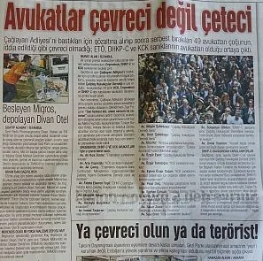
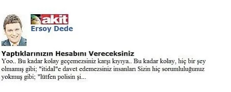

Hedef Göstermenin Üç Adımı

İsimler, resimler yayınlanıyorsa bunu “Bu gazeteler kitlelerini bilgilendiriyor” diyerek geçiştirmek mümkün müdür? Habercilik ile hedef göstermek arasındaki çizgi sanıldığı kadar kalın mıdır ve ne zaman aşılmış olur?

[Bianet](https://m.bianet.org/bianet/siyaset/148100-hedef-gostermenin-uc-adimi) - [Mustafa Eren](https://m.bianet.org/yazar/mustafa-eren?sec=bianet) - 01 Temmuz 2013

**Yeni Şafak ve Akit Gazetelerinin, Taksim Gezi Parkı İsyanındaki Tutumu -4**

Hrant Dink’i hedef gösteren yazılar hatırdadır. İsmi, resmi, “Türklüğe hakaret ettiği” iddiasıyla manşetlere taşınmış, hakkında davalar açılmış sonrasında tehdit mektupları almış ve katledilmişti. Habercilik ile hedef göstermek arasındaki çizginin nasıl aşıldığının tipik örneklerinden birini oluşturmaktaydı Hrant Dink’e ilişkin yazılanlar. Bu çizgiyi Taksim Gezi Parkı isyanı sonrasında da açıktan görebilmek mümkün.

Yazı dizimizin ilk yazısında Yeni Şafak ve Akit gazetelerinin Gezi Parkı isyanına ilişkin haberlerini aktarmış ve şöyle bir değerlendirmede bulunmuştuk: “Yazılanlar açıkça göstermektedir ki bu gazeteler polis tarafından kendilerine servis edilen haberleri hiçbir süzgeçten geçirmeden, gazetecilik etiği açısından değerlendirmeden haber yapmaktadırlar.” Bugün ise “polise iliştirilmiş” gazeteciliğin yanı sıra insanları, kurumları manşete taşıyan, isimlerini gazetelerde yayınlayan gazetecilik anlayışı üzerinde duracağız.

Söz konusu olan isimlerin yayınlanması, insanların ve kurumların afişe edilmesi olduğunda yapılan haberlerin nasıl değerlendirileceği önem taşıyor. Eğer isimler, resimler yayınlanıyorsa bunu “Bu gazeteler kitlelerini bilgilendiriyor” diyerek geçiştirmek mümkün müdür? Habercilik ile hedef göstermek arasındaki çizgi sanıldığı kadar kalın mıdır ve ne zaman aşılmış olur? Bu yazı içerisinde, bu iki gazetenin haberlerinden yola çıkarak işte bu sorulara cevap arayacağız.

Sağdaki tam sayfa haber 18 Haziran günü Akit’te yer alıyordu.

“İşte Çapulculara Destek Verenler” başlığıyla yayınlanan bu haberin spotunda ise şu sözler yer alıyor: “İstanbul Cumhuriyet Başsavcılığı’nın; halkı isyana teşvik eden ve provokatörlere destek olan, toplumu tahrik edici tweet’ler atan açıklamaları ve iletileri takibe aldığı, önümüzdeki günlerde çok sayıda tanınmış siyasetçi, sanatçı ve işadamının ifadesini alacağı öğrenildi. Sosyal paylaşım sitelerinin bazı asılsız haberler ve fotoğraflar yayınlayan kişilerin IP numarasından tespit edilip, söz konusu kişilerin çağrılarak ifadelerinin alınacağı belirtiliyor.”

Bu habere bakıldığında Gezi Parkı’nda yaşanan olayların “provokasyon”, “tahrik” gibi olumsuz çağrışımlarla anıldığı görülüyor. Böylece Gezi Parkı isyanı, kriminalize ediliyor, bir suç haline getiriliyor. Bu eylemler bir kere suç haline getirildikten sonra, eylemlerde yer alan, eylemlere destek olan kişileri, kurumları “provokatör”, “tahrikçi” olarak etiketlemek, damgalamak da mümkün hale geliyor.

Haber içinde alt başlıklar da kullanılmış: “işadamları ve bankacılar”, “işte o siyasiler”, “işte o sanatçılar”, “eyleme katılan diğer sanatçılar”, “işte o gazeteciler”. Bu alt başlıklar içinde onlarca isim yayınlanmış. Bu isimlerin bazılarının yanında parantez içinde “eylemlere katılıyor”, “eylemlere katıldı” ibarelerine de yer verilmiş. Yazılanlardan birkaç örnek verecek olursak:

“Boyner Yönetim Kurulu Başkanı Cem Boyner: Taksim Gezi Parkı’ndaki eylemlere katıldı ve ‘Ne Sağcıyım Ne Solcu Çapulcuyum Çapulcu…’ dövizini taşıdı”

“Olgun Şimşek (Eylemlere katıldı) Mart ayında Kaş’ta yolda yürürken düşüp ayağını kırdı buna rağmen Taksim’deydi. Koltuk değnekleriyle geldiği alandan uzun süre ayrılmadı”

“Birgün Gazetesi yazarı Ece Temelkuran: Twitter’dan paylaştığı iletide yaşanan olayları dünya kamuoyuna duyurulması açısından takipçilerine iletilerini İngilizce yazmalarını önerdi ve ‘Arkadaşlar, lütfen elinizden geldiğince İngilizce yazın. Yabancı gazeteciler de olayları buradan takip ediyor. Anlamaları lazım detayları’ ifadelerini kullandı”

Bu haberde kullanılan taktik açıktır: Eylemi kriminalize et, eylemci doğrudan kriminalize olur. İlk adımda Gezi eylemleri “provokasyon”, “dış güçlerin kışkırtması”, “ajan faaliyeti” olarak nitelendiriliyor ve bu eylemlere destek olanlar doğrudan, subjektif olarak olmasa dahi objektif olarak provokatör, dış güçlerin uzantısı, ajan haline geliyorlar. Ancak bu sadece ilk adım. Bunun bir adım ötesinde ise bu eylemlere katılan, destek veren kişilerin objektif olarak ajan, provokatör olmaları yetmiyor ve subjektif olarak da ajan ve provokatör ilan edilmeleri gerekiyor. Yeni Şafak ve Akit gazetelerinden alınan aşağıdaki haberler bu ikinci adımın örnekleridir.

Eylemi kiriminalize, eylemciyi suçlu ilan ettikten sonra üçüncü adıma geliyor sıra. Bu adımı “Nerde bu devlet, nerde bu millet” adımı olarak görebiliriz. Genellikle örtük olarak, zaman zaman da açıktan, birilerinin bu “suçlular”ı, bu “hainler”i, bu “vatan millet düşmanları”nı durdurması, onlara haddini bildirmesi çağrısı yapılır.

Akit gazetesine ait bu köşe yazılarındansağdaki 12 Haziran soldaki 5 Haziran tarihlerine ait. Bu köşe yazılarında olduğu gibi “Bunlardan hesap sorulmadıkça ülkeye huzur gelmez” başlığı atıldıktan sonra, ilk köşe yazısında olduğu gibi bu çağrıyı sadece “imamlar, avukatlar, polisler, savcılar, hakimler” duymaz, “hesap sorma” işini kendisine görev addedenler de çıkar. Habercilik ile hedef gösterme arasındaki eşiğin belirsizleştirilerek aşıldığı noktaya da varılmış olur böylece. (AE/HK)

Hedef Göstermede İkinci Adım İçin Bir Örnek

Aşağıdaki haber de ikinci adımın önemli örneklerinden biri olarak görülebilir. 16 Haziran tarihli Akit gazetesinin hedefinde bu sefer avukatlar var.  “Avukatlar Çevreci Değil Çeteci” başlıklı bu haber, “Çağlayan Adliyesi’ni bastıkları için gözaltına alınıp sonra serbest bırakılan 49 avukattan çoğunun iddia edildiği gibi çevreci olmadığı; ETÖ, DHKP-C ve KCK sanıklarının avukatları olduğu ortaya çıktı” spotuyla devam ediyor. Yazı içerisinde ise “49 avukattan büyük bölümü, yasadışı örgüt ile bağlantılı olduğu tespit edilen Çağdaş Hukukçular Derneğine üye olduğu” sözleriyle ÇHD’nin yasadışı örgüt ile bağlantılı olduğu iddiayı bile aşan bir düzeyde öne sürülüyor. Yazının devamında ise 20 avukatın isimleri tek tek sayılıyor ve isimlerinin yanına “Ergenekon sanıklarının avukatı”, “KCK sanıklarının avukatı”, “Çağdaş Hukukçular Derneği üyesi”, “DHKP-Ç davasına konu Çağdaş Hukukçular Derneğine mensup. Terör örgütü üyesi iddiasıyla yargılana sanıkların avukatı.” benzeri açıklamalar ekleniyor.Bu haberden anlaşılıyor ki Akit gazetesi için bir davanın avukatı olmakla sanığı olmak arasında bir ayrım yoktur.  Akit, bu anlayışla kaleme aldığı yazısında avukatları isim isim yayınlamaktan ve onları “çeteci” başlığıyla sunmaktan kaçınmamıştır.[\[1\]](https://m.bianet.org/bianet/siyaset/148100-hedef-gostermenin-uc-adimi#_ftn1)

Sosyal Linç

Akit gazetesinin köşe yazarlarından Ersoy Dede’nin 4 Haziran tarihli köşe yazısı “Yaptıklarınızın Hesabını Vereceksiniz” başlığını taşıyordu. Yazıda başbakan başta olmak üzere hükümet ve devlet adına konuşan herkesin dile getirdiği “yaktılar yıktılar”, “camiye ayakkabılarıyla girdiler” benzeri iddialar sıralanıyor. Camide içki içtiler iddiası ise Ersoy Dede’nin düş gücüyle daha da ileri taşınıyor: “Hele iğrenç ayaklarınızla kirlettiğiniz Dolmabahçe Camii için hiç affetmeyeceğim sizi.. Saygısızca ayakkabılarınızla girdiğiniz o camide değerlerimizi hiçe sayıp içip içip bira şişelerini alnımızı sürdüğümüz seccadeye fırlatmanızın hesabını vereceksiniz.” Caminin o günkü görüntüleri artık internette herkesin görebileceği şekilde dolaşırken, sadece nereden ve nasıl geldiği belli olmayan, caminin penceresinin önünde bulunan ezilmiş bir bira kutusundan yola çıkılarak yazılan bu satırlar provokasyona basit ve tipik bir örnek oluşturmaktadır. Tüm bu provokatif söylemin sonunda ise “yargılanacaksınız, hesap vereceksiniz” diyor Ersoy Dede. Ancak çağrısı yargı önünde hesap vermekle de sınırlı kalmıyor. 11 Haziran tarihli köşe yazısında “Bu Sanatçı Takımını Tanıyalım” başlığını atıyor ve 4 Haziran tarihli köşe yazısına atıfla şöyle devam ediyor:“Vakit deşifre vakti dostlar.. ‘Deşifre edince ne olacak?’ Haa. Önemli soru bu işte.. Geçenlerde yazdım ya; ‘yargılanacaksınız, bu işten yırtamayacaksınız’ diye.. Sosyal medyada, sözlüklerde orada-burada saydırıyorlar bana.. Niye? Çünkü yargılanacakları gerçeğiyle tanıştırdım onları.. Şimdi bir başka gerçekle daha tanıştıracağım. Hem onları hem de meselenin farkında olmayan bazı Belediye Başkanı ya da sivil toplum örgütü temsilcilerini..”Yazısının sonrasında ise sivil toplum örgütlerine ve belediye başkanlarına “şu isimleri bir not edelim” dedikten sonra “Konserlerine gitmek yok, festivallere davet etmek yok, kasetlerini almak yok.” diye devam ediyor. Bu söylem, ne Yeni Şafak’ta ne de Akit’te istisna değil. Bir tarama yapılsa benzer içerikte onlarca yazı ile karşılaşılabilir. Yapılan fiziksel değil belki ama sosyal linç çağrısıdır. Onlar değil mi ki devlet-i aliye karşı çıkmışlardır, hesap vermeli, heder olmalıdırlar.

* * *

_[\[1\]](https://m.bianet.org/bianet/siyaset/148100-hedef-gostermenin-uc-adimi#_ftnref1) 12 Haziran tarihli Akit’te ise “Avukat Kılıklı Eşkiyalar Protesto Peşinde” başlıklı bir haber yer almaktadır._

**Gezi Direnişi ve Medya Yazı Dizisi**

*   [Akıldane Komplo Teorisyenlerinin Körlüğü](http://www.bianet.org/biamag/siyaset/147600-akildane-komplo-teorisyenlerinin-korlugu) \[15 Haziran 2013\]
*   [“Kökü Dışarıda”nın Yeni Versiyonu “Yabancı Parmağı”](http://www.bianet.org/bianet/siyaset/147556-koku-disarida-nin-yeni-versiyonu-yabanci-parmagi) \[14 Haziran 2013\]
*   [Provokatif Haberler: “Hedef Miraç Gecesi”, “Camiye Saldırdılar”](http://www.bianet.org/bianet/siyaset/147675-provokatif-haberler-hedef-mirac-gecesi-camiye-saldirdilar)\[17 Haziran 2013\]
