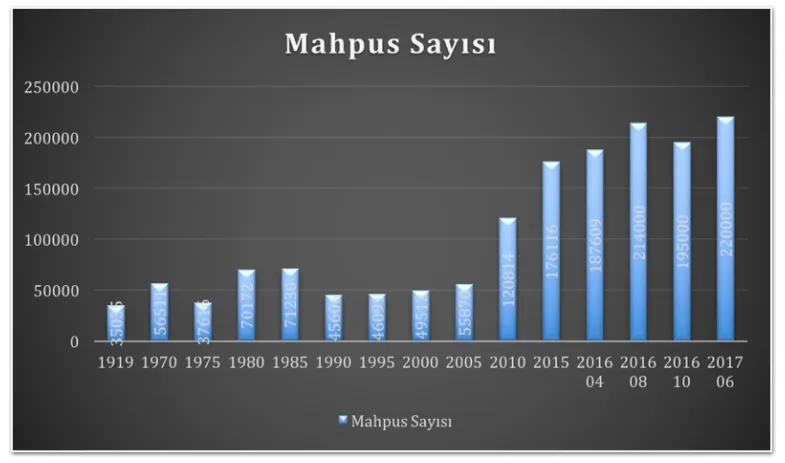
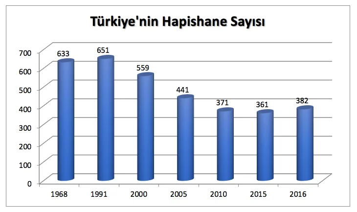
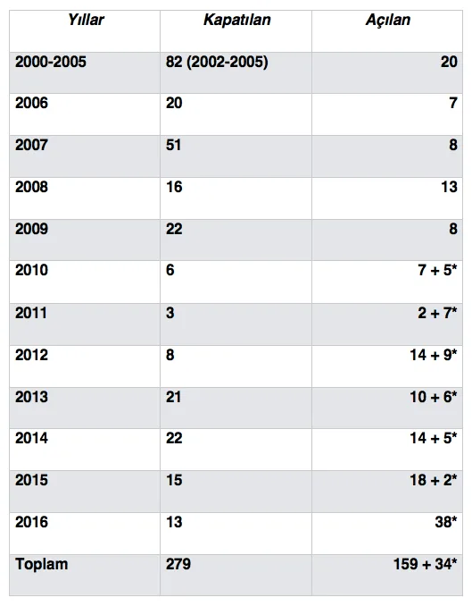
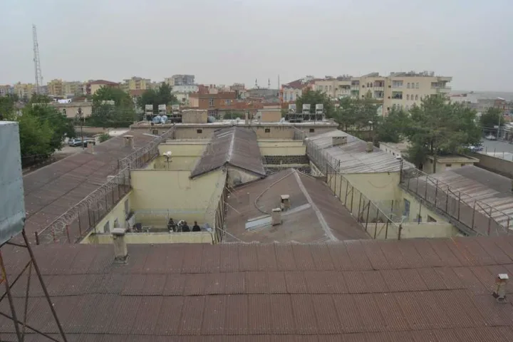
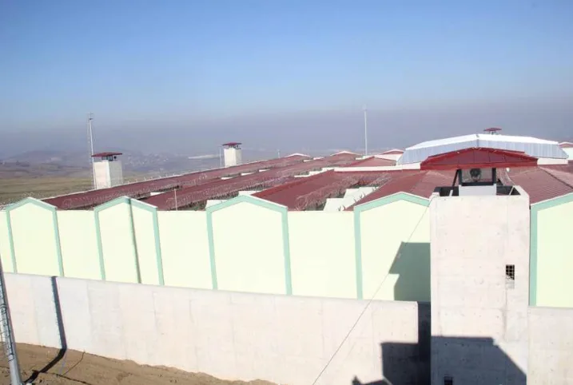
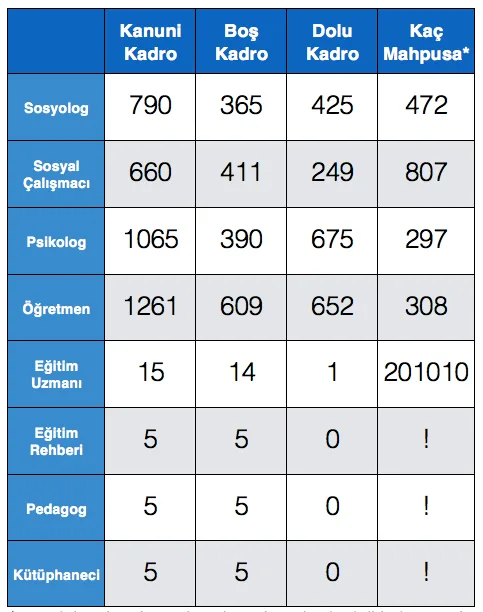
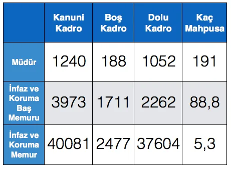

“Kaza”dan “Kampüs”e Türkiye’nin Ceza İnfaz Sistemi

Türkiye’nin mahpus sayısı son 10 yılda düzenli bir şekilde artış gösteriyor. Cumhuriyet tarihinden itibaren 50 bin civarında seyreden mahpus sayısı 2016 yılı sonuna gelindiğinde 201 bine ulaşmıştı. Haziran 2017 tarihinde ise 220 bini aştı.

Türkiye’nin mahpus sayısı son 10 yılda düzenli bir şekilde artış gösteriyor. Cumhuriyet tarihinden itibaren 50 bin civarında seyreden mahpus sayısı 2016 yılı sonuna gelindiğinde 201 bine ulaşmıştı. Haziran 2017 tarihinde ise 220 bini aştı.

Bu rakamlara göre, Türkiye’de 2000-2015 yılları arasında yaşanan artış yüzde 226,2’dır. Bu rakamları ancak dünyada mahpus nüfusunda yaşanan değişimle karşılaştırdığımızda anlamlı bir değerlendirme yapabilmek mümkün olacaktır.

2000-2015 yılları arasında dünyada nüfus yüzde 18,2 artarken mahpus nüfusu genel nüfus artışının sadece biraz üzerine çıkmış ve yüzde 19,5’luk bir artış gerçekleşmiştir. Avrupa’da ise yüzde 3,3’lük nüfus artışına rağmen mahpus nüfusunun yüzde 21,3 azaldığı görülmektedir. Türkiye, mahpus nüfusunun artışında dünya ortalamasının oldukça üzerinde, Avrupa’nın ise tersi yönde bir sürecin içerisindedir son 10 yıldır.

Türkiye’nin 1970’lerde içerisine girdiği ve 2000 sonrası daha belirgin olarak kendisini gösteren yeni ceza infaz sürecini daha iyi anlayabilmek için mahpus sayısının artışına eşlik eden mimari dönüşüm de dikkat çekmek gerekmektedir. 1990’larda 650 civarında olan hapishane sayısı 2016 yılı sonunda 382’ye inmişti. Ancak bu rakamın yanıltıcı olmaması adına 2016 yılında var olan 382 hapishanenin (bilinen rakamlarla) 159’unun 2000 sonrası inşa edilen hapishaneler olduğunu ve 34’ünün de “oda tipi” olarak yeniden restore edildiğini söylemek gerekiyor.

\*Restore edilen hapishanelerin sayısı

Bu mimari dönüşümün vurgu yapılması gereken yönünü kapatılan hapishanelerin küçük kapasiteli kaza hapishaneleri olması yeni açılanların ise büyük kapasiteli ve hatta “kampüs tipi” olarak adlandırılan yerler olması oluşturuyor. Bu dönüşüm insan hakları açısından önemlidir. Önemlidir çünkü kaza hapishaneleri, kanunlar tarafından suç addedilen fiilin failinin, yani mahkemelerin hakkında hapis cezası verdiği kişilerin kendi ilçelerinde hapis yatabilmesine olanak sağlıyordu. Bu sayede mahpus ailesinden ve sosyal çevresinden kopmadan hapiste tutulabiliyor, mahpusun aynı ilçede olan ailesi ve avukatı kendisini fazladan bir zaman ve maddi imkan ayırmadan ziyaret edebiliyordu (başka ildeki yakınlarını veya müvekkilini ziyaret etmek hem zaman hem de maliyet arttıran bir durum yaratmaktadır. Mesafe arttıkça zaman ve maliyet de artmaktadır). Kaza hapishanelerinin bir diğer etkisi ise, kapatılmanın, Stanford Hapishane Deneyi (“Zimbardo Deneyi” olarak da bilinir) ile ortaya konulan şiddet ortaya çıkaran yanını zayıflatması oluşturmaktadır.[\[1\]](#_ftn1) Mahpusun da çalışanın da aynı ilçede yaşadığı ve birbirlerini sadece “infaz koruma memuru-mahpus” ikilemi içerisinde değil de komşu, okuldan tanıdık vb. farklı roller içerisinde tanıma, bilme durumu hapishanelerin şiddet ortaya çıkaran özelliğini dizginlemeye yol açmaktadır. Gündelik yaşam içerisinde tanıdığın, bildiğin birini “insan olanın dışına atmak”, “suçlu” olarak kodlanıp karşına getirilen ve tanımadığın birini “insan olanın dışına atmak” kadar, hızlı ve kolay olmamaktadır.

2016 yılında kapatılan Siverek A3 Tipi Ceza İnfaz Kurumu. Fotoğrafta da görülebileceği gibi kapatılan hapishaneler şehrin içindedir, mahpus sokaktan geçen arabanın, çevredeki okul çocuklarının sesini duyabilmekte yani “dışarıda” akıp giden hayatın sesini duyabilmektedir.

2016 yılında açılan Samsun Ceza İnfaz Kurumu. Yeni hapishaneler, şehrin tamamen dışında, şehrin yaşantısından izole, özel araç olmadan ziyaretin zor olduğu yerler olarak tasarlanmış.

**“Islah” iddiası ve sosyal görevliler…**

“Ülkemizde de 1940'lı yıllardan sonra suçlunun tecridi yoluyla toplumun korunmasını hedefleyen infaz rejimleri terk edilmiştir. Bunun yerine çeşitli tretman modelleri konularak suçlunun ıslahı yoluyla tahliye sonrasına hazırlanmasını amaçlayan infaz rejimleri uygulanmaya başlamıştır.” Bu alıntı, Ceza ve Tevkifevleri Genel Müdürlüğü’nün 2016 Yılı Faaliyet Raporu’ndan alınmıştır. Hem burada hem de ilgili yasalarda mahpusların “iyileştirilmesi”, “ıslahı”, “topluma kazandırılması” vb. hapis cezasının amaçları arasında gösterilmektedir.

Kampüs tipi hapishanelerin bir diğer olumsuz yanını da “ıslah” iddiasıyla bağdaşmayan kurgusu oluşturmaktadır.[\[2\]](#_ftn1) Mahpusu şehrin dışında inşa edilmiş, sosyal yaşamdan izole, ziyaret etmenin zorlaştırıldığı, yüksek beton duvarlarla çevrili mekanlara kapattıktan sonra spor salonu, konferans salonu, kütüphane, atölye benzeri imkanlar sunduğunu söyleyip “sosyalleştirmeye” çalışmak otobanların kenarlarındaki doğal çim örtünün üzerine beton döküp sonra onların üzerine yeniden çim döşemeye benzer bir durum oluşturmaktadır. Kaldı ki biraz daha yakından bakıldığında mimari düzenlemenin yanı sıra personel dağılımının da “ıslah” iddiasına denk düşmediği görülmektedir.

\*Buradaki rakamlar sadece hapishanelerde değil, denetimli serbestlik müdürlüklerinde görev yapan personeli de kapsamaktadır. Dolayısıyla bu psikolog, sosyolog vb. başına düşen mahpus sayısı aslında daha da fazladır.

Bu iki tablo dikkate alındığında hapishanelerin sadece “güvenlik” kaygısıyla ele alındığı ve mahpusların sosyal görevlilerle nadiren karşılaşıp sadece “infaz koruma” memurlarıyla yüz yüze olduğu görülmektedir. 297 mahpusa bir psikolog, 807 mahpusa bir sosyal çalışmacı düşüyorsa, aslında 15 eğitim uzmanı kadrosu varken sadece bir eğitim uzmanı istihdam edilmişse, kadroları olmasına rağmen hiç eğitim rehberi, pedagog ve kütüphaneci yoksa burada “istihdam” iddiasının altının boş olduğunu söylemek mümkündür.

**Sonuç olarak…**

Mahpus sayısının artışı ve her yıl yeni ve mimarisinin yukarıda saydığımız gerekçelerle insan hakları açısından kaygı verici görülebileceği hapishaneler inşa edilmesi gösteriyor ki Türkiye devleti hapsetmenin temel ceza infaz yöntemi olarak kalmasında ısrarcıdır. Tüm dünyada “hapsetmeye alternatif yöntemler” tartışılır ve özellikle de Avrupa özgülünde mahpus sayısı azalırken, bazı ülkeler mahpus sayıları azaldığı için hapishaneleri kapatırken Türkiye’nin içerisinde bulunduğu “ceza infaz” süreci kaygı vericidir.

Bu gidişata dikkat çekmek ve olası alternatifleri dile getirmek demokrasinin gereği ve tüm insan hakları savunucularının görevidir.

* * *

[\[1\]](#_ftnref1) “Islah” iddiası başlı başına tartışmalı bir iddiadır ve üzerinde ayrıca durulmalıdır. “Suç” ve “suçlu” kodlamalarının toplumun farklı kesimleri tarafından tartışmalı olarak ele alındığı ve adli sisteme olan inancın zayıf olduğu durumlarda bu kodlamalardan yola çıkan “ıslah” iddiaları da tartışmalı hale gelmektedir (Bu konu için bakınız: Mustafa Eren, Kapatılmanın Patolojisi, Kalkedon Yayıncılık, İstanbul 2014, syf 264-273).

[\[2\]](#_ftnref1) Hapishaneler ve şiddet konusu için bakınız: Mustafa Eren, Kapatılmanın Patolojisi, Kalkedon Yayıncılık, İstanbul 2014
