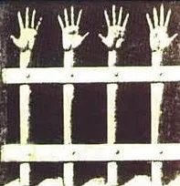

Hiç kimseyle ilişki kuramayan, konuşamayan, duyamayan, dokunamayan kişi, başkasının yokluğunda kendisine yönelir. İnsanı sabitleyebilirsiniz ancak beyin çalışmaya, düşünmeye devam edecektir ve ürettikleri de her zaman için kontrolünüzde olmayacak ve zamanla tamamen kontrolünüzden çıkabilecektir.

Bianet - [Mustafa Eren](https://m.bianet.org/yazar/mustafa-eren?sec=biamag) - 30 Haziran 2012

Diyelim ki aşık oldunuz. Nasıl anlatabilirsiniz? "Aşk"ı internette aratın, karşınıza birçok tanım veya anlatım çıkacaktır. Herkes kendi deneyimlerinden yola çıkarak tarif etmeye çalışacaktır aşkı. "Ayakların yerden kesilir", "Ondan başkasını göremez, düşünemez olursun", "Yemeden içmeden kesilirsin", "Dağları deler, çöllere düşersin", "Seversin, kavuşamazsın aşk olur" ... "Aşkın kimyasal temeline" dair bilgi ya da şemalar dahi bulmak \[1\]mümkün internette.

TDK sözlüğünde "Aşırı sevgi ve bağlılık duygusu, sevi, amor" olarak açıklanan, kimyasal semptomlarından yola çıkılarak anlatılmaya çalışılan aşk, aşık olan birinin içinde bulunduğu durumu, duygularını, "aşk hali"ni anlatabilir mi? Kör birinin fili tarif etmesinin bile ötesinde değil midir bu durum.

Ya da yükseklik korkunuz var diyelim. Bunu yüksekten korkmayan birine nasıl anlatır ya da açıklayabilirsiniz. Eğer o kişi yüksekten korkmuyorsa, bunu ona anlatabilmenizin tek yolu, onun korkuları üzerinden anlatmaya çalışmak olacaktır. Yoksa o duygu, o korku, nasıl dile getirilebilir?

Peki ya karşınızdaki kişinin hiç deneyimlemediği, bir benzerini dahi yaşamadığı bir şeyi nasıl anlatırsınız?

Anlatmakta zorlandığınız ve sonunda anlatmaktan vazgeçtiğiniz durumlar olmadı mı hiç?

Lacan, "gerçek" (le reel) terimiyle ifade eder, simgeselleştirilmesi mümkün olmayanı. Burada kast edilen "gerçeklik" anlamında "gerçek" değildir. Freud'un id, ego, süperego üçlemesini çağrıştırır bir şekilde Lacan'ın da imgesel, simgesel ve gerçek\[2\] üçlemesinin bir bölümünü oluşturan gerçek, ruhsal yaşamın bir düzlemi olarak, "bir şekilde, şu bizi bekleyen bilinmeyendir, her zaman bizden önde olan, adı konulamayan, simgeselleştirilemeyen veya imgelenemeyendir."\[3\] Bir başka ifadeyle Gerçek, gösterileni olmayan şeydir, saf bir gösterilendir.

Lacan'ın Gerçek kavramı, hapislik deneyimini daha anlaşılır kılabilmek için de bir aracı olabilir mi? Hapislik de bir Gerçek midir? Özellikle de, "duyusal algı mahrumiyeti", "algı yoksunluğu" ile birlikte anılan, tecrit\[4\] koşullarında yaşanan hapislik bir Gerçek midir? Ülkemizde 19 Aralık 2000 tarihinde, "Hayata Dönüş" adı verilen kanlı bir operasyonla yaşama geçirilen ve sonrasında devam eden Ölüm Orucu Direnişi ile 122 kişinin yaşamına mal olan tecrite dayalı F Tipi hapishanelere bir de Gerçek penceresinden bakılabilir mi?

## Açıklanamayan bir deneyim olarak hapislik ve tecrit

Hapislik anlatılabilir mi? Özellikle de "kötü koşullar"da geçen hapislik dile getirilebilir mi? İnsan gördüğü işkenceyi kelimelere dökebilir, anlaşılır kılabilir mi? Söz konusu olan hapislik ve işkenceyse kelimelerin "kifayetsizliği" daha da artmaz mı?

Hapisliğe aşina olmayan birisi için hapislik ne olabilir? "Dört duvar arasında tutulursun, cezan neyse yatar çıkarsın." Hapisliğe, ülkemiz hapishanelerine aşina birisi için hapislik ne olabilir? "Kapatılırsın, 'kötü muamelelere' de maruz kalabilirsin, sonuçta hapistesin." Ancak bir gün, iki gün, bir ay, on ay değil örneğin yıllarca kapalı tutulmanın verdiği hisler nasıl anlatılabilir ya da anlaşılabilir? Ya da, işkence görmek dile getirilebilir mi? Örneğin hayaların burulduğunda ne hissedersin, elektrik verildiğinde ne olur, gözlerinin önünde birisine işkence edilmesi bir insanda ne gibi duygular uyandırır; nasıl deneyimlerdir bunlar... Yaşayanlar için bile çoğunlukla anlamlandırılamayan, üzerindeki etkileri anlatılamayan, sadece yaşanmış olan ve sonuçları görülebilen durumlardır bunlar.

Yaşayanlardan, bu ve benzeri deneyimlerini dile getirmeleri istendiğinde sıklıkla şu gibi ifadelerle karşılaşılabiliyor:

"_Bu sürede şahit olduğunuz veya yaşadığınız uygulamalar oldu mu?_

Tek tek uygulamalar değildi ki yaşadıklarımız; sürekli yaşanan bir cehennemî zulümden söz ediyoruz. Yani 'şu gün şöyle bi'şi oldu, öbür gün de şöyle' diye 'işkence uygulamaları' anlatmak, hani belki dinleyenin, okuyanın zihninde birkaç dehşet veren enstantanenin uyanmasına vesile olabilir. Yoksa o dakikaları, geçmek bilmeyen günleri, ayları, yılları 'şunlara şahit oldum' diyerek anlatmak mümkün değildir. Yazanlar oldu. Ama ne kadarını yazsınlar ki. Hepsi kifayetsiz!

_Genelde 12 Eylül süreci ve özel olarak bu cezaevi ile ilgili anlatılanları dinlemek bile insanları zorluyor._

Zorlanmakta haklısınız. Ben de anlatmakta, yazmakta zorlanıyorum.

_Çıktıktan sonra yaşadıklarınızı yakınlarınızla paylaşabildiniz mi?_

Bazı bazı... Kâbusu paylaşmak mümkün olamaz."\[5\]

Lacan'ın öğrencilerinden J. D. Nasio da Gerçek'i açıklarken, yukarıdaki anlatımın son cümlesiyle örtüşecek bir şekilde "kabus" örneğini verir. Nasio, bir gece kabus görüp uyanan birinin, ertesi sabah yaşadıklarını anlatmak istediğinde şöyle diyeceğini söylüyor:

"Çocukken bir gölge odamın duvarlarına tırmandığında buna benzer büyük bir korku ve dehşet deneyimlediğimi hatırlıyorum."

Nasio'ya göre "Gerçek, tam da korkunun tabiatı, duygunun maddesidir." Çocukken nasıl yaşadıysak, kırk elli yıl sonra da aynısını yaşadığımız, silinmemiş, değişmemiş duygusal bir haldir. "Ruhsal dünyamızın zamanla değişime uğramamış tarafıdır."\[6\] Burada yaşanılan korku, hissedilenler, dile getirilemeyip, geçmiş deneyime yapılan bir atıfla açıklanmak istenmiştir. Gerçek, dile getirilemez, sembolleştirilemez. Sembolik düzen içerisinde gerçeğe yer yoktur. Bir şeyi sembolleştirdiğin anda gerçek olmaktan çıkar.

Anlatılmak istenen, hapislik değil de hapisliğin özel bir biçimi olarak, tecrit olduğunda ise, anlatma çabası daha da içinden çıkılamaz bir hal almaktadır. Tecrite dayalı, hücre tipi hapishanelerde kalıp da, kendilerinden tecriti anlatması istenen mahpuslar "tecrit anlatılamaz" demekte, ancak sonuçlarından yola çıkarak tecriti açıklamaya çalışmaktadırlar.\[7\]

Uzun süreli tecritin, psikolojik ve fiziksel yıkıma yol açtığını söyleyen mahpuslar, bu yıkımın nasıl gerçekleştiği sorulduğunda ise anlatmakta zorlanmaktadırlar. Sonuç olarak ortaya çıkan tabloyu basitleştirerek ve biraz da ilginçleştirerek özetleyecek olursak; orta yerde içerisinde konulan kişiyi hasta eden, fiziki ve psikolojik dengesini bozan, bir kutu var. Bu kutuya "sağlıklı" olarak sokulan insanlar, çıkarıldıklarında neler yaşadıklarını, yaşadıklarının onlarda nasıl böyle bir tahribata yol açtığını anlatamadıkları için bu kutu hala sihirli, doğaüstü görülebilmektedir.

Kızıl Ordu Fraksiyonu'nun (RAF, Baader-Meinhof Grubu olarak da adlandırılmaktadır) bir üyesi olarak tutuklanıp hücre tipi bir hapishane olan JVA Stuttgart-Stammheim'a kapatılan ve 16 yıl boyunca hapiste tutulan Günter Sonnenberg, tecrit için şunları söylüyor:

"Problem şu: İnsan, uzun süre kapalı bir odada kaldığında, hiçbir ses duymadığı ve hiçbir insan görmediği, pencereden bakamadığı, yani ses, görme gibi uyarıcılar olmadığı zaman hastalanıyor. Çünkü insanın uyarıcılara ve karşı tepkilere ihtiyacı var. Bunlar olmadığı zaman insan tecrit edilmiş oluyor ve rahatsızlanıyor."\[8\]

Sonnenberg'in "uyarıcılar olmadığı zaman" diyerek ifade etmeye çalıştığı durum, bilimsel olarak "duysal yoksunluk", "duyusal mahrumiyet", "duyusal algı yokluğu" gibi isimlerle biliniyor. İnsanoğlu, ancak duyularıyla beraber ve başka insanlarla birlikte var olabilir, yaşayabilir. Bunlardan mahrum edildiğinde, kaçınılmaz olarak sorunlar yaşamaktadır. Tam da bu noktada, Lacan'ın üçlemesinin "sembolik" kısmı için söyledikleri akla getirilebilir. "Bir" tek başına var olamaz, her zaman başkalarını referans alır. Her imleyen, ancak başka imleyenler yanında değerlidir. Bu yüzden sembolik düzenin iki birimi vardır: "Bir" ve "başkalar".\[9\] Dolayısıyla "Bir"i tek kılmaya zorladığınızda onda bir yıkıma neden olursunuz:

"Bu bir işkence. Hiç delil bırakmayan bir işkence. Yani vücutta herhangi bir yara yok işkenceye dair. Hiçbir delil yok. Ama insan bunu fark ediyor. Çünkü insan bilincini kaybediyor. Hafıza kaybediliyor. Gerçekle hayal arasındaki çizgi kalkıyor ve gerçekle hayali karıştırıyorsunuz. Bu şartlar altında insan mesela konuşmayı da unutuyor, çünkü hiç kimseyle konuşamıyorsunuz."\[10\]

Hiç kimseyle ilişki kuramayan, konuşamayan, duyamayan, dokunamayan kişi, başkasının yokluğunda kendisine yönelir. İnsanı sabitleyebilirsiniz ancak beyin çalışmaya, düşünmeye devam edecektir ve ürettikleri de her zaman için kontrolünüzde olmayacak ve zamanla tamamen kontrolünüzden çıkabilecektir. Uzun süreli tecritin şizofreni benzeri bir tabloya yol açabileceği tespiti bu açıdan önemlidir.\[11\]

"İnsan kendi kendisiyle sürekli konuşuyor. Kendiyle konuşurken aslında başkalarıyla konuştuğunu zannediyor. Böyle bir şey yok, kafasında konuşuyor, ama bunu fark edemiyor. Bazen yıllar sonra bile tekrarlanıyor bu. Tecrit insanı kendisine doğru itiyor. İnsan hem saldırının hem de kendisinin odak noktasında duruyor. Hep kendini görmekle mücadele etmek çok zor."(Tecrit hücrelerinde tutulmuş olan bir başka mahpus olan Andreas Vogel'in anlatımlarından)\[12\]

Tecritin anlatılamazlığının ve insan üzerindeki etkilerinin en yerinde örneklerinden biridir Ulrike Meinhof'un mektupları. Kızıl Ordu Fraksiyonu'nun önde gelen kişilerinden biri olarak tutuklanan ve tutukluğunun dördüncü yılındayken, 9 Mayıs 1976 günü hücresinde ölü bulunan(!) Ulrike Meinhof, mektubunda tecriti şöyle anlatmaya çalışıyor:

## **"****Kurşuna Hapsedilmiş**

16 Haziran 1972 - 9 Şubat 1973

Kafanda patlama oluyor duygusu (kafatasının yırtılacağı, patlayacağı duygusu).

Omuriliğin beyine itilmesi duygusu.

Beynin tıpkı kurutulmuş meyve gibi buruşuyor olduğu duygusu.

Sürekli kendini gergin hissetme ( sanki uzaktan kumandayla yönlendiriliyorsun).

Yüreğini vücudundan işeyerek atma duygusu, sanki suyu tutamıyorsun.

Hücre yürüyor duygusu. Uyanıyorsun, gözlerini açıyorsun: hücre yürüyor; öğleden sonra, güneş içeriye ışık verdiğinde birden duruyor. Yürüyor duygusunu durduramazsın. Ateşten mi soğuktan mı titrediğini anlayamıyorsun - neden titrediğine bir anlam veremiyorsun - üşüyorsun. Normal sesle konuşmak için çaba gerekiyor, sesli konuşmak için olduğu gibi, haykırmak gibi.

Dilin tutulması duygusu - kelimelerin anlamını teşhis edememek, sadece tahmin edebilmek - ıslıklı seslere (ç, ş) artık dayanamamak; gardiyan, ziyaret, havalandırma hayale benziyor.

Başağrısı.

Şimşekler.

Cümle düzeni, gramer, cümle yapısı - denetlenemiyor artık. Yazarken: iki sıra - ikinci sıranın sonunda birinci sıranın başını unutmuş oluyorsun.

İçinin yandığı duygusu.

Ne olduğunu söyleyince veya ne olabileceğini, karşındakinin yüzüne kaynar su döker gibi bir duygu, mesela insanı tamamen yakan kaynar benzin gibi. Dışarı çıkaramadığın yoğun saldırganlık. En kötüsü bu. Hayatta kalma şansının olmaması, net şuur; tamamen akamete uğramak, bunu anlatamamak. Ziyaretlerden geriye hiçbir şey kalmıyor. Yarım saat sonra ziyaretin bugün mü yoksa geçen hafta mı olduğunu mekanik bir biçimde hatırlamaya çalışıyorsun.

Haftada bir kere banyo yapmak bir an su üstüne çıkmak gibi, istirahat etmek gibi- o duygu bir kaç saat sürüyor.

Zamanın ve mekanın iç içe girmiş olması duygusu.

Kendini biçimsizleşmiş hissetmek, sendelemek - ondan sonra: gece - gündüz farklılığının akustiği hakkında bir şey duyduğunda korkunç sevinç.

Zamanın tekrar tekrar akması beynin tekrar tekrar genişlemesi, omuriliğinin tekrar tekrar aşağı inmesi duygusu, haftalarca.

Derinin yüzülmüş olması duygusu.

_Ölü bölümde ikinci kez (Aralık 1973)_

Kulakta bir gürleme, dövülüyorsun duygusuyla uyanıyorsun.

Sarkık bir şekilde hareket ettiğin duygusu.

Vakumun içinde olma duygusu, sanki kurşunun içine kapatılmışsın.

Daha sonra: Şok. Kafana sanki demir levha düşmüş.

İçeride aklına gelen karşılaştırmalar, kavramlar: (Psiko-) öğütme makinesi, hızından dolayı derinin gerilmesi, uzay simülasyon kapsülündeki gibi, Kafka'nın ceza kolonisi -çivi yatağın üzerideki adam- , sürekli dönme dolapta olmak gibi.

Radyoya ilişkin: Asgari rahatlama hissi, mesela hız yaparken saatte 240 km'den 190 km'ye inmek gibi.

Bütün bunların diğer hücrelerden farklı olmayan bir hücrede yaşanması sonuçları daha da güçlendiriyor ve ses tecridinin ne olduğunu bilmeyenlerle iletişimi imkansız kılıyor.

Mahkumun kafasını da karıştırıyor. (Hücrelerin beyaz oluşu, yani askeri hastane odaları gibi olmaları, yaşadığın terörü daha şiddetli kılıyor; ama sadece sessizlikle birlikte. Bunu fark ettikten sonra duvarları boyuyorsun.)

Tabii ki böyle bir durumda ölümü yeğliyorsun.

Frankfurt-Preungesheim'da böyle bir şeyde (boş hasta bölümü) yatan Nils Milberg, hakimi onu öldürmeye çalışmakla suçladı.

Ama içeride maruz kaldığımız "infaz"ın gerçekleşmesi aslında. Yani içinizin çözülmesi söz konusu - maddelerin asitte çözülmeleri gibi - direnmeye yoğunlaşmakla bu süreç yavaşlatır, ancak etkileri tamamen ortadan kaldırılamaz.

Sinsiliğin bir parçası da kişi olmaktan çıkarılmak.

Bu olağanüstü hal durumunda senden başka kimse yok."\[13\]

Meinhof, tecritin kendisini anlatamıyor, bunun yerine, onu, geçmiş deneyimlerinden yola çıkarak açıklamaya çalışıyor. Bu anlatımda, tecritin, "içinizin çözülmesi" ve "kişi olmaktan çıkarılmak" sözlerinin altı çizilmeli ve yine Lacan'a dönülmelidir.

"Bir"in tek başına var olamayacağını söyleyen Lacan'ın üçlemesindeki sembolik'i (simgesel), "simgesel baba" kavramı üzerinden açıklamaya çalışan Nasio şunları söylüyor:

"Simgesel baba, babanın otoritesinin simgesel yansıması değil, **bu yaşamı düzenleyen ve bütünlüğü garantileyen** daha kendine has bir 'imleyen'dir (signifiant). Klinikçiler için 'simgesel baba' kavramı psikoza yol açan mekanizmayı açıklamak için çok yararlıdır. Bu hastalıkta ruh sağlığı yıkılmıştır çünkü 'simgesel baba' denilen **zihinsel işleyişi düzenleyen** gösteren güvenli bir sigorta gibi atmıştır."(abç)\[14\]

Tecrit, duyusal algı yoksunluğu yoluyla, Lacan'ın üçlemesi içerisinde sembolik düzen olarak tarif ettiği düzlemi çökertmektedir. Bu durum birçok deneyle de tespit edilmiştir. Bu deneyler tıp alanında literatüre de girmiştir. Bu deneylerin en bilinenleri: 1954 yılında Amerika'da Mc Gill Üniversitesi'nin Hebbs laboratuarında gerçekleştirilen algı yoksunluğu deneyleri\[15\]; Almanya'da Hamburg Üniversite Kliniği'nde 1971 yılında başlatılan ve oluşturulan "Camera Silens" adlı özel bir bölümde gerçekleştirilen deneyler\[16\] ve Jan Gross ve Ludvik Svab'ın gerçekleştirdiği deneylerdir.\[17\]Gross ve Svab'ın, 1950'lerin başında gerçekleştirdikleri deneylerin ardından kaleme aldıkları "Duyusal Mahrumiyet Deneylerinin Değerlendirmesi" başlıklı yazılarında ulaştıkları bazı sonuçlar şunlardır:

"Denekler başlangıçta genellikle uyuduktan sonra, deney süresi içerisinde sükûnet ve kurtulma duygularını yitirdiler: ayrıca kontrol edilen düşünce yeteneklerini de kaybettiler. Ruh halleri uyuşukluk, sinirlilik ve sıkıntı arasında gidip gelmeye başladı. Aynı zamanda da bunlara ek olarak huzursuzluk, yorgunluk ve baş ağrıları ortaya çıktı."

"Kendilerine daha fazla ücret ödeneceği söylenmesine rağmen, deneklerin deneyleri 2-3 gün daha devam ettirme durumunda olmadıkları görülmüştür. Hatta bazı denekler için deney koşullarında bulunmak bile öylesine dayanılmaz gelmiştir ki, yapılacak olan psikolojik analizin, zamanından önce bitirilmesi zorunlu olmuştur."\[18\]

Tüm bu deneyler, algı yoksunluğunun insan üzerindeki tahribatını göstermekte ve Lacan'ın "'Bir' tek başına var olamaz" görüşünü doğrulamaktadır. Tecriti, diğer hapislik deneyimlerinden ayrı kılan ve anlatılmasını, anlaşılmasını daha da imkansız kılan da bu özgünlüğüdür. Yaşayanların dahi anlamlandıramadığı, anlayamadığı, sadece yaşadığı bir durumdur tecrit.

## Özneyi tahrip eden bir deneyim olarak tecrit

Lacan'a göre "özne" simgesel düzen tarafından kurulur. "Özne simgeselde bir gösteren olarak ortaya çıkarak doğar" demektedir Lacan.\[19\] Tecritin hedef aldığı, tahrip ettiği, sigortasını attırdığı da, yukarıda da belirtildiği, gibi simgesel düzendir. Buradan ve mahpusların anlatımlarından yola çıkarak şu tespite ulaşılabilir:

Tecrit, özneyi ve kimliği tahrip eden bir deneyim olarak ortaya çıkmaktadır. Tecriti anlaşılamaz, anlatılamaz kılan nedenlerin başlıcalarından biri de budur. O, kişiyi tahrip etmektedir, algılayışını, ruhsal bütünlüğünü ortadan kaldırmaktadır. Buradan bakıldığında tecrit için kolaylıkla dile getirilebilecek tespitlerden biri şu olacaktır:

Evet, tecrit bir Gerçek'tir. Anlatılamaz ve anlaşılamaz. Sadece sonuçlarına bakılarak hakkında bir şeyler söylenebilir. Ve evet, tecrit bir işkencedir ve kendisine yönelik tüm eleştirileri hak etmektedir. (ME/YY)

**Kaynakça**

5 No'luda Neler Oldu (Ayşe Düzkan'ın Yılmaz Yalçıner'le [röportajı](http://www.diyarbakirzindani.com/index.php?option=com_content&task=view&id=235&Itemid=34))

Engin Gençtan, İnsanın Dirimsel Gereksinmeleri Olarak Duyumsal Uyarılma ve [Uyku](http://dergiler.ankara.edu.tr/dergiler/40/494/5804.pdf)

Hüseyin Karabey, _Sessiz Ölüm_, Metis Yayınları, İstanbul Şubat 2002

_MonoKL_, 2009 Yaz, sayı VI - VII

Mustafa Eren, Ceza İnfaz Kurumu Yönetimi El Kitabı Üzerine Bir Değerlendirme - Hapishanelere İlişkin Avrupa Kriterlerinin ve Türkiye Pratiğinin Bir Belge Üzerinden [Okunması](http://www.cezaevindestk.org/duyuru-22-ceza_infaz_kurumu_yonetimi_el_kitabi_uzerinde_bir_degerlendirme)

Saffet Murat Tura, _Freud'dan Lacan'a Psikanaliz_, Kanat Kitap, İstanbul Mart 2007

Selami Kurnaz, _Tecrit - Yaşayanlar Anlatıyor_, Boran Yayınevi, İstanbul Ağustos 2005

Şizofreni de Depresyon [Olur mu](http://www.hurriyet.com.tr/yasasinhayat/11503884.asp), _Hürriyet_, 27 Nisan 2009

Ümit Koşan, _Sessiz Ölüm_, Metis Yayınları, İstanbul Nisan 2000

* * *

**Dipnotlar:**

\[1\] [wikipedia](http://tr.wikipedia.org/wiki/A%C5%9Fk) (16.12.2010)

\[2\]İstanbul Bilgi Üniversitesi'nde Psikanaliz dersi veren Bülent Somay, bu üçlemeyi, muhayyel, sembolik ve Gerçek olarak çevirmeyi tercih etmektedir. Yazının bundan sonraki bölümünde, "gerçek" kavramı bu çeviriye uygun olarak büyük g ile "Gerçek" olarak yazılacaktır.

\[3\] J. D. Nasio, "Jacques Lacan Kuramının Genel Kavramları", çev. Atakan Karakış, MonoKL, 2009 yaz, sayı VI-VII, syf 51

\[4\] Tecrit ya da izolasyon, hücre tipi hapishanelerde bulunan mahpusların, birbirlerinden tecrit edilmiş olarak hücrelerde tutulma durumunu ifade etmek için kullanılmaktadır. Türkiye'deki F Tipi hapishaneler, 1 ve 3 kişilik hücrelerden oluşan, tecrite dayalı hapishanelerdir. F Tipi Hapishaneler ve tecrit konusu için yazarın "_Ceza İnfaz Kurumu Yönetimi El Kitabı Üzerinde Bir Değerlendirme - Hapishanelere İlişkin Avrupa Kriterlerinin ve Türkiye Pratiğinin Bir Belge Üzerinden [Okunması](http://www.cezaevindestk.org/duyuru-22-ceza_infaz_kurumu_yonetimi_el_kitabi_uzerinde_bir_degerlendirme)"_ adlı yazısına bakılabilir.

\[5\] Ayşe Düzkan'ın 12 Eylül döneminde Diyarbakır Hapishanesi'nde tutulan Yılmaz Yalçıner'le [röportajından](http://www.diyarbakirzindani.com/index.php?option=com_content&task=view&id=235&Itemid=34).

\[6\] J. D. Nasio, syf 49

\[7\]Tecrite ilişkin, mahpusların anlatımları için üç kitaptan yararlanılmıştır. Hüseyin Karabey'in ve Ümit Koşan'ın Sessiz Ölüm adlı kitaplarında, Almanya, İspanya, Kuzey İrlanda, İtalya ve ABD'den tecriti yaşamış mahpuslarla yapılan röportajlara yer veriliyor. Selami Kurnaz'ın Yaşayanlar Anlatıyor - Tecrit adlı kitabı ise Türkiye'deki hapishanelerde tutulan mahpusların deneyimlerini aktarıyor.

\[8\] Hüseyin Karabey, Sessiz Ölüm, İstanbul Şubat 2002, Metis Yayınları, syf 40

\[9\] J. D. Nasio, , syf 50

\[10\] Hüseyin Karabey, syf 40

\[11\] Memory CenterNöropsikiyatri Merkezi'nden Konsültasyon Liyezon Psikiyatri Uzmanı Prof. Dr. Kemal Arıkan, bir röportajında, kendisine yöneltilen "Şizofrenin risk etkenleri nedir?" sorusuna şöyle cevap veriyor: "En büyük risk genetik yatkınlıktır. Uzun süreli duyusal izolasyonun da yani ses, görüntü vb duyusal uyaranlardan mahrumiyetin de şizofreni benzeri bir tabloya yol açabileceği söylenmektedir." Şizofreni De Depresyon [Olur Mu](http://www.hurriyet.com.tr/yasasinhayat/11503884.asp), Hürriyet, 27 Nisan 2009

\[12\] Hüseyin Karabey, syf 51

\[13\] Hüseyin Karabey, syf 130-132

\[14\] J. D. Nasio, syf 49

\[15\] Doç. Dr. Engin Gençtan, İnsanın Dirimsel Gereksinmeleri Olarak Duyumsal Uyarılma ve [Uyku](http://dergiler.ankara.edu.tr/dergiler/40/494/5804.pdf), (16/01/2010)

\[16\] Ümit Koşan, Sessiz Ölüm, İstanbul Nisan 2000, Metis Yayınları

\[17\] Hüseyin Karabey'in kitabında bu deneylerden örnekler yer almaktadır.

\[18\] Ümit Koşan, syf 54-55

\[19\] Saffet Murat Tura, Freud'dan Lacan'a Psikanaliz, İstanbul Mart 2007, Kanat Kitap, syf 205
