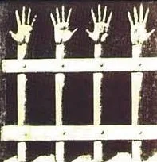

*Note : la version originale turque de cet article a été publiée pour la première fois sur Bianet le 30 juin 2012.*

Imaginez que vous tombiez amoureux. Comment le décririez-vous ? Si vous cherchez le terme « amour » sur Internet, vous tomberez sur d’innombrables définitions et descriptions. Chacun tente d’expliquer l’amour à partir de sa propre expérience : « On perd pied », « On ne peut plus penser à personne d’autre », « On perd l’appétit », « On déplacerait des montagnes et traverserait des déserts », « L’amour non partagé est le plus vrai des amours »... On trouve même sur Internet des informations et des schémas sur les « bases biochimiques de l’amour ».[1]

Mais l’amour, défini dans le dictionnaire comme « un sentiment intense d’affection et de dévouement » ou expliqué par des symptômes chimiques, peut-il jamais transmettre l’éprouvé même de l’état amoureux ? Cette description ne va-t-elle pas bien au-delà de la tentative d’un aveugle cherchant à décrire un éléphant ?

Ou supposons que vous souffriez d’acrophobie. Comment pourriez-vous expliquer cette peur à quelqu’un qui ne l’a jamais éprouvée ? Si cette personne ne partage pas cette angoisse, votre seul moyen demeure de la lui rendre intelligible à travers ses propres peurs. Comment autrement ce sentiment, cette angoisse spécifique, pourrait-il être mis en mots ?

Et comment expliquer ce que votre interlocuteur n’a jamais vécu, pas même sous une forme approchante ? N’avez-vous jamais connu de situations où vous éprouviez de la peine à expliquer quelque chose, au point de finir par y renoncer totalement ?

Jacques Lacan utilise le terme de Réel pour désigner ce qui se refuse à toute symbolisation. Ici, « le Réel » ne doit pas être entendu au sens de la « réalité » quotidienne. Il constitue plutôt l’un des trois ordres de la triade lacanienne : l’Imaginaire, le Symbolique et le Réel.[2] En tant que dimension de la vie psychique, il est « en quelque sorte l’inconnu qui nous attend, qui nous précède toujours, qui ne peut être nommé, ni symbolisé, ni imaginé ».[3] En d’autres termes, le Réel est ce qui est dénué de signifié ; il existe comme pur signifiant.

Le concept du Réel chez Lacan peut-il dès lors servir d’instrument pour rendre l’expérience de l’incarcération plus intelligible ? L’incarcération elle-même relève-t-elle du Réel ? L’incarcération sous le régime de l’isolement,[4] étroitement liée à la privation sensorielle et à la privation perceptive, peut-elle en particulier être pensée comme relevant du Réel ? L’expérience des prisons de type F [établissements pénitentiaires de haute sécurité en Turquie, reposant sur des cellules individuelles ou de trois personnes et organisés selon un régime d’isolement], imposées le 19 décembre 2000 par une opération sanglante baptisée « Retour à la vie » et qui ont coûté la vie à 122 personnes lors de la grève de la faim dite « de la mort » qui s’ensuivit, peut-elle être réexaminée à la lumière du Réel ?

## L’incarcération et l’isolement comme expérience indescriptible

L’emprisonnement peut-il seulement se décrire ? L’expérience carcérale, en particulier lorsqu’elle s'exerce sous des « conditions dures », peut-elle être mise en mots ? Un être humain peut-il parvenir à dire la torture qu'il a subie et la rendre intelligible ? Lorsque l’incarcération et la torture constituent le cœur même du sujet, l’« insuffisance des mots » ne devient-elle pas plus manifeste encore ? Pour qui est étranger au milieu carcéral, l’incarcération peut s'entendre ainsi : « On vous enferme entre quatre murs, vous purgez votre peine, puis vous sortez. » Même pour quiconque connaît les prisons de Turquie, l’incarcération signifie tout au plus : « On est mis à l’écart et l’on se trouve éventuellement exposé à des “vexations” ; après tout, c’est la prison. »

Mais comment décrire ce que l'on éprouve à être enfermé non pas un jour, un mois ou un an, mais des années durant ? Comment mettre la torture en mots ? Qu'éprouve-t-on lorsque les testicules sont écrasés, que se passe-t-il lors des décharges électriques, quels sentiments cela éveille-t-il lorsque quelqu’un est torturé sous vos yeux ? Ce sont là des expériences que les victimes elles-mêmes ne parviennent le plus souvent ni à élaborer ni à mettre en mots, dont on observe bien les séquelles, mais qui se refusent à toute description.

Lorsque l’on demande aux survivants de témoigner de ces expériences, l'on se heurte fréquemment à de tels propos :[5]

> « **Y a-t-il eu durant cette période des pratiques ou des événements concrets dont vous avez été témoin ou victime ?**
>
> Ce que nous avons vécu ne relevait pas d'incidents isolés. Nous parlons d’une cruauté ininterrompue. Décrire la torture en disant : « Ce jour-là, il s’est passé ceci, le lendemain cela », peut éveiller quelques images terribles dans l'esprit de qui écoute ou lit. Mais ces minutes sans fin, ces jours, ces mois et ces années qui n'en finissaient pas de passer ne sauraient se transmettre par de simples mots comme « J’ai vu ceci » ou « J’ai vécu cela ». Certains ont écrit là-dessus. Mais que peut-on bien écrire ? Tout ce qui s'écrit demeure insuffisant !
>
> **Même écouter les récits sur la période consécutive au 12 septembre [le coup d’État militaire de 1980] et, plus particulièrement, sur cette prison [la prison de Diyarbakır] s'avère très difficile pour les gens.**
>
> Vous avez raison de dire que c’est difficile. Il m’est tout aussi difficile d’en parler que d’en écrire.
>
> **Avez-vous pu partager ce que vous avez vécu avec vos proches après votre libération ?**
>
> Très rarement... Un cauchemar ne se partage pas vraiment. »

J. D. Nasio, élève de Lacan, recourt, pour expliquer le Réel, à un exemple qui rejoint précisément la dernière phrase de ce témoignage : celui du cauchemar. Nasio décrit un sujet qui s'éveille la nuit d’un terrible cauchemar et tente, le lendemain matin, d’expliquer ce qu’il a éprouvé:

> « Je me souviens d’avoir ressenti enfant une peur et une terreur similaires lorsqu’une ombre grimpait sur les murs de ma chambre. »

Selon Nasio, « le Réel est précisément la nature de la peur, la matière même du sentiment ». C’est un état émotionnel que nous éprouvons quarante ou cinquante ans plus tard exactement comme dans l’enfance, un état ineffaçable et inaltéré. C’est « cette partie de notre monde psychique qui ne s’est pas modifiée au fil du temps ».[6]

La peur éprouvée ici, ce qui est ressenti, ne peut s'exprimer directement ; on l'explique en renvoyant à une expérience antérieure. Le Réel ne se laisse ni énoncer ni symboliser. Dans l’ordre symbolique, il n’y a pas de place pour le Réel. Au moment même où l’on symbolise une chose, elle cesse d’être le Réel.

Lorsqu’il ne s’agit plus de tenter d’expliquer la prison en général, mais l’isolement en tant que sa forme la plus extrême, l’entreprise devient plus vouée à l’échec encore. Les prisonniers ayant passé des années dans des cellules d’isolement et à qui l’on demandait de décrire cet isolement répètent sans cesse : « L’isolement ne se décrit pas. » Ils cherchent plutôt à l’expliquer à travers ses conséquences.[7]

Les détenus qui témoignent qu’un isolement prolongé conduit à une destruction psychique et physique éprouvent de la peine à expliquer comment cette destruction s’opère exactement. Pour résumer l’image simplifiée qui en découle : il y a là une boîte qui rend malade celui qu'on y enferme et détruit son équilibre physique comme psychique. Comme les personnes qui entrent « saines » dans cette boîte ne peuvent expliquer après leur libération ce qu’elles y ont vécu ni comment une telle dévastation a pu se produire, cette boîte finit presque par apparaître comme une boîte magique.

Günter Sonnenberg, arrêté en tant que membre de la Fraction Armée Rouge (RAF), enfermé dans la prison de Stuttgart-Stammheim et incarcéré pendant seize ans, déclare à propos de l’isolement:[8]

> « Le problème est le suivant : lorsqu’un être humain demeure longtemps dans un espace clos, n’entend aucun bruit, ne voit aucun être humain, ne peut pas regarder par la fenêtre, c’est-à-dire lorsqu’il se trouve privé de stimuli tels que des sons ou des impressions visuelles, il devient malade. Car l’être humain a besoin de stimuli et de réponses en retour. Si ceux-ci viennent à manquer, l’être humain est isolé et tombe malade. »

L’état que Sonnenberg décrit par le manque de stimuli est scientifiquement connu sous le nom de privation sensorielle ou privation perceptive. L’être humain ne peut exister que par ses sens et dans sa relation avec autrui. Si cela lui est retiré, des troubles surviennent inévitablement. C’est précisément ici que la conception lacanienne du Symbolique devient intelligible. Le « Un » ne saurait exister seul ; il se réfère toujours aux « Autres ». Chaque signifiant ne prend sa valeur qu'au regard d'autres signifiants. C’est pourquoi l’ordre symbolique comporte deux unités: le « Un » et les « Autres ».[9] Forcer le « Un » à l'isolement, c’est en précipiter la destruction:[10]

> « C’est une torture. Une torture qui ne laisse pas de traces. C’est-à-dire qu’il n’y a pas de blessures sur le corps. Pas de preuves. Mais l’être humain le ressent. Car la conscience se dissout. La mémoire se perd. La frontière entre réalité et représentation se brouille, on confond réalité et fiction. Dans ces conditions, l’être humain désapprend par exemple jusqu'à la parole, faute de pouvoir parler avec quiconque. »

Celui qui ne peut nouer de relation avec personne, ni parler, ni entendre, ni toucher, se tourne vers lui-même en l’absence de l’Autre. On peut immobiliser le corps, mais l’esprit continue de penser. Ses productions ne demeurent toutefois pas éternellement sous contrôle et peuvent avec le temps échapper totalement à toute maîtrise. Le constat qu’un isolement de longue durée peut conduire à un tableau clinique proche de la schizophrénie est à cet égard révélateur.[11]

> « On se parle constamment à soi-même. Tout en se parlant à soi-même, on croit s'adresser réellement à d’autres. Mais il n'en est rien, on ne parle que dans sa tête, sans même s’en rendre compte. Parfois cela se répète des années plus tard encore. L’isolement rabat l’être humain sur lui-même. On se trouve au centre de l'attaque tout en en étant la cible. Il est extrêmement difficile d’être constamment confronté à son propre moi. »(D’après les récits d’Andreas Vogel, un autre prisonnier soumis à l'isolement.)[12]

L’un des exemples les plus saisissants de l’impossibilité de décrire l’isolement et ses effets sur l’être humain réside dans les lettres d’Ulrike Meinhof. Meinhof, l’une des figures de proue de la Fraction Armée Rouge, fut arrêtée en 1972 et retrouvée morte dans sa cellule le 9 mai 1976, lors de sa quatrième année de détention. Dans l’une de ses lettres, elle tente d'exprimer l’isolement en ces termes:[13]

> **Enfermée dans une sphère**
>
> *16 juin 1972 – 9 février 1973*
>
> La sensation que la tête explose (la sensation que la boîte crânienne devrait en fait éclater, s’arracher).
>
> La sensation que la moelle épinière est compressée dans le cerveau.
>
> La sensation que le cerveau rétrécit, comme un fruit séché.
>
> La sensation d’être constamment et imperceptiblement sous tension, comme si l’on était téléguidée.
>
> La sensation qu'on vous arrache vos associations d’idées.
>
> La sensation de pisser son âme hors du corps, comme lorsque l'on ne peut retenir son urine.
>
> La sensation que la cellule roule. Tu te réveilles, tu ouvres les yeux : la cellule roule ; l'après-midi, quand le soleil entre, elle s'arrête net. La sensation de rouler ne te quitte pas. Tu ne peux déterminer si tu trembles de froid ou de fièvre — tu as froid.
>
> Pour parler à voix normale, il faut fournir un effort, comme s'il fallait parler très fort.
>
> La sensation de devenir muet — de ne plus saisir le sens des mots, de ne plus faire que deviner.
>
> Les sifflements (s, ss, tz, z, ch) sont intolérables.
>
> Les gardiens, les visites, la promenade apparaissent totalement irréels, comme des hallucinations.
>
> Maux de tête.
>
> Éclairs.
>
> Structure de la phrase, grammaire, syntaxe — incontrôlables. En écrivant : deux lignes ; à la fin de la deuxième, on a déjà oublié le début de la première.
>
> La sensation de brûler de l'intérieur.
>
> Quand on dit ce qui est ou ce qui pourrait être, la sensation de jeter de l'eau bouillante ou de l'essence enflammée au visage de l'autre.
>
> Une agressivité sans la moindre échappatoire.
>
> C'est le pire.
>
> La certitude que l'on n'a aucune chance de survivre ; l'échec absolu à le faire comprendre.
>
> Des visites, il ne reste rien. Une demi-heure plus tard, on ne peut plus que reconstruire mécaniquement si la visite a eu lieu aujourd'hui ou la semaine précédente.
>
> Se baigner une fois par semaine signifie un instant de réapparition, de répit — cela dure quelques heures.
>
> La sensation que le temps et l'espace se confondent.
>
> La sensation de défiguration, de titubement.
>
> Puis une joie folle lorsqu'on perçoit quelque chose qui rappelle la différence acoustique entre le jour et la nuit.
>
> La sensation que le temps s'écoule, que le cerveau se dilate de nouveau, que la moelle épinière redescend — pendant des semaines.
>
> La sensation d'avoir la peau arrachée.
>
> **Deuxième séjour dans le Quartier des morts (décembre 1973)**
>
> Un bourdonnement dans l'oreille ; on s'éveille avec la sensation d'être frappé.
>
> La sensation de se mouvoir comme au ralenti.
>
> La sensation de se trouver dans le vide, comme si l'on était enfermé dans une boule de plomb.
>
> Puis le choc. Comme si une plaque de fer s'abattait sur la tête.
>
> Comparaisons et notions qui viennent à l'esprit : broyeur psychique, lissage de la peau par la vitesse, capsule de simulation spatiale, La Colonie pénitentiaire de Kafka — l'homme sur le lit de clous —, un manège perpétuel.
>
> À propos de la radio : une sensation de soulagement minime, un peu comme le passage de 240 km/h à 190 km/h.
>
> Que tout cela se déroule dans une cellule qui ne se distingue extérieurement en rien des autres cellules renforce encore les effets de cette expérience et rend toute communication impossible avec des personnes qui ne connaissent pas l'isolement acoustique.
>
> Cela désoriente également le prisonnier lui-même. (Que les cellules soient blanches, comme les chambres d'un hôpital militaire, rend la terreur éprouvée plus intense encore ; mais seulement conjuguée au silence. Dès qu'on s'en rend compte, on repeint les murs.)
>
> Naturellement, dans une telle situation, on préfère la mort.
>
> Nils Milberg, qui se trouvait dans une telle cellule (service médical vide) à Francfort-Preungesheim, a accusé le juge de vouloir le tuer.
>
> Mais c'est à l'exécution de la « mise à mort » que nous sommes exposés là-dedans.
>
> Il s'agit d'une dissolution de l'intérieur, comme des substances qui se dissolvent dans l'acide.
>
> En se concentrant sur la résistance, on peut ralentir ce processus, mais on ne peut en annuler totalement les effets.
>
> Une partie de cette perfidie consiste à se voir dépossédé de son unité personnelle.
>
> Dans cet état d'exception, il n'y a personne d'autre que soi-même.

Meinhof ne décrit pas directement l’isolement, mais s'efforce de le faire entendre à travers ses expériences passées. Dans ce récit, les expressions « dissolution de l’intérieur » et « se voir dépossédé de son unité personnelle » méritent d'être soulignées ; il convient ici de revenir à Lacan.

Nasio, qui explicite le Symbolique dans la triade lacanienne à travers le concept du « Père symbolique » et rappelle que le « Un » ne saurait exister seul, développe:[14]

> « Le Père symbolique n’est pas l’image symbolique de l'autorité paternelle, mais un signifiant spécifique qui ordonne cette vie et garantit son intégrité. Pour les cliniciens, le concept de “Père symbolique” est très utile pour expliquer le mécanisme qui mène à la psychose. Dans cette maladie, la santé psychique s’est effondrée parce que le signifiant que l’on nomme “Père symbolique” et qui règle le fonctionnement mental a sauté comme un fusible. »

En privant le sujet de ses perceptions sensorielles, l’isolement détruit précisément cette dimension que Lacan définit comme l’ordre symbolique. Ce phénomène a d’ailleurs été mis en évidence par de nombreuses expérimentations et fait désormais partie intégrante de la littérature médicale. Parmi les travaux les plus connus figurent les expériences sur la privation perceptive menées en 1954 au laboratoire Hebb de l’Université McGill (Canada),[15] les recherches entreprises dès 1971 à la clinique universitaire de Hambourg dans une unité spécialisée baptisée « Camera Silens »,[16] ainsi que les études de Jan Gross et Ludvik Svab.[17]

Dans leur étude intitulée Évaluation d’expériences sur la privation sensorielle, rédigée au début des années 1950, Gross et Svab aboutissaient notamment aux constats suivants:[18]

> « Alors que les sujets dormaient généralement au début, ils perdaient progressivement tout sentiment de repos et d'apaisement ; ils perdaient en outre la capacité de penser de manière contrôlée. Leur humeur oscillait entre apathie, irritabilité et anxiété. Dans le même temps, de l’agitation, de la fatigue et des maux de tête faisaient leur apparition. »

> « Bien qu’une rémunération supérieure leur eût été promise, les sujets se sont révélés incapables de prolonger les expériences de deux ou trois jours supplémentaires. Pour certains d'entre eux, le séjour dans les conditions du test était devenu si insupportable que l’analyse psychologique prévue a dû être interrompue prématurément. »

Toutes ces expérimentations mettent en évidence les effets destructeurs de la privation perceptive sur l’être humain et confirment la thèse lacanienne selon laquelle le « Un » ne peut exister dans l’isolement. C’est précisément cette spécificité qui distingue l’isolement des autres formes de détention et le rend si difficile à décrire et à comprendre. Il s’agit d’un état que même ceux qui l’ont traversé n’ont pu appréhender pleinement, mais seulement endurer.

## L’isolement comme expérience destructrice du sujet

Selon Lacan, le « sujet » se constitue à travers l’ordre symbolique. « Le sujet naît en tant qu’il surgit comme signifiant dans le Symbolique », affirme Lacan.[19]

Or, l’isolement s’attaque précisément à cet ordre symbolique. En privant le sujet de ses perceptions sensorielles, il détruit cette dimension que Lacan désigne comme l’ordre symbolique et ébranle le mécanisme même qui constitue le sujet. En prenant appui sur ce socle théorique et sur les récits des détenus, le constat suivant s’impose :

L’isolement s’avère être une expérience qui détruit le sujet et l’identité. C’est l’une des raisons majeures pour lesquelles il demeure incompréhensible et indescriptible. Il ne se contente pas d'infliger de la souffrance à l’individu ; il dissout ses repères perceptifs et son intégrité psychique.

Dès lors, la conclusion suivante s’impose :

Oui, l’isolement est un Réel. Il ne se laisse ni décrire ni appréhender pleinement ; on ne peut s’en approcher qu’à travers ses répercussions. Et oui, l’isolement est une torture, et toute critique formulée à son encontre est pleinement fondée.

---

*Note de traduction : cette traduction française a été réalisée avec l’assistance de l’intelligence artificielle, puis relue, révisée et approuvée par l’auteur. L’auteur assume l’entière responsabilité de l’exactitude et de la version définitive de cette traduction.*

**Bibliographie**

Düzkan, Ayşe. 5 No'luda Neler Oldu [Que s’est-il passé au n° 5 ?] (Entretien avec Yılmaz Yalçıner).

Eren, Mustafa. Ceza İnfaz Kurumu Yönetimi El Kitabı Üzerine Bir Değerlendirme – Hapishanelere İlişkin Avrupa Kriterlerinin ve Türkiye Pratiğinin Bir Belge Üzerinden Okunması [Une évaluation du Manuel de gestion des établissements pénitentiaires : Lecture des critères européens et de la pratique turque concernant les prisons à travers un document].

Gençtan, Engin. İnsanın Dirimsel Gereksinmeleri Olarak Duyumsal Uyarılma ve Uyku [La stimulation sensorielle et le sommeil comme besoins vitaux de l’être humain].

Karabey, Hüseyin. Sessiz Ölüm [Mort silencieuse]. Istanbul : Metis Yayınları, février 2002.

Koşan, Ümit. Sessiz Ölüm [Mort silencieuse]. Istanbul : Metis Yayınları, avril 2000.

Kurnaz, Selami. Tecrit – Yaşayanlar Anlatıyor [Isolement – Les survivants racontent]. Istanbul : Boran Yayınevi, août 2005.

MonoKL, été 2009, n° VI–VII.

Şizofreni de Depresyon Olur mu [La schizophrénie peut-elle s'accompagner de dépression ?]. Hürriyet, 27 avril 2009.

Tura, Saffet Murat. Freud'dan Lacan'a Psikanaliz [De Freud à Lacan : La Psychanalyse]. Istanbul : Kanat Kitap, mars 2007.

**Notes de bas de page**

[1] Wikipedia (consulté le 16/12/2010).

[2] Bülent Somay, qui enseigne la psychanalyse à l’Université Bilgi d’Istanbul, traduit de préférence cette triade par l’Imaginaire (muhayyel), le Symbolique et le Réel. Dans la suite du texte, le concept du Réel est écrit avec une majuscule conformément à cette traduction.

[3] J. D. Nasio, « Concepts généraux de la théorie de Jacques Lacan », trad. Atakan Karakış, MonoKL, été 2009, n° VI–VII, p. 51.

[4] L’isolement (tecrit) décrit l’état dans lequel les prisonniers sont tenus séparés les uns des autres dans des cellules individuelles ou de petits groupes au sein des prisons cellulaires. Les prisons de type F en Turquie reposent sur des cellules pour 1 et 3 personnes et sont axées sur l’isolement. Pour plus de détails, voir l’article de l’auteur : Une évaluation du Manuel de gestion des établissements pénitentiaires...

[5] Extrait de l’entretien d’Ayşe Düzkan avec Yılmaz Yalçıner, incarcéré à la prison de Diyarbakır pendant la période du coup d’État militaire du 12 septembre 1980.

[6] J. D. Nasio, p. 49.

[7] Pour les récits des prisonniers sur l’isolement, trois ouvrages ont été consultés : Les ouvrages Sessiz Ölüm de Hüseyin Karabey et Ümit Koşan contiennent des entretiens avec des prisonniers d’Allemagne, d’Espagne, d’Irlande du Nord, d’Italie et des États-Unis. Le livre de Selami Kurnaz, Tecrit – Yaşayanlar Anlatıyor, documente les expériences de prisonniers dans les établissements pénitentiaires turcs.

[8] Hüseyin Karabey, Sessiz Ölüm, Istanbul : Metis Yayınları, février 2002, p. 40.

[9] J. D. Nasio, p. 50.

[10] Hüseyin Karabey, p. 40.

[11] Le Prof. Dr. Kemal Arıkan (spécialiste en psychiatrie de liaison au Memory Center Nöropsikiyatri Merkezi) a répondu dans une interview à la question sur les facteurs de risque de la schizophrénie : « Le plus grand facteur de risque est la disposition génétique. Il est toutefois également rapporté qu’un isolement sensoriel prolongé – c’est-à-dire la privation de stimuli tels que le son, l’image, etc. – peut conduire à un tableau clinique semblable à la schizophrénie. » Hürriyet, 27 avril 2009.

[12] Hüseyin Karabey, p. 51.

[13] Hüseyin Karabey, p. 130–132.

[14] J. D. Nasio, p. 49.

[15] Doç. Dr. Engin Gençtan, İnsanın Dirimsel Gereksinmeleri Olarak Duyumsal Uyarılma ve Uyku (consulté le 16/01/2010).

[16] Ümit Koşan, Sessiz Ölüm, Istanbul : Metis Yayınları, avril 2000.

[17] Des exemples de ces expériences se trouvent dans le livre de Hüseyin Karabey, Sessiz Ölüm.

[18] Ümit Koşan, p. 54–55.

[19] Saffet Murat Tura, Freud'dan Lacan'a Psikanaliz, Istanbul : Kanat Kitap, mars 2007, p. 205.
