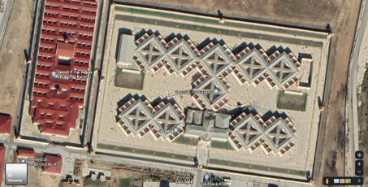
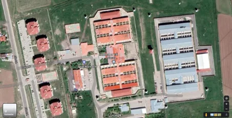
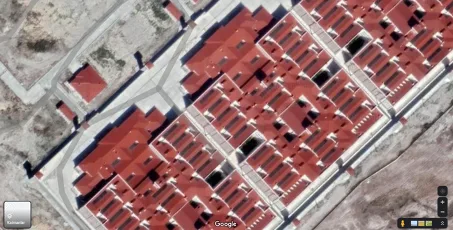
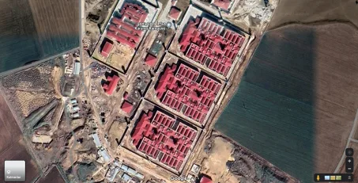
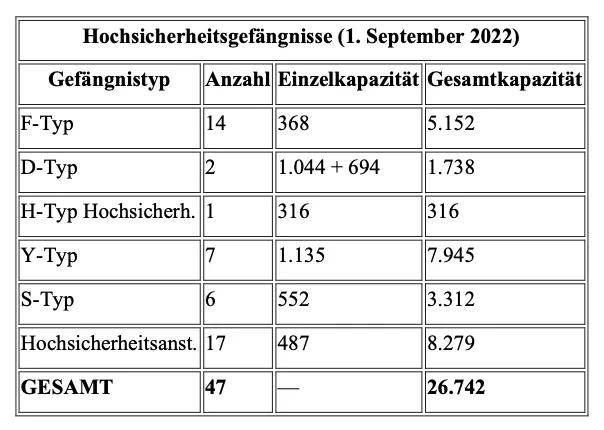

**Bianet – 1 Oktober 2022**

In der Türkei werden seit einigen Jahren still und leise neue Gefängnisse eines „neuen Typs“ eröffnet, ohne dass die Öffentlichkeit darüber informiert wird. Wenn man sich an die Zeiten erinnert, in denen das von politischen Inhaftierten als „Sarg“ bezeichnete Gefängnis in Eskişehir in den Jahren 1991 und 1996 eröffnet wurde oder an die Einführung der zellenbasierten F-Typ-Gefängnisse im Jahr 2000, so war diese Stille keineswegs üblich. Damals machten die Inhaftierten durch Hungerstreiks und Todesfasten auf ihre Ablehnung aufmerksam, während in der Öffentlichkeit – unter Beteiligung von Berufsverbänden, Intellektuellen, Künstler:innen und Politiker:innen – die Qualität der neuen Gefängnisse diskutiert wurde. Heute hingegen erfährt man von der Existenz neuer Gefängnisse erst dann, wenn diese eröffnet werden, Inhaftierte dorthin verlegt oder verbannt werden, dort Misshandlungen erfahren und versuchen, dies öffentlich zu machen. Die Regierung nimmt es nicht einmal mehr für nötig, die Öffentlichkeit zu informieren. Obwohl mit den Bezeichnungen S, Y und „Hochsicherheits-“i drei neue Typen von Hochsicherheitsgefängnissen eröffnet wurden, geben die zuständigen Stellen keinerlei Auskunft über deren architektonische Besonderheiten oder das dort geltende Vollzugsregime. Interessierte und Betroffene sind gezwungen, entweder Anträge nach dem Informationsfreiheitsgesetz zu stellen oder auf bruchstückhafte, quelllose Gerüchte zurückzugreifen, die im Internet kursieren.

Die Gründe für diese Rücksichtslosigkeit der Regierung können selbstverständlich diskutiert werden (die Schwäche der demokratischen Opposition, die weitgehende Kontrolle der „nationalen Medien“, die veränderte Qualität und Quantität der politischen Inhaftierten usw.). Doch genau hier will dieser Text nicht den Schwerpunkt setzen. Vielmehr möchte er gemeinsam mit den Leser:innen über eine Frage nachdenken und zur Diskussion anregen: Warum war es in den letzten Jahren erforderlich, Dutzende neuer Gefängnisse von drei neuen Typen von Hochsicherheitsgefängnissen zu eröffnen?

Zu Beginn der 2000er Jahre wurden 14 F-Typ- und 2 D-Typ-Hochsicherheitsgefängnisse eröffnet. In den darauffolgenden 20 Jahren jedoch wurde kein einziges neues Hochsicherheitsgefängnis gebaut. Selbst nach dem Putschversuch vom 15. Juli, als Zehntausende Menschen unter dem Vorwurf der “Mitgliedschaft in FETÖ” in Untersuchungshaft genommen wurden**,** erschien dies nicht notwendig und wurde nicht einmal thematisiert. Warum also werden jetzt neue Hochsicherheitsgefängnisse mit Kapazitäten von mehreren Tausend eröffnet – und mit welchen Zielen?

**Neu eröffnete Gefängnisse und ihre Kapazitäten**

Seit einigen Jahren, vor allem aber seit 2021, werden zusätzlich zu den F- und D-Typ- Hochsicherheitsstrafvollzugsanstalten drei neue Gefängnistypen eröffnet: die „S-Typ- Geschlossene Strafvollzugsanstalt“, die „Y-Typ-Geschlossene Strafvollzugsanstalt“ sowie die „Hochsicherheits-Geschlossene Strafvollzugsanstalt“.

Zu den architektonischen Merkmalen, den Kapazitäten und dem in diesen Gefängnissen praktizierten Vollzugsregime haben Vertreter des Justizministeriums bislang keine direkten Erklärungen in der Presse abgegeben. In den Medien finden sich jedoch vereinzelte, teils fehlerhafte Informationsbruchstücke. Klar erkennbar ist darin, dass es sich bei allen drei neuen Typen um „Hochsicherheitsgefängnisse“ handelt, die in erster Linie für politische Inhaftierte, für zu verschärfter lebenslanger Haft Verurteilte sowie für als „gefährlich“ eingestufte Inhaftierte vorgesehen sind.

Im Jahr 2021 wurden 32 neue Gefängnisse eröffnet, in den ersten acht Monaten des Jahres 2022 weitere 18. Während die genaue Ausgestaltung der im Jahr 2022 eröffneten Gefängnisse bislang nicht bekannt ist, handelte es sich bei 11 der 32 im Jahr 2021 eröffneten Einrichtungen um neue Typen von Hochsicherheitsgefängnissen (Justizministerium, Tätigkeitsbericht 2021, 2022: 104–106).

Mit den bis zum 1. September 2022 eröffneten 18 neuen Gefängnissen stieg die Gesamtzahl der Gefängnisse auf 399. Davon sind 14 F-Typ, 2 D-Typ, 1 H-Typ,ii 7 Y-Typ, 6 S-Typ sowie 17 als „Hochsicherheits-“ bezeichnete Gefängnisse – insgesamt also 47 Hochsicherheitsgefängnisse. Berücksichtigt man, dass ein Standard-F-Typ-Gefängnis über eine Kapazität von 368 Plätzen verfügt, die D-Typ-Anstalt Diyarbakır über 694, die D-Typ- Anstalt Denizli über 1044 und die H-Typ-Anstalt Erzurum über 316, so betrug die

Gesamtkapazität dieser Hochsicherheitsgefängnisse bis zum Beginn der 2020er Jahre 7.206 Plätze. Mit der Eröffnung von drei weiteren neuen Hochsicherheitsgefängnissen bis Ende August 2022 hat sich diese Kapazität nahezu vervierfacht.

Die Anzahl und die möglichen Kapazitäten der Hochsicherheitsgefängnisse – einschließlich der neu eröffneten – stellen sich wie folgt dar:

**F-Typ-Gefängnisse**

Es handelt sich um nach dem sogenannten “Raumsystem” errichtete Gefängnisse, die aus Ein- und Drei-Personen-Zellen bestehen. In einer Standard-F-Typ-Strafvollzugsanstalt gibt es 103 Dreipersonenzellen und 59 Einzelzellen. Während die Einzelzellen einstöckig und 10 m2 groß sind, sind die Dreipersonenzellen zweistöckig.iii

Tekirdağ F-Typ-Hochsicherheits-Geschlossene Strafvollzugsanstalten Nr. 1 und 2

Die F-Typ-Gefängnisse wurden zu Beginn der 2000er Jahre in einer Welle eröffnet; danach wurden keine weiteren Gefängnisse dieses Typs gebaut. Zum 1. September 2022 existieren 14 F-Typ-Gefängnisse:

1.  **ADANA:** Adana F-Typ-Hochsicherheits-Geschlossene Strafvollzugsanstalt
2.  **ANKARA:** Sincan Nr. 1 F-Typ-Hochsicherheits-Geschlossene Strafvollzugsanstalt
3.  **ANKARA:** Sincan Nr. 2 F-Typ-Hochsicherheits-Geschlossene Strafvollzugsanstalt
4.  **BOLU:** Bolu F-Typ-Hochsicherheits-Geschlossene Strafvollzugsanstalt
5.  **BURSA:** İmralı F-Typ-Hochsicherheits-Geschlossene Strafvollzugsanstalt
6.  **EDİRNE:** Edirne F-Typ-Hochsicherheits-Geschlossene Strafvollzugsanstalt
7.  **İZMİR:** İzmir Nr. 1 F-Typ-Hochsicherheits-Geschlossene Strafvollzugsanstalt
8.  **İZMİR:** İzmir Nr. 2 F-Typ-Hochsicherheits-Geschlossene Strafvollzugsanstalt
9.  **KIRIKKALE:** Kırıkkale F-Typ-Hochsicherheits-Geschlossene Strafvollzugsanstalt
10.  **KOCAELİ:** Kocaeli Nr. 1 F-Typ-Hochsicherheits-Geschlossene Strafvollzugsanstalt
11.  **KOCAELİ:** Kocaeli Nr. 2 F-Typ-Hochsicherheits-Geschlossene Strafvollzugsanstalt
12.  **TEKİRDAĞ:** Tekirdağ Nr. 1 F-Typ-Hochsicherheits-Geschlossene Strafvollzugsanstalt
13.  **TEKİRDAĞ:** Tekirdağ Nr. 2 F-Typ-Hochsicherheits-Geschlossene Strafvollzugsanstalt
14.  **VAN:** Van F-Typ-Hochsicherheits-Geschlossene Strafvollzugsanstalt

**D-Typ-Gefängnisse**

Unmittelbar nach den F-Typ-Gefängnissen wurden Ende 2003 die D-Typ-Gefängnisse eröffnet. Ihren Namen sollen sie sowohl von den Städten Denizli und Diyarbakır als auch von ihrer geschlossenen Bauweise erhalten haben, die an den Buchstaben „D“ erinnert.  
Sie bestehen aus Ein-, Drei- und Vier-Personen-Zellen. Das D-Typ-Gefängnis Diyarbakır verfügt über eine Kapazität von 694 Plätzen, das D-Typ-Gefängnis Denizli über 1.044 Plätze (Webseite des D-Typ-Gefängnisses Diyarbakır, 2022; Bericht der TİHEK, 2019).

Falls die Angabe auf der Webseite des D-Typ-Gefängnisses Diyarbakır zutrifft, wonach der Bau im Jahr 1995 begonnen wurde, so kann angenommen werden, dass die Planungen und Bauarbeiten dieser Gefängnisse bereits vor den F-Typ-Gefängnissen begannen.iv Dennoch wurden nur zwei Gefängnisse dieses Typs eröffnet, und ebenso wie bei den F-Typen wurden später keine weiteren Gefängnisse dieser Bauart errichtet.

Zum 30. September 2022 existieren lediglich zwei D-Typ-Gefängnisse:

1.  **DENİZLİ:** D-Typ-Geschlossene Strafvollzugsanstalt Denizli
2.  **DİYARBAKIR:** D-Typ-Geschlossene Strafvollzugsanstalt Diyarbakır

Wie im untenstehenden Bild zu sehen ist, gehören die D-Typ-Gefängnisse architektonisch zu den auffälligsten und eigenständigsten Bauformen innerhalb des türkischen Gefängnissystems.

D-Typ-Geschlossene Strafvollzugsanstalt Denizli

**H-Typ-Hochsicherheits-Geschlossene Strafvollzugsanstalt Erzurum**

Die H-Typ-Gefängnisse, auch als „Sondertyp“ bezeichnet, wurden in den 1970er- und 1980er-Jahren errichtet. Ein Teil von ihnen folgt dem sogenannten „Raumsystem“, unterscheidet sich jedoch hinsichtlich des Vollzugsregimes von dem mit den F-Typ- Gefängnissen eingeführten Zellenmodell.v Nach den Angaben der CTE bestanden im September 2022 insgesamt fünf H-Typ-Gefängnisse; lediglich das Gefängnis Erzurum wurde durch spätere bauliche Anpassungen in ein Hochsicherheitsgefängnis umgewandelt (İHD, 2009).

Das Gefängnis besteht aus zwei Abteilungen und zwölf Blöcken und verfügt über „79 Doppelstockeinheiten für jeweils vier Personen sowie 26 Einzelzellen für Disziplinarmassnahmen“ (Webseite der H-Typ-Strafvollzugsanstalt Erzurum, 2022). Die Gesamtkapazität beträgt 316 Plätze.vi

H-Typ-Hochsicherheits-Geschlossene Strafvollzugsanstalt Erzurum

**Y-Typ-Gefängnisse**

Nach den in der Presse veröffentlichten Informationen unterscheiden sie sich von den anderen Hochsicherheits-**Gefängnissen** dadurch, dass sie dreigeschossig sind und als „Gefängnisse mit noch strengeren Sicherheitsmaßnahmen“ konzipiert wurden (Webseite Adalet TV, 2022). In diesen dreigeschossigen **Gefängnissen** soll sich auf jeder Etage jeweils ein **Inhaftierter** befinden, wobei die Inhaftierten einander nicht sehen können.

Zum 1. September 2022 existierten sieben Y-Typ-Gefängnisse:

1.  **ADANA:** Adana/Suluca Y-Typ-Geschlossene Strafvollzugsanstalt
2.  **ANTALYA:** Antalya Y-Typ-Geschlossene Strafvollzugsanstalt
3.  **EREĞLİ (KONYA):** Ereğli Nr. 1 Y-Typ-Geschlossene Strafvollzugsanstalt
4.  **EREĞLİ (KONYA):** Ereğli Nr. 2 Y-Typ-Geschlossene Strafvollzugsanstalt
5.  **ÇORLU:** Çorlu Nr. 1 Y-Typ-Geschlossene Strafvollzugsanstalt
6.  **ÇORLU:** Çorlu Nr. 2 Y-Typ-Geschlossene Strafvollzugsanstalt
7.  **KIRŞEHİR:** Kırşehir Nr. 1 Y-Typ-Geschlossene Strafvollzugsanstalt

Obwohl in den Medien unterschiedliche Angaben zur Kapazität dieser Gefängnisse zu finden sind, wird sowohl auf der Webseite des Strafvollzugskampüs Ereğli als auch im Tätigkeitsbericht des Justizministeriums für das Jahr 2021 eine Kapazität von 1.135 Plätzen angegeben.

Ereğli Y-Typ-Gefängnisse Nr. 1 und Nr. 2

**Hochsicherheitsgefängnisse**

Es handelt sich um zweigeschossige Gefängnisse mit Ein- und Drei-Personen-Zellen.  
Sie verfügen über eine Kapazität von 487 Plätzen (Webseite NNC Haber, 2022; Webseite Ereğli Kampüs Açık, 2022). Zum 1. September 2022 existierten 17 Hochsicherheits- Strafvollzugsanstalten:

1.  **ADANA:** Adana/Suluca Nr. 1 Hochsicherheits-Geschlossene Strafvollzugsanstalt
2.  **ADANA:** Adana/Suluca Nr. 2 Hochsicherheits-Geschlossene Strafvollzugsanstalt
3.  **ANKARA:** Sincan Nr. 1 Hochsicherheits-Geschlossene Strafvollzugsanstalt
4.  **ANKARA:** Sincan Nr. 2 Hochsicherheits-Geschlossene Strafvollzugsanstalt
5.  **ANTALYA:** Antalya Hochsicherheits-Geschlossene Strafvollzugsanstalt
6.  **ÇORLU:** Çorlu Hochsicherheits-Geschlossene Strafvollzugsanstalt
7.  **DİYARBAKIR:** Diyarbakır Nr. 1 Hochsicherheits-Geschlossene Strafvollzugsanstalt
8.  **DİYARBAKIR:** Diyarbakır Nr. 2 Hochsicherheits-Geschlossene Strafvollzugsanstalt
9.  **ELAZIĞ:** Elazığ Nr. 1 Hochsicherheits-Geschlossene Strafvollzugsanstalt
10.  **ELAZIĞ:** Elazığ Nr. 2 Hochsicherheits-Geschlossene Strafvollzugsanstalt
11.  **EREĞLİ (KONYA):** Ereğli Hochsicherheits-Geschlossene Strafvollzugsanstalt
12.  **ERZİNCAN:** Erzincan Hochsicherheits-Geschlossene Strafvollzugsanstalt
13.  **ERZURUM:** Dumlu Nr. 1 Hochsicherheits-Geschlossene Strafvollzugsanstalt
14.  **ERZURUM:** Dumlu Nr. 2 Hochsicherheits-Geschlossene Strafvollzugsanstalt
15.  **İZMİR:** İzmir Hochsicherheits-Geschlossene Strafvollzugsanstalt
16.  **KIRŞEHİR:** Kırşehir Hochsicherheits-Geschlossene Strafvollzugsanstalt
17.  **VAN:** Van Hochsicherheits-Geschlossene Strafvollzugsanstalt

Die Architektur dieser Gefängnisse erscheint von aussen betrachtet identisch mit jener der Y- Typ-Gefängnisse. Die beiden folgenden Fotos verdeutlichen dies anschaulich.

Strafvollzugskampüs Çorlu

Strafvollzugskampüs Ereğli

Nach den Informationen auf der Webseite der Generaldirektion für Straf- und Haftanstalten (CTE) befinden sich in den Strafvollzugskampüs Çorlu und Strafvollzugskampüs Ereğli jeweils zwei Y-Typ- und ein Hochsicherheits-Gefängnis. Auf den veröffentlichten Bildern jedoch erscheinen alle drei Gefängnisse identisch.

Die Bedeutung dieser Ähnlichkeit liegt darin, dass bei identischer Architektur die Kapazität der Y-Typ-Gefängnisse 1.135 Plätze beträgt, während die Kapazität der Hochsicherheits- Gefängnisse lediglich 487 Plätze umfasst. Woher dieser Unterschied rührt und wie stark sich die pro Inhaftiertem zur Verfügung stehende Quadratmeterzahl tatsächlich unterscheidet, bleibt vorerst ein Rätsel.vii

**S-Typ-Gefängnisse**

Diese bestehen aus Ein- und Drei-Personen-Zellen (Bişkin, 2021). Ihre Kapazität beträgt 552 Plätze. In den wenigen Presseberichten wird betont, dass diese Gefängnisse insbesondere für Inhaftierte, die zu einer verschärften lebenslangen Freiheitsstrafe verurteilt wurden**,** errichtet wurden:

“Sie sind für Personen konzipiert, die zu einer verschärften lebenslangen Freiheitsstrafe verurteilt wurden. Mit anderen Worten: Es wäre nicht falsch zu sagen, dass die S-Typ- Strafvollzugsanstalten Gefängnisse darstellen, in denen noch strengere Sicherheitsmaßnahmen gelten als in den F-Typ-Hochsicherheitsstrafvollzugsanstalten**.**” (Webseite Adalet TV, 2021)

Nach dem Gesetz müssen Inhaftierte, die zu einer verschärften lebenslangen Freiheitsstrafe verurteilt wurden, in Einzelhaft gehalten werden und dürfen – abgesehen von den im Gesetz ausdrücklich vorgesehenen Ausnahmefällen – nicht mit anderen Inhaftierten zusammenkommen. Eine genauere Betrachtung der Fotos dieser Gefängnisse zeigt, dass ein erheblicher Teil der Höfe in kleine Einheiten unterteilt ist. Dies bestätigt die Angaben, dass diese Gefängnisse speziell für Inhaftierte mit verschärfter lebenslanger Freiheitsstrafe errichtet wurden.

Bodrum S-Typ-Gefängnis

Zum 1. September 2022 existierten sechs S-Typ-Gefängnisse:

1.  **ANTALYA:** Antalya S-Typ-Geschlossene Strafvollzugsanstalt
2.  **BODRUM:** Bodrum S-Typ-Geschlossene Strafvollzugsanstalt
3.  **IĞDIR:** Iğdır S-Typ-Geschlossene Strafvollzugsanstalt
4.  **KIRŞEHİR:** Kırşehir S-Typ-Geschlossene Strafvollzugsanstalt
5.  **MANAVGAT:** Manavgat S-Typ-Geschlossene Strafvollzugsanstalt
6.  **SAMSUN:** Kavak S-Typ-Geschlossene Strafvollzugsanstalt

**Gefängnisse als „Repressionsinstrument“ der Regierung**

Die Gesamtzahl der Hochsicherheits-Gefängnisse beläuft sich auf 47, ihre mögliche Gesamtkapazität auf 26.742 Plätze. Vergleicht man dies mit der Situation bis zum Jahr 2020, als die drei neuen Typen von Hochsicherheits-Gefängnissen eröffnet wurden, so betrug die Kapazität lediglich 7.206 Plätze (Gesamtkapazität von 14 F-Typ-, 2 D-Typ- und dem H-Typ- Gefängnis Erzurum). Innerhalb von nur zwei Jahren ist also nahezu eine Verdreifachung zu verzeichnen.

**Hochsicherheitsgefängnisse (1. September 2022) Gefängnistyp Anzahl Einzelkapazität Gesamtkapazität**

Nach den jährlich veröffentlichten Strafvollzugsstatistiken des Europarats befanden sich zum 31. Januar 2021 in der Türkei 30.555 Personen wegen „Terrorismus“ in Haft (SPACE 1/2021: 51).viii Angesichts dieser Zahl könnte man annehmen, dass selbst die in den letzten zwei Jahren auf nahezu 27.000 Plätze verdreifachte Kapazität der Hochsicherheits-Gefängnisse nicht ausreicht. Doch bleibt die drängende Frage bestehen: Während man sich zwanzig Jahre lang mit 14 F-Typ- und 2 D-Typ-Gefängnissen begnügte – welcher „brennende Bedarf“ veranlasste die Regierung plötzlich, innerhalb von nur zwei Jahren Dutzende neue Hochsicherheits-Gefängnisse zu errichten, in denen ein noch strengeres Vollzugsregime als in den F-Typ-Gefängnissen zur Anwendung kommt?

Ob diese neue Welle von Hochsicherheits-Gefängnissen zu einer Welle von Repression und Inhaftierungen gegenüber der gesamten gesellschaftlichen Opposition – oder genauer gesagt: gegenüber all jenen Gruppen, die zwar nicht Teil der organisierten Opposition sind, aber von der politischen Macht als Gegner oder Bedrohung angesehen werden – führt, wird sich in der jetzigen Wahlkampfphase bald zeigen.

Zudem darf nicht vergessen werden, dass die Isolation, die am 19. Dezember 2000 mit der unter dem Namen „Operation Rückkehr ins Leben“ durchgeführten militärischen Intervention gegen 20 Gefängnisse und der Tötung von 30 Inhaftierten durchgesetzt wurde, heute noch weiter ausgeweitet wird. Sie wird nun als Mittel der Unterdrückung, Einschüchterung und Geiselnahme der gesellschaftlichen Opposition eingesetzt. Sollte diese Zumutung dazu führen, dass die Isolation erneut in Erinnerung gerufen und – auch unter Einschluss der F-Typ-Gefängnisse – in eine umfassende Ablehnung von Isolationshaft verwandelt wird, wäre dies ein erfreuliches Ergebnis.

* * *

**Hinweis zur Übersetzung:**

Diese deutsche Übersetzung wurde mit Unterstützung von ChatGPT erstellt und anschließend von dem Autor, Mustafa Eren, überprüft und überarbeitet.

**Open-Access-Hinweis:**

Diese Fassung wurde für den Open-Access-Zugang vorbereitet. Für Zitate verweisen Sie bitte auf die ursprüngliche türkische Version, die am 1. Oktober 2022 bei Bianet veröffentlicht wurde.

* * *

**Anhang: Im Jahr 2021 eröffnete Gefängnisse**

1.  Adana Nr. 1 T-Typ-Geschlossene Strafvollzugsanstalt
2.  Adana Nr. 2 T-Typ-Geschlossene Strafvollzugsanstalt
3.  Adana Offene Strafvollzugsanstalt
4.  Antalya Hochsicherheits-Geschlossene Strafvollzugsanstalt
5.  Antalya Hochsicherheits-Geschlossene Strafvollzugsanstalt
6.  Antalya S-Typ-Geschlossene Strafvollzugsanstalt
7.  Antalya Offene Strafvollzugsanstalt
8.  Muğla Bodrum S-Typ-Geschlossene Strafvollzugsanstalt
9.  Muğla Bodrum Offene Strafvollzugsanstalt
10.  Siverek Nr. 2 T-Typ-Geschlossene Strafvollzugsanstalt (Kapazität: 1.200 Plätze)
11.  Buca Hochsicherheits-Geschlossene Strafvollzugsanstalt (Kapazität: 487 Plätze)
12.  Buca Offene Strafvollzugsanstalt (Kapazität: 400 Plätze)
13.  Ardanuç Offene Strafvollzugsanstalt (Kapazität: 140 Plätze)
14.  Gerede L-Typ-Geschlossene Strafvollzugsanstalt (Kapazität: 1.322 Plätze)
15.  Gerede Offene Strafvollzugsanstalt (Kapazität: 400 Plätze)
16.  Manavgat S-Typ-Geschlossene Strafvollzugsanstalt (Kapazität: 552 Plätze)
17.  Manavgat Offene Strafvollzugsanstalt (Kapazität: 400 Plätze)
18.  Sakarya Nr. 2 L-Typ-Geschlossene Strafvollzugsanstalt (Kapazität: 1.322 Plätze)
19.  Sakarya Nr. 3 L-Typ-Geschlossene Strafvollzugsanstalt (Kapazität: 1.322 Plätze)
20.  Sakarya Offene Strafvollzugsanstalt (Kapazität: 800 Plätze)
21.  Kavak S-Typ-Geschlossene Strafvollzugsanstalt (Kapazität: 552 Plätze)
22.  Kavak Jugendstrafanstalt (Geschlossen) (Kapazität: 288 Plätze)
23.  Kavak Offene Strafvollzugsanstalt (Kapazität: 482 Plätze)
24.  Kütahya T-Typ-Geschlossene Strafvollzugsanstalt (Kapazität: 1.200 Plätze)
25.  Kütahya Offene Strafvollzugsanstalt (Kapazität: 400 Plätze)
26.  Erzincan L-Typ-Geschlossene Strafvollzugsanstalt (Kapazität: 1.322 Plätze)
27.  Erzincan Offene Strafvollzugsanstalt (Kapazität: 400 Plätze)
28.  Erzincan Frauengefängnis (Geschlossen) (Kapazität: 487 Plätze)
29.  Erzincan Hochsicherheits-Geschlossene Strafvollzugsanstalt (Kapazität: 487 Plätze)
30.  Ereğli Nr. 1 Y-Typ-Geschlossene Strafvollzugsanstalt (Kapazität: 1.135 Plätze)
31.  Ereğli Nr. 2 Y-Typ-Geschlossene Strafvollzugsanstalt (Kapazität: 1.135 Plätze)
32.  Ereğli Hochsicherheits-Geschlossene Strafvollzugsanstalt (Kapazität: 487 Plätze)

* * *

**Endnoten**

i Während zwei der drei neuen hochsicherheitstypischen Gefängnisse die Bezeichnungen “S-Typ” und “Y-Typ” erhielten, wurde eines nicht nach einem Buchstaben, sondern direkt nach der Sicherheitskategorie als “Hochsicherheits-“ benannt, was teilweise zu Verwirrung führt. Einschließlich der F-Typ-Gefängnisse gehören jedoch alle vier Gefängnistypen zur Kategorie der “Hochsicherheitsgefängnisse”.

ii Das H-Typ-Gefängnis Erzurum ist im Jahr 2022 das einzige "Hochsicherheits-" Gefängnis unter den insgesamt fünf H-Typ-Gefängnissen.

iii Für eine detaillierte Analyse der Architektur dieser Gefängnisse siehe: TTB, 2000.

iv Auf der Webseite des D-Typ-Gefängnisses Diyarbakır finden sich folgende Angaben: "Mit dem Bau der Strafvollzugsanstalt wurde im Jahr 1995 im Gebiet Üç Kuyu Köyü, Parzelle 132, Blatt 8, auf einem 1.413.000 m2 großen Grundstück begonnen; am 28.12.2002 wurde er abgeschlossen und am 22.12.2003 die Einrichtung in Betrieb genommen."

v Für den Eröffnungsverlauf und die architektonischen Merkmale siehe: Eren, 2014: 239/315.

vi Obwohl auf der Webseite des Gefängnisses die Kapazität mit 316 angegeben wird, steht diese Angabe im Widerspruch zu der im selben Text genannten Formulierung "79 Doppelstockeinheiten für jeweils vier Personen und 26 Einzelräume". Denn rechnerisch ergibt sich daraus eine Gesamtkapazität von 342.

vii Die unterschiedliche Quadratmeterzahl pro Inhaftiertem ist von Bedeutung. Falls die Architektur identisch ist, könnte die Tatsache, dass die Y-Typ-Gefängnisse über mehr als die doppelte Kapazität der Hochsicherheitsgefängnisse verfügen, damit erklärt werden, dass zusätzliche Betten aufgestellt wurden (z. B. indem auf jeder Etage eine Person untergebracht wird). In diesem Fall könnte jede Hochsicherheitsanstalt bei „Bedarf“ durch entsprechende Anpassungen in ein Y-Typ-Gefängnis umgewandelt werden, in dem ein noch strengeres Vollzugsregime gilt, und ihre Kapazität könnte mehr als verdoppelt werden.

viii Dabei ist zu berücksichtigen, dass diese Zahl ausschließlich die Strafgefangenen umfasst und nicht die Untersuchungshäftlinge, deren Verfahren wegen des Vorwurfs der „Terrorstraftaten“ noch andauern.

* * *

**Literaturverzeichnis / Quellen**

Adalet Bakanlığı (2022). _2021 Yılı Bakanlık Faaliyet Raporu_, Şubat 2022. Online verfügbar unter: https://sgb.adalet.gov.tr/Resimler/Dokuman/9052022144505Adalet%20Bakanl%C4%B1%C4 %9F%C4%B1%202021%20Faaliyet%20Raporu.pdf

Adalet TV (2021). _S Tipi Cezaevlerinin Genel Özellikleri Neler_, 5 Temmuz 2021, Zugriff am 30.09.2022. Online: https://www.adalet.tv/s-tipi-cezaevlerinin-genel-ozellikleri-neler/2652/

Adalet TV (2022). _Y Tipi Cezaevlerinin Genel Özellikleri Neler_, 1 Mart 2022, Zugriff am 30.09.2022. Online: https://www.adalet.tv/y-tipi-cezaevlerinin-genel-ozellikleri-neler/3961/

Bişkin, H. (2021). _Yeni F Tipi Cezaevleri: S Tipi_, Gazete Duvar, 7 Mayıs 2021, Zugriff am 30.09.2022. Online: https://www.gazeteduvar.com.tr/yeni-f-tipi-cezaevleri-s-tipi-haber- 1521377

Council of Europe (2021). _SPACE I-2021 / Prison Population_, 15 December 2021. Online: https://wp.unil.ch/space/files/2022/05/Aebi-Cocco-Molnar-Tiago\_2022\_\_SPACE- I\_2021\_FinalReport\_220404.pdf

CTE (2022). _Ceza İnfaz Kurumları Tipleri_, Zugriff am 30.09.2022. Online: https://cte.adalet.gov.tr/home/haritaliste

Denizli D Tipi (2022). _Kurumumuz Hakkında Bilgiler_, Zugriff am 30.09.2022. Online: https://denizlidcik.adalet.gov.tr/kurumumuz

Diyarbakır D Tipi (2022). _Hakkımızda_, Zugriff am 30.09.2022. Online: https://diyarbakirdcik.adalet.gov.tr/hakkimizda

Ereğli Kampüs Açık (2022). _Hakkımızda_, Zugriff am 30.09.2022. Online: https://ereglikampusacik.adalet.gov.tr/hakkimizda

Eren, M. (2014). _Kapatılmanın Patolojisi_. Kalkedon Yayıncılık, İstanbul.

Erzurum H Tipi (2022). _Hakkımızda_, Zugriff am 30.09.2022. Online: https://erzurumhcik.adalet.gov.tr/hakkimizda

İHD (2009). _Erzurum H Tipi Cezaevinde Yaşanan Hak İhlalleri Raporu_, 6 Ocak 2009. Online: https://www.ihd.org.tr/erzurum-h-tipi-cezaevinde-yasanan-hak-ihlalleri-raporu/

NNC Haber (2022). _Burdur’da Yüksek Güvenlikli Cezaevi_, 2 Ocak 2020, Zugriff am 30.09.2022. Online: https://www.nnchaber.com/burdurda-yuksek-guvenlikli-ceza-evi- 5019432-haberi

TİHEK (2019). _Denizli D Tipi Kapalı Ceza İnfaz Kurumu Ziyareti_, Rapor No: 2019/15, Ağustos 2019. Online: https://www.tihek.gov.tr/upload/file\_editor/2019/11/1574238461.pdf

TİHEK (2022). _Diyarbakır D Tipi Kapalı Ceza İnfaz Kurumu Ziyareti_, Rapor No: 2022/17, 17 Mayıs 2022. Online: https://www.tihek.gov.tr/upload/file\_editor/2022/07/1658230366.pdf

TTB (2000). _F Tipi Cezaevlerine İlişkin Türk Tabipleri Birliği Raporu_. Online: https://www.ttb.org.tr/eweb/rapor/f\_tipi.html

* * *

**Glossar der Begriffe**

**Disziplinarhaftzelle** **→ Disiplin odası**

Spezielle Zellen, in denen Inhaftierte im Rahmen einer Disziplinarstrafe für eine bestimmte Zeit festgehalten werden. In der Türkei werden sie von der Gefängnisverwaltung als „disiplin odası“ bezeichnet. Auch in europäischen Gefängnissen existiert eine vergleichbare Praxis; im Deutschen wird meist der Begriff _Disziplinarhaftzelle_, im Englischen _disciplinary cell_ oder _punishment cell_ verwendet.

**Gefängnis** **→ Hapishane**

Vom Autor als neutraler Begriff für den Ort der Inhaftierung verwendet. Im Gegensatz zum Begriff „Cezaevi“, der eine Schuldzuschreibung impliziert, betont „Gefängnis“ den gesellschaftlichen Kontext der Inhaftierung.

**Inhaftierte** **→ Mahpus**

Umfasst sowohl Untersuchungshäftlinge als auch Strafgefangene. Der Begriff wird vom Autor bevorzugt, da er für die inhaftierte Person verwendet wird, ohne eine negative Zuschreibung von „Schuld“ zu implizieren, und somit eine neutrale Bezeichnung darstellt.

**Raumsystem → Oda Sistemi**

In der Türkei bevorzugen staatliche Stellen die Bezeichnung “Raumsystem” anstelle von “Zellensystem”, um die aus Zellen bestehenden Gefängnisse zu beschreiben. Damit soll der kritische und negativ konnotierte Gehalt des Begriffs „Zellensystem“ vermieden werden.

**Strafgefangener / Verurteilter** **→ Hükümlü**

Eine Person, deren Urteil rechtskräftig geworden ist und deren Strafe vollstreckt wird.

**Strafvollzugsanstalt** **→ Ceza İnfaz Kurumu**

Dies ist die offizielle Terminologie des Staates und wurde daher bei der Wiedergabe institutioneller Bezeichnungen beibehalten. Innerhalb des Textes wurde der Begriff jedoch – soweit möglich – vermieden.

**Strafvollzugskampüs** **→ Ceza İnfaz Kurumları Kampüsü**

Bezeichnung in der Türkei für Anlagen, in denen sich auf demselben Gelände mehrere Gefängnisse desselben oder unterschiedlichen Typs (z. B. F-Typ, Y-Typ und Hochsicherheitsgefängnisse) befinden, deren Gesamtkapazität teils über 10.000 Plätze erreichen kann. In der offiziellen Terminologie wird ausdrücklich der Begriff _Kampüs_ verwendet. In den USA existiert eine ähnliche Verwendung (_prison campus_). In Europa hingegen werden häufiger Begriffe wie _Komplex_ (_Gefängniskomplex, Strafvollzugskomplex_) verwendet. Dort ist es üblicher, dass innerhalb eines Gebäudes

**Untersuchungshäftling** **→ Tutuklu**

Eine Person, deren Urteil noch nicht rechtskräftig ist und deren Gerichtsverfahren noch andauert.

**verschärfte lebenslange Freiheitsstrafe** **→ Ağırlaştırılmış müebbet hapis cezası**

Eine besondere Sanktion, die in der Türkei nach der Abschaffung der Todesstrafe eingeführt wurde. Im Unterschied zur gewöhnlichen lebenslangen Freiheitsstrafe bedeutet sie für strafrechtlich verurteilte Personen längere Haftzeiten, während sie für politische Inhaftierte faktisch lebenslange Inhaftierung bis zum Tod vorsieht. Politische Inhaftierte mit einer solchen Strafe haben keinerlei Möglichkeit, von Mechanismen wie bedingter Entlassung, vorzeitiger Haftentlassung oder Amnestie zu profitieren. Der Europäische Gerichtshof für Menschenrechte (EGMR) hat diese Strafe als „_Haft ohne Hoffnung auf Entlassung__“_ bezeichnet und sie im Hinblick auf menschenrechtliche Standards kritisiert.

[🔗 **Türkische Version**](/yazilar/yeni-tip-hapishaneler-ve-toplumsal-muhalefete-gozdagi/)

[🔗 **Englische Version**](/en/yazilar/new-high-security-prisons-turkey/)

[📥 **PDF Herunterladen**](/pdf/neue-hochsicherheits-gefaengnisse-tuerkei.pdf)

[🔗 B**ianet (Orijinal)**](https://bianet.org/yazi/yeni-tip-hapishaneler-ve-toplumsal-muhalefete-gozdagi-267878)
