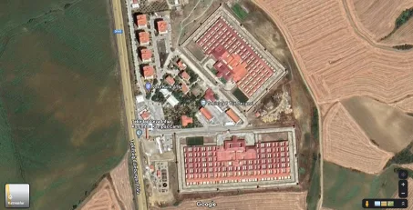
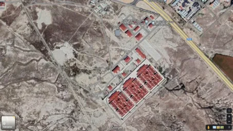
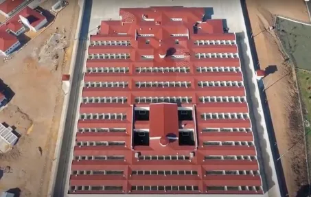

**Bianet – 1 October 2022**

In recent years, new types of prisons have been quietly opened in Turkey without any public announcement or transparency. This silence is unusual when compared to previous periods—such as the opening of Eskişehir Prison, described by political prisoners as a "coffin cell," in 1991 and 1996, or the introduction of the F-Type high-security prisons based on solitary confinement in 2000. Back then, prisoners protested through hunger strikes and death fasts, while professional associations, intellectuals, artists, and politicians sparked public debates over the nature of these new prisons. Today, however, the public only learns of new prisons once they are already operational—when prisoners are transferred or exiled there, subjected to ill-treatment, and attempt to make their voices heard. The government no longer bothers to inform the public. Although three new high-security prison types —designated as S, Y, and "High-Security"— have been introduced, there has been no official disclosure regarding their architectural features or the specific penal regimes they enforce.[\[i\]](#_edn1) Those concerned or curious are left to file Freedom of Information requests or rely on scattered, often unverifiable claims circulating online.

Of course, there are several possible explanations for this recklessness on the part of the government—such as the weakness of democratic opposition, the near-total control over mainstream media, or the shifting nature and composition of the political prisoner population. But this is not the main focus of this article. Instead, it invites readers to reflect and discuss a central question: Why has the government felt the need to open dozens of new high-security prisons in three entirely new models over the past few years? In the early 2000s, the government opened 14 F-Type and 2 D-Type high-security prisons, but in the two decades that followed, no new high-security facilities were built. Even after the July 15 coup attempt, when tens of thousands were arrested on charges of being “FETÖ members,” the state did not feel compelled to build more of these prisons. So why now? What is driving the construction of these massive new high-security prisons with capacities in the thousands?

**Newly Opened High-Security Prisons and Their Capacities**  
Since the past few years—and more notably since 2021—three new types of high-security prisons have been introduced in addition to the existing F-Type and D-Type High-Security Penal Institutions. These are officially named as: “S-Type Closed Penal Institution,” “Y-Type Closed Penal Institution,” and “High-Security Closed Penal Institution.” There have been no direct public statements from Ministry of Justice officials regarding the architectural features, capacities, or prison regimes applied in these new facilities. However, scattered and often inaccurate bits of information have appeared in the media. What can be clearly discerned from these fragments is that all three of these new prison types are classified as “high-security” and are primarily intended to hold political prisoners, those sentenced to aggravated life imprisonment, and individuals deemed “dangerous inmates.”

In 2021 alone, 32 new prisons were opened, followed by another 18 in the first eight months of 2022. While the nature of the facilities opened in 2022 remains unclear, 11 of the 32 prisons inaugurated in 2021 were among the newly introduced high-security prison types (Ministry of Justice, 2021 Annual Activity Report, 2022: 104–106).

With the addition of the 18 new prisons opened by September 1, 2022, the total number of prisons in Turkey rose to 399. Of these, 47 are high-security institutions: 14 F-Type, 2 D-Type, 1 H-Type,[\[ii\]](#_edn2) 7 Y-Type, 6 S-Type, and 17 classified simply as “High-Security.” Considering that a standard F-Type prison has a capacity of 368 inmates, the Diyarbakır D-Type holds 694, the Denizli D-Type 1,044, and the Erzurum H-Type 316, the total capacity of all high-security prisons built up to the 2020s stood at 7,206. With the opening of three additional high-security prisons of the new types by the end of August 2022, this capacity has nearly quadrupled.

Below is an overview of the number and estimated capacities of high-security prisons, including the newly established ones:

**F-Type Prisons**  
These prisons are constructed based on the “room system” and consist of single-occupancy and three-person cells. A standard F-Type prison includes 103 three-person cells and 59 single-person cells. The single cells are single-story and measure approximately 10 square meters, while the three-person cells are two-story units.[\[iii\]](#_edn3)

Tekirdağ No 1 and No 2 F Type High Security Closed Penal Institution

F-Type prisons were opened in a wave in the early 2000s, and no additional facilities of this type have been built since. As of September 1, 2022, there are 14 F-Type high-security prisons in Turkey:

1.  **ADANA:** Adana F-Type High-Security Closed Penal Institution
2.  **ANKARA:** Sincan No. 1 F-Type High-Security Closed Penal Institution
3.  **ANKARA:** Sincan No. 2 F-Type High-Security Closed Penal Institution
4.  **BOLU:** Bolu F-Type High-Security Closed Penal Institution
5.  **BURSA:** İmralı F-Type High-Security Closed Penal Institution
6.  **EDİRNE:** Edirne F-Type High-Security Closed Penal Institution
7.  **İZMİR:** İzmir No. 1 F-Type High-Security Closed Penal Institution
8.  **İZMİR:** İzmir No. 2 F-Type High-Security Closed Penal Institution
9.  **KIRIKKALE:** Kırıkkale F-Type High-Security Closed Penal Institution
10.  **KOCAELİ:** Kocaeli No. 1 F-Type High-Security Closed Penal Institution
11.  **KOCAELİ:** Kocaeli No. 2 F-Type High-Security Closed Penal Institution
12.  **TEKİRDAĞ:** Tekirdağ No. 1 F-Type High-Security Closed Penal Institution
13.  **TEKİRDAĞ:** Tekirdağ No. 2 F-Type High-Security Closed Penal Institution
14.  **VAN:** Van F-Type High-Security Closed Penal Institution

**D-Type Prisons**  
Shortly after the F-Type prisons, D-Type facilities were inaugurated at the end of 2003. It is said that they are named after their locations—Denizli and Diyarbakır—and after the "D"-shaped layout of their architectural design. These prisons consist of 1-person, 3-person, and 4-person cells. The Diyarbakır D-Type prison has a capacity of 694, while the Denizli D-Type holds 1,044 inmates (Diyarbakır D-Type website, 2022; Human Rights and Equality Institution of Turkey \[TİHEK\] Report, 2019).

According to the Diyarbakır D-Type prison’s official website, construction began in 1995. If this information is accurate, planning and construction for these facilities actually predate the F-Type prisons.[\[iv\]](#_edn4) Nevertheless, only two D-Type prisons were ever opened, and—similar to the F-Type model—no additional facilities of this type have been built since.

As of September 30, 2022, the two existing D-Type prisons are as follows:

1.  **DENİZLİ:** Denizli D-Type Closed Penal Institution
2.  **DİYARBAKIR:** Diyarbakır D-Type Closed Penal Institution

As can be seen in the image below, D-Type prisons stand out as having the most distinct architectural style among all Turkish prison types.

Denizli D Type Closed Penal Institution

**Erzurum H-Type High-Security Closed Penal Institution**  
H-Type prisons—also referred to as “Special-Type” facilities—began to be constructed during the 1970s and 1980s. Some of them follow the “room system,” but they operate under a penal regime that differs from the solitary confinement model introduced with the F-Type prisons.[\[v\]](#_edn5) According to data from the Directorate General of Prisons and Detention Houses (CTE), as of September 2022, there were five H-Type prisons in Turkey. Among them, only the Erzurum H-Type prison was later converted into a high-security facility through architectural modification (Human Rights Association \[İHD\], 2009).

The prison consists of two sections and twelve blocks, including **seventy-nine duplex units designed for four inmates each****,** and**twenty-six single-occupancy disciplinary cells (solitary confinement units)** (Erzurum H-Type official website, 2022). The total capacity of the prison is 316 inmates.[\[vi\]](#_edn6)

Erzurum H Type High Security Closed Penal Institution

**Y-Type Prisons**  
According to information reported in the media, Y-Type prisons differ from other high-security facilities primarily in being three stories tall and in being designed to implement “one level stricter security measures” than other high-security prisons (Adalet TV website, 2022). Each of the three floors is reportedly designed to hold one prisoner per floor, in such a way that the inmates cannot see one another.

As of September 1, 2022, there are seven Y-Type prisons in operation:

1.  **ADANA:** Adana/Suluca Y-Type Closed Penal Institution
2.  **ANTALYA:** Antalya Y-Type Closed Penal Institution
3.  **EREĞLİ (KONYA):** Ereğli No. 1 Y-Type Closed Penal Institution
4.  **EREĞLİ (KONYA):** Ereğli No. 2 Y-Type Closed Penal Institution
5.  **ÇORLU:** Çorlu No. 1 Y-Type Closed Penal Institution
6.  **ÇORLU:** Çorlu No. 2 Y-Type Closed Penal Institution
7.  **KIRŞEHİR:** Kırşehir No. 1 Y-Type Closed Penal Institution

Although media reports vary regarding the capacity of these prisons, both the official website of the Ereğli Penal Institutions Campus and the Ministry of Justice’s 2021 Annual Activity Report state the capacity as 1,135.

Ereğli No 1 and No 2 Y Type Closed Penal Institution

**High-Security Prisons**  
These prisons are two-story facilities composed of 1-person and 3-person cells. Each has a capacity of 487 inmates (NNC News website, 2022; Ereğli Penal Campus Public Site, 2022). As of September 1, 2022, there are 17 High-Security Closed Penal Institutions in Turkey:

1.  **ADANA:** Adana/Suluca No. 1 High-Security Closed Penal Institution
2.  **ADANA:** Adana/Suluca No. 2 High-Security Closed Penal Institution
3.  **ANKARA:** Sincan No. 1 High-Security Closed Penal Institution
4.  **ANKARA:** Sincan No. 2 High-Security Closed Penal Institution
5.  **ANTALYA:** Antalya High-Security Closed Penal Institution
6.  **ÇORLU:** Çorlu High-Security Closed Penal Institution
7.  **DİYARBAKIR:** Diyarbakır No. 1 High-Security Closed Penal Institution
8.  **DİYARBAKIR:** Diyarbakır No. 2 High-Security Closed Penal Institution
9.  **ELAZIĞ:** Elazığ No. 1 High-Security Closed Penal Institution
10.  **ELAZIĞ:** Elazığ No. 2 High-Security Closed Penal Institution
11.  **EREĞLİ (KONYA):** Ereğli High-Security Closed Penal Institution
12.  **ERZİNCAN:** Erzincan High-Security Closed Penal Institution
13.  **ERZURUM:** Dumlu No. 1 High-Security Closed Penal Institution
14.  **ERZURUM:** Dumlu No. 2 High-Security Closed Penal Institution
15.  **İZMİR:** İzmir High-Security Closed Penal Institution
16.  **KIRŞEHİR:** Kırşehir High-Security Closed Penal Institution
17.  **VAN:** Van High-Security Closed Penal Institution

From the outside, the architecture of these prisons appears to be identical to that of the Y-Type prisons. The two photos below clearly illustrate this resemblance.

Çorlu Penal Institutions Campus

Ereğli Penal Institutions Campus

According to information published on the website of the Directorate General of Prisons and Detention Houses, each of the Penal Institutions Campuses in Çorlu and Ereğli contains two Y-Type prisons and one High-Security prison. However, in the available images, all three facilities appear identical in architectural design. This similarity is significant because, despite having the same external structure, the official capacity of a Y-Type prison is 1,135 inmates, while that of a High-Security prison is only 487. The source of this discrepancy—and whether the space allocated per prisoner differs significantly between the two prison types—remains unclear for now.[\[vii\]](#_edn7)

**S-Type Prisons**  
These facilities consist of one-person and three-person cells (Bişkin, 2021) and have a capacity of 552 inmates. The limited number of media reports available emphasize that these prisons are specifically designed for inmates sentenced to aggravated life imprisonment:

“They are designed for inmates who have received aggravated life sentences. In other words, it would not be inaccurate to describe S-Type penal institutions as one level stricter than F-Type high-security closed prisons.”  
_(Adalet TV website, 2021)_

According to the law, prisoners sentenced to aggravated life imprisonment must be held in solitary confinement, and—except under certain exceptional circumstances outlined in the law—they are not permitted to interact with other inmates. A close examination of photographs from these prisons reveals that many of the exercise yards (courtyards) are divided into small individual units. This architectural feature supports the claim that these facilities are specifically built for inmates serving aggravated life sentences.

Bodrum S Type Closed Penal Institution

As of September 1, 2022, there are six S-Type prisons in operation:

1.  **ANTALYA:** Antalya S-Type Closed Penal Institution
2.  **BODRUM:** Bodrum S-Type Closed Penal Institution
3.  **IĞDIR:** Iğdır S-Type Closed Penal Institution
4.  **KIRŞEHİR:** Kırşehir S-Type Closed Penal Institution
5.  **MANAVGAT:** Manavgat S-Type Closed Penal Institution
6.  **SAMSUN:** Kavak S-Type Closed Penal Institution

**Expanded Capacity for Political Prisoners and Prisons as a Tool of Repression**  
The total number of high-security prisons in Turkey now stands at 47, with an estimated combined capacity of 26,742 inmates. Until 2020—the year when the three new types of high-security prisons began to be introduced—this capacity was approximately 7,206 (the combined capacity of 14 F-Type, 2 D-Type, and the Erzurum H-Type prison). In other words, within just two years, the capacity of high-security prisons has nearly tripled.

**High-Security Prisons in Turkey (as of September 1, 2022)**

**Prison Type**

**Number**

**Unit Capacity**

**Total Capacity**

F-Type

14

368

5.152

D-Type

2

1.044 + 694

1.738

H-Type (High-Security)

1

316

316

Y-Type

7

1.135

7.945

S-Type

6

552

3.312

High-Security (unnamed)

17

487

8.279

**TOTAL**

**47**

**26.742**

According to the annual Penal Statistics published by the Council of Europe, as of January 31, 2021, there were 30,555 individuals convicted of “terrorism” offenses in Turkey (SPACE I/2021: 51).[\[viii\]](#_edn8) Given this figure, even the newly expanded high-security prison capacity—approximately 27,000 beds, nearly tripled in just two years—may be insufficient. However, this raises an urgent and troubling question: While the government managed with only 14 F-Type and 2 D-Type high-security prisons for two decades, what pressing need suddenly compelled it, within just two years, to launch a massive construction wave of dozens of new high-security facilities—ones that appear to enforce even stricter incarceration regimes than F-Type prisons?

Whether this new wave of high-security prison construction will soon evolve into a broader crackdown—targeting not only organized social opposition but also all groups the political authorities perceive as dissenting or threatening—remains to be seen, especially as the country enters a pre-election period.

It is also crucial not to forget that the policy of isolation, inaugurated with the “Return to Life Operation” on December 19, 2000—an orchestrated military assault on 20 prisons that resulted in the killing of 30 inmates—has now been expanded even further. What began as a tool of control and containment is today being imposed more aggressively as a means of repression, intimidation, and hostage-taking against social dissent. If this imposition can serve as a moment to recall the history of isolation and spark a renewed, collective resistance—including against F-Type prisons—then that would be a powerful and hopeful outcome indeed.

**Note on Translation:**  
This English translation was generated with the assistance of ChatGPT and subsequently reviewed and edited by the author, Mustafa Eren.

**Open Access Notice:**  
This version has been prepared for open access circulation. For citation, please refer to the original Turkish version published by Bianet on **October 1, 2022**.

**Appendix: Prisons Opened in 2021**

1.  Adana No. 1 T-Type Closed Penal Institution
2.  Adana No. 2 T-Type Closed Penal Institution
3.  Adana Open Penal Institution
4.  Antalya High-Security Closed Penal Institution
5.  Antalya High-Security Closed Penal Institution
6.  Antalya S-Type Closed Penal Institution
7.  Antalya Open Penal Institution
8.  Muğla Bodrum S-Type Closed Penal Institution
9.  Muğla Bodrum Open Penal Institution
10.  Siverek No. 2 T-Type Closed Penal Institution (capacity: 1,200)
11.  Buca High-Security Closed Penal Institution (capacity: 487)
12.  Buca Open Penal Institution (capacity: 400)
13.  Ardanuç Open Penal Institution (capacity: 140)
14.  Gerede L-Type Closed Penal Institution (capacity: 1,322)
15.  Gerede Open Penal Institution (capacity: 400)
16.  Manavgat S-Type Closed Penal Institution (capacity: 552)
17.  Manavgat Open Penal Institution (capacity: 400)
18.  Sakarya No. 2 L-Type Closed Penal Institution (capacity: 1,322)
19.  Sakarya No. 3 L-Type Closed Penal Institution (capacity: 1,322)
20.  Sakarya Open Penal Institution (capacity: 800)
21.  Kavak S-Type Closed Penal Institution (capacity: 552)
22.  Kavak Juvenile Closed Penal Institution (capacity: 288)
23.  Kavak Open Penal Institution (capacity: 482)
24.  Kütahya T-Type Closed Penal Institution (capacity: 1,200)
25.  Kütahya Open Penal Institution (capacity: 400)
26.  Erzincan L-Type Closed Penal Institution (capacity: 1,322)
27.  Erzincan Open Penal Institution (capacity: 400)
28.  Erzincan Women’s Closed Penal Institution (capacity: 487)
29.  Erzincan High-Security Closed Penal Institution (capacity: 487)
30.  Ereğli No. 1 Y-Type Closed Penal Institution (capacity: 1,135)
31.  Ereğli No. 2 Y-Type Closed Penal Institution (capacity: 1,135)
32.  Ereğli High-Security Closed Penal Institution (capacity: 487)

* * *

\[i\] Two of the three newly introduced high-security prison types were given letter-based names—“S-Type” and “Y-Type”—while the third was named simply based on its security level: “High-Security.” This naming scheme is somewhat confusing, as all four types of prisons, including the previously established F-Type facilities, fall under the broader category of high-security institutions

[\[ii\]](#_ednref2) As of 2022, Erzurum H-Type Prison is the only one classified as “high-security” among the five H-Type prisons in operation.

[\[iii\]](#_ednref3) For a detailed assessment of the architecture of these prisons, see: TTB, 2000.

[\[iv\]](#_ednref4) The official website of the Diyarbakır D-Type prison states the following: “Construction of the penal institution began in 1995 in the location known as Üç Kuyu Village, on parcel 132 of plot 8, covering an area of 1,413,000 square meters. It was completed on 28.12.2002 and officially opened on 22.12.2003.”

[\[v\]](#_ednref5) For details on the opening process and architectural features of these prisons, see: Eren, 2014: 239/315.

[\[vi\]](#_ednref6) Although the prison’s official website states that its capacity is 316, this figure contradicts information elsewhere on the same page, which mentions “seventy-nine duplex units for four inmates each and twenty-six single-occupancy rooms.” When calculated, the total capacity based on these units amounts to 342.

[\[vii\]](#_ednref7) The difference in square meters per inmate is significant. If the architectural layout is identical, the fact that Y-Type prisons have more than twice the capacity of High-Security prisons may be due to additional beds being installed—for example, by placing one inmate on each floor. In such a case, each High-Security prison could, “when needed,” be converted into a Y-Type facility with a stricter incarceration regime, and its capacity could be more than doubled.

[\[viii\]](#_ednref8) It should be noted that this figure includes only convicted individuals and does not account for detainees who are still on trial under charges of “terrorism.”

**References**

*   **Adalet TV** (2021). “What Are the General Features of S-Type Prisons?” (July 5, 2021). Accessed September 30, 2022. [https://www.adalet.tv/s-tipi-cezaevlerinin-genel-ozellikleri-neler/2652/](https://www.adalet.tv/s-tipi-cezaevlerinin-genel-ozellikleri-neler/2652/)
*   **Adalet TV** (2022). “What Are the General Features of Y-Type Prisons?” (March 1, 2022). Accessed September 30, 2022. [https://www.adalet.tv/y-tipi-cezaevlerinin-genel-ozellikleri-neler/3961/](https://www.adalet.tv/y-tipi-cezaevlerinin-genel-ozellikleri-neler/3961/)
*   **Bişkin, H.** (2021). “New F-Type Prisons: S-Type.” _Gazete Duvar_ (May 7, 2021). Accessed September 30, 2022. [https://www.gazeteduvar.com.tr/yeni-f-tipi-cezaevleri-s-tipi-haber-1521377](https://www.gazeteduvar.com.tr/yeni-f-tipi-cezaevleri-s-tipi-haber-1521377)
*   **Council of Europe** (2021). _SPACE I – 2021: Prison Population_ (December 15, 2021). [https://wp.unil.ch/space/files/2022/05/Aebi-Cocco-Molnar-Tiago\_2022\_\_SPACE-I\_2021\_FinalReport\_220404.pdf](https://wp.unil.ch/space/files/2022/05/Aebi-Cocco-Molnar-Tiago_2022__SPACE-I_2021_FinalReport_220404.pdf)
*   **Denizli D-Type Prison – Official Website** (2022). “About Our Institution.” Accessed September 30, 2022. [https://denizlidcik.adalet.gov.tr/kurumumuz](https://denizlidcik.adalet.gov.tr/kurumumuz)
*   **Directorate General of Prisons and Detention Houses (CTE)** (2022). “Types of Penal Institutions.” Accessed September 30, 2022. [https://cte.adalet.gov.tr/home/haritaliste](https://cte.adalet.gov.tr/home/haritaliste)
*   **Diyarbakır D-Type Prison – Official Website** (2022). “About Us.” Accessed September 30, 2022. [https://diyarbakirdcik.adalet.gov.tr/hakkimizda](https://diyarbakirdcik.adalet.gov.tr/hakkimizda)
*   **Ereğli Penal Institutions Campus – Open Prison Website** (2022). “About Us.” Accessed September 30, 2022. [https://ereglikampusacik.adalet.gov.tr/hakkimizda](https://ereglikampusacik.adalet.gov.tr/hakkimizda)
*   **Eren, M.** (2014). _Kapatılmanın Patolojisi_ \[_The Pathology of Confinement_\]. İstanbul: Kalkedon.
*   **Erzurum H-Type Prison – Official Website** (2022). “About Us.” Accessed September 30, 2022. [https://erzurumhcik.adalet.gov.tr/hakkimizda](https://erzurumhcik.adalet.gov.tr/hakkimizda)
*   **Human Rights Association (İHD)** (2009). _Report on Rights Violations in Erzurum H-Type Prison_ (January 6, 2009). [https://www.ihd.org.tr/erzurum-h-tipi-cezaevinde-yasanan-hak-ihlalleri-raporu/](https://www.ihd.org.tr/erzurum-h-tipi-cezaevinde-yasanan-hak-ihlalleri-raporu/)
*   **Human Rights and Equality Institution of Turkey (TİHEK)** (2019). _Visit to Denizli D-Type Closed Penal Institution_, Report No. 2019/15 (August 2019). [https://www.tihek.gov.tr/upload/file\_editor/2019/11/1574238461.pdf](https://www.tihek.gov.tr/upload/file_editor/2019/11/1574238461.pdf)
*   **Human Rights and Equality Institution of Turkey (TİHEK)** (2022). _Visit to Diyarbakır D-Type Closed Penal Institution_, Report No. 2022/17 (May 17, 2022). [https://www.tihek.gov.tr/upload/file\_editor/2022/07/1658230366.pdf](https://www.tihek.gov.tr/upload/file_editor/2022/07/1658230366.pdf)
*   **Ministry of Justice** (2022). _2021 Annual Activity Report_ (February 2022). [https://sgb.adalet.gov.tr/Resimler/Dokuman/9052022144505Adalet%20Bakanl%C4%B1%C4%9F%C4%B1%202021%20Faaliyet%20Raporu.pdf](https://sgb.adalet.gov.tr/Resimler/Dokuman/9052022144505Adalet%20Bakanl%C4%B1%C4%9F%C4%B1%202021%20Faaliyet%20Raporu.pdf)
*   **NNC News** (2022). “High-Security Prison in Burdur” (January 2, 2020). Accessed September 30, 2022. [https://www.nnchaber.com/burdurda-yuksek-guvenlikli-ceza-evi-5019432-haberi](https://www.nnchaber.com/burdurda-yuksek-guvenlikli-ceza-evi-5019432-haberi)
*   **Turkish Medical Association (TTB)** (2000). _Report on F-Type Prisons_. [https://www.ttb.org.tr/eweb/rapor/f\_tipi.html](https://www.ttb.org.tr/eweb/rapor/f_tipi.html)

[🔗 Turkish Version](/yazilar/yeni-tip-hapishaneler-ve-toplumsal-muhalefete-gozdagi/)

[📥 Download PDF](/pdf/new-high-security-prisons-turkey.pdf)
