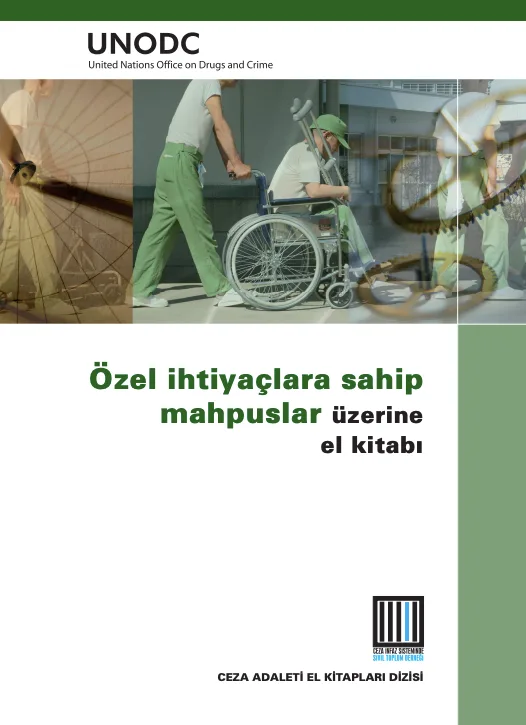

**Özel İhtiyaçlara Sahip Mahpuslar Üzerine El Kitabı - Birleşmiş Milletler - Çev. Ömer B. Albayrak - 2013**

Hapishaneler, sosyolog Erving Goffman’ın da dediği gibi “total kurum”lardır. Total yani içerisinde tutulanların tüm yaşantısını kapsama iddiasında olan, dışarıyla arasına katı ve keskin sınırlar çizen, içeridekiler üzerinde “total” bir tahakküm kurma potansiyeli taşıyan kurumlardır. Çift taraflı olarak kapalıdırlar. İçeridekileri, içeriyi dışarıya karşı kapadığı gibi, dışarıyı da içeriye karşı ulaşılamaz, bilinemez kılar.

Hapishanelerin bu tahakküm potansiyeli ve kapalılığı hapishanelerde bazı insanları diğerlerinden daha fazla etkiler. Akıl sağlığı ihtiyaçları olanlar, engelliler, etnik ve ırksal azınlıklar ve yerli halklar, yabancı uyruklular, LGBT bireyler, yaşlılar, ölümcül hastalığı olanlar, ölüm cezası almış olanlar hapishanelerde daha fazla ve olumsuz etkilenme olasılığı olan mahpus gruplarının sadece bazılarıdır.

Avrupa Cezaevi Kuralları’nın ilk maddesinde “Özgürlüğünden yoksun bırakılan herkese, insan haklarının gerektirdiği gibi saygılı davranılmalıdır” denilmektedir. Birleşmiş Milletler’in “Herhangi Bir Şekilde Tutuklanan veya Hapsedilen Tüm Kişilerin Korunması Hakkında İlkeler Bütünü”, “Mahpuslara Muamele İle İlgili Standart Asgari Kurallar” ve “Mahpuslara Muamele İle İlgili Temel İlkeler” adlı belgelerinde de benzer ifadeler vardır. Örneğin; Asgari Kurallar’ın 60. Maddesinin ilk fıkrasında “Kurumun uyguladığı rejim, mahpusların sorumluluğunu azaltmadan veya insan onuruna gösterilen saygıyı düşürmeden, hapishane yaşamı ile özgür yaşam arasındaki farkı asgariye indirmeye çalışır.” denilmektedir. Türkiye’de hapishanelere ilişkin öncelikli kanun olan Ceza ve Güvenlik Tedbirlerinin İnfazı Hakkında Kanun’un 2. Maddesinde ise “Ceza ve güvenlik tedbirlerinin infazında zalimane, insanlık dışı, aşağılayıcı ve onur kırıcı davranışlarda bulunulamaz” ifadeleri yer alır. Ceza ve Tevkifevleri Genel Müdürlüğü’nün yayınladığı Ceza İnfaz Kurumu Yönetimi El Kitabı’nda ise “Hapis cezası sadece özgürlükten yoksun bırakmayı içerir, hapsetme koşulları asla ek bir cezalandırma olarak kullanılmamalıdır”, “Özgürlüklerinden mahrum edilen bütün insanlara, her zaman, insanlık onuruna uygun bir şekilde ve insan olmalarından kaynaklanan onura saygı gösterilerek davranılmalıdır” ifadeleri geçer. Görüldüğü gibi hem uluslararası mevzuat hem de Türkiye’nin ulusal mevzuatı hapsedilme konusunu aynı zamanda bir “insan hakları” konusu olarak ele almakta ve kapatılmanın haricinde ek bir cezalandırmaya dönüştürülemeyeceğini ifade etmektedir. Söz konusu olan “özel ihtiyaçları olan mahpuslar” olduğunda ise bu ihtiyaçların karşılanması, insan haklarının korunması ve hapsetmenin ek bir cezalandırmaya dönüşmemesi için bir gereklilik halini almaktadır. Bu nedenle bu mahpus gruplarının tespit edilmesi ve ihtiyaçlarının belirlenmesi, karşılanması bir insan hakları problemi olarak karşımızda durmaktadır.

Özel ihtiyaçları olan mahpuslar söz konusu olduğunda günlük yaşamlarını sürdürebilmeleri için fiziki düzenlemeler yapılması, sağlık hizmetlerine erişimlerinin sağlanması, insan haklarının korunması (örneğin kimliklerinden veya durumlarından kaynaklı olarak ayrımcılığa maruz kalmamaları, güvenlik ve ihtiyaçlarının karşılanması vb.) daha da önemli hale gelmektedir. Oysaki hapishanelerin yukarıda bahsedilen kapalılığı ve mahpuslara yönelik olası 4txt4.indd 3 16.02.2013 03:24 olumsuz bakışlar ve damgalama tüm mahpus kitlesini olumsuz etkilerken özel ihtiyaçları olanları daha da görünmez hale getirmektedir. Bu nedenle bu mahpus gruplarına yönelik çalışmaların hapishanelerde insan haklarının korunması açısından önemi büyütür. Bu çalışmalar sayesinde bu mahpus gruplarına yönelik farkındalığın artması; sivil toplum örgütleriyle bu mahpus grupları ve hapishane idareleri arasında bağ kurulması; bu mahpus gruplarının özel ihtiyaçlarının ve hapishanelerdeki sorunlar ile eksikliklerin tespit edilmesi ve olası çözüm önerilerinin ortaya çıkarılması, tartışılması sağlanabilecektir.

Elinizde tuttuğunuz kitap Birleşmiş Milletler’in bu yöndeki çabasının bir ürünüdür. Özel ihtiyaçları olan mahpusları ele almakta ve hapishanelerde bu mahpus gruplarına yönelik temel ihtiyaçları ve uluslararası standartları konu etmektedir. Kitap her ne kadar yasa yapıcılara, adli mercilere, politikacılara, kolluk kuvvetlerine, hapishane idarelerine, hapishanelerdeki sosyal çalışmacılara ve hapishane personeline seslense de sivil toplum örgütleri ve ilgili herkese yönelik bir başvuru kaynağı durumundadır.

Hapsetmenin kendisinin insan haklarının ihlali olduğu yönünde tartışmaların iyice görünür hale geldiği ve alternatif cezalar tartışmasının yaygınlaştığı şu günlerde bu kitap bu tartışmalara da bir kaynak durumundadır. Kitapta kapatılmanın olumsuz tarafları açıklıkla dile getirilmekte ve özellikle de özel ihtiyaçları olan mahpus grupları için durumlarını kötüleştirme riski taşıdığı ve son çare olarak düşünülmesi gerektiği vurgulanmaktadır. Kitabı okurken bu tartışmaların da hatırlanması anlamlı olacaktır.

Ceza İnfaz Sisteminde Sivil Toplum Derneği’nin (CİSST) kitabın çevirisini yapması ve kitabı odağına yerleştirdiği “Özel İhtiyaçları Olan Mahpuslar Projesi”ni başlatması önemli bir girişimdir. Proje kapsamında genel olarak kamuoyunda özel olarak da ilgili sivil toplum örgütlerinde bir farkındalık yaratılması, bu sivil toplum örgütlerinin bir araya geldiği birliktelikler kurulması, bunlarla mahpus grupları arasında iletişimin sağlanması, yapılacak çalışmalar sonucunda sorun ve eksikliklerin tespiti ve çözüm önerilerinin oluşturulması Türkiye açısından özel ihtiyaçları olan mahpuslara yönelik çalışmalar bir başlangıç olarak görülebilir. Proje kapsamında ele alınan her bir mahpus grubu için bir internet sayfasının oluşturulması da bilgilerin bir araya geleceği bir havuz oluşturulması ve bu bilgilerin herkesle paylaşılması açısından önemlidir. Bu çalışmaların sürdürülmesi, Türkiye’de insan haklarının ilerletilmesi çabasının bir parçasıdır.

İlgili sivil toplum örgütlerinin etkinliklerinin bir parçası haline getirmesi ve devlet kurumlarının dikkate alıp gerekli adımları atması sayesinde daha değerli hale gelecek olan bu kitap, Türkiye’de özel ihtiyaçları olan mahpuslara yönelik yegane kaynaktır ve bir boşluğu doldurmaktadır…

[🇬🇧 **Yazının İngilizce Versiyonu**](/en/yazilar/prisoners-with-special-needs-and-human-rights/)

[🔗 **Birleşmiş Milletler El Kitabının Tam Metni**](https://www.unodc.org/documents/justice-and-prison-reform/Prisoners_with_special_needs_HB_Turkish.pdf)

[🔗 **Elkitabının CİSST Baskısı (Tam Metin)**](https://cisst.org.tr/wp-content/uploads/2025/07/ozel-ihtiyaclara-sahip-mahpuslar-uzerine-el-kitabi.pdf)

[**📥 Yazının PDF Versiyonu**](/pdf/ozel-ihtiyaclari-olan-mahpuslar-ve-insan-haklari.pdf)
