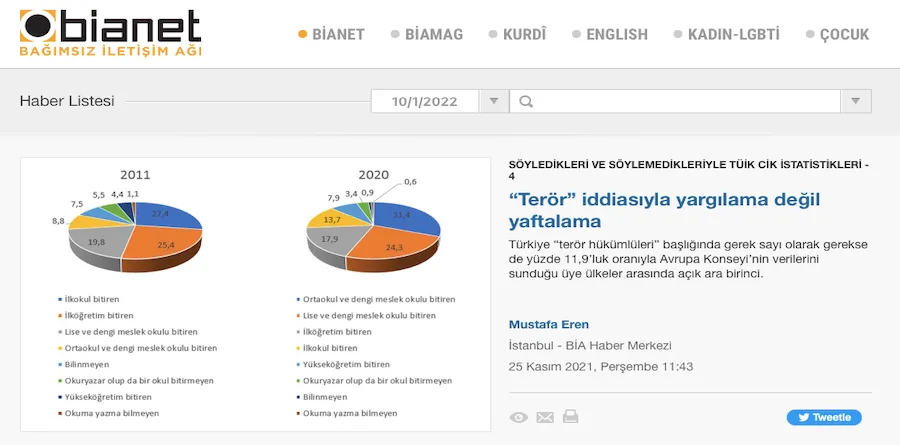

Bianet - 25 Kasım 2021

[“Terör” iddiasıyla yargılama değil yaftalama](https://m.bianet.org/bianet/bianet/253889-teror-iddiasiyla-yargilama-degil-yaftalama)

Türkiye İstatistik Kurumu (TÜİK) Ceza İnfaz Kurumu İstatistikleri kapsamında sunulan tabloların bir kısmı “suç türleri”ni de içeriyor ancak açıklanan bu 24 suç türü arasında mevcut yasaların ve devlet anlayışının “terörist” olarak nitelendirdiği ancak gerek “terörist” nitelendirmesinin tartışılır niteliği gerekse de hapsedilme gerekçelerine ve amaçlarına bakıldığında “siyasi mahpus” olarak nitelendirilmesi mümkün ve çoğunlukla da daha doğru olan mahpus grubuna dair bir veri elde edebilmek mümkün değil. Ceza ve Tevkifevleri Genel Müdürlüğü (CTE) 2012 yılına kadar kendi sitesinde “Ceza İnfaz Kurumlarında Bulunan Hükümlü ve Tutuklu Mevcudunun Suç Grubuna Göre Dağılım Cetveli” adı altında mahpusların “adli”, “terör”, “çıkar amaçlı suç örgütü mensubu”, “suç grubu bilinmeyen” kategorilerine göre dağılımını bir tablo olarak sunuyordu. Ancak 2012 yılından sonra CTE’nin sitesinden bu tablo çıkarıldı ve Adalet Bakanlığı’ndan ya da devlet erkanından bir kişi bu konuda bir veri açıklamadığı sürece bu sayılara ulaşmak artık mümkün değil.[\[1\]](https://m.bianet.org/bianet/bianet/253889-teror-iddiasiyla-yargilama-degil-yaftalama#_ftn1) Bu “suç türlerine” göre dağılımı içeren veriyi TÜİK’in veya Adli Sicil ve İstatistik Genel Müdürlüğü’nün açıklamalarında veya yayınlarında görebilmenin imkanı da yok. Buna rağmen Türkiye’de “terör” gerekçesiyle “hüküm giymiş” olan insanların yani “hükümlülerin” sayısını Avrupa Konseyi’nin yayınladığı Ceza İstatistikleri içerisinde görebiliyoruz. [\[2\]](https://m.bianet.org/bianet/bianet/253889-teror-iddiasiyla-yargilama-degil-yaftalama#_ftn2) Kendi ülkesinde bu veriyi açıklamaktan imtina eden Adalet Bakanlığı bu verileri Avrupa Konseyi’ne sunuyor ve Türkiye vatandaşları da bu verilere ancak oradan ulaşabiliyor. Avrupa Konseyi’nin 2020 yılına ait istatistiklerine göre 31 Ocak 2020 tarihinde Türkiye’deki 250 bin 594 “hükümlü”nün 29 bin 827’si “terör” nedeniyle hüküm almıştır. Türkiye gerek sayı olarak gerekse de yüzde 11,9’luk oranıyla Avrupa Konseyi’nin verilerini sunduğu üye ülkeler arasında açık ara birinci durumdadır. Konsey’in verilerine göre üye ülkelerde terör nedeniyle hüküm alanların ortalaması yüzde 0,5’tir ve bu oranın yüzde 0,5’ten çok daha düşük olmamasının nedeni de Türkiye’nin yüzde 11,9 ile bu ortalamayı yükseltmesidir. Avrupa Konseyi’nin yıllık olarak yayınladığı Ceza İstatistikleri içerisinden ilgili veriyi çektiğimizde karşımıza aşağıdaki tablo çıkıyor.[\[3\]](https://m.bianet.org/bianet/bianet/253889-teror-iddiasiyla-yargilama-degil-yaftalama#_ftn3)

Tabloyu değerlendirmeye geçmeden önce “kazı çalışması” sonucu elde ettiğimiz diğer verileri tablolaştıralım ve sadece “hükümlüler”i değil “tutuklular”ı da kapsayan sayılara ve örgüt bazlı dağılıma bakalım.

2011 sonrası tabloya baktığımızda 2016 yılına kadar “terör” iddiasıyla tutuklu ve hükümlü olanların oranının yüzde 5 ve altında kaldığını 2017 yılıyla beraber bu oranın yüzde 10’ların üzerine çıktığını görüyoruz. Burada asıl etken 15 Temmuz 2016 tarihinde yaşanan darbe girişimi ve sonrasında “FETÖ” adlandırmasıyla başlayan tutuklama furyasıdır. Darbe girişiminden bir sene sonra “FETÖ” gerekçesiyle yapılan tutuklamaların sayısı 50 binin üzerine çıkmış sonrasında her sene düşmüştür. 2020 yılının Kasım ayında “FETÖ” iddiasıyla tutuklu ve hükümlü olanların sayısı 25 bin 655’tir. Mahpus sayılarının değişimine baktığımızda 2016-2021 yılları arasında “FETÖ” üyesi oldukları iddiasıyla 10 binlerce insanın cezaevine alınıp serbest bırakıldığını, mevcut durumda en kalabalık “terör” mahpus grubunu hala “FETÖ”nün oluşturduğunu, PKK üyesi oldukları iddiasıyla tutuklanan insanların sayısında 2 katından fazla bir artış yaşandığını, DHKP-C üyesi oldukları iddiasıyla tutuklananların sayısının yaklaşık 2 kat arttığını, 2010’larda başlayan IŞİD tutuklamalarıyla beraber bu iddiayla tutuklananların üçüncü büyük “terör” mahpus grubunu oluşturduğunu görüyoruz. 2018 yılında örgüt bazlı olarak yapılan açıklamayı baz alacak olursak, o tarihte 48 bin 924 olan “terör” mahpusunun yüzde 70’ini “FETÖ”, yüzde 21’ini PKK, yüzde 2,6’sını IŞİD, yüzde 1’ini DHKP-C, yüzde 0,2’sini El Kaide, yüzde 0,2’sini TİKKO[\[4\]](https://m.bianet.org/bianet/bianet/253889-teror-iddiasiyla-yargilama-degil-yaftalama#_ftn4) geriye kalan yüzde 4,9’unu ise diğer örgüt üyeleri oldukları iddiasıyla tutuklu ve hükümlü olanların oluşturduğu görülmektedir. Yaklaşık 37 bin “terör” tutuklusu ve hükümlüsü ile Avrupa ülkeleri arasında açık ara ilk sırayı alan Türkiye’de, “terör” yaftasının, insanları artık iler tutar yanı kalmamış yargılamalarla uzun süre hapiste tutmanın aracı haline geldiği görülmektedir.

## “Mektepli” hükümlü sayısı arttı

TÜİK’in yayınladığı “Eğitim durumuna göre yıl içinde ceza infaz kurumuna giren hükümlüler” istatistiklerini 2011 ve 2020 yılları için grafiğe döktüğümüzde karşımıza şu görüntüler çıkmaktadır.

2020 yılında hükümlü nüfusunun yarısından fazlasını ortaokul / lise veya dengi bir meslek okulunu bitirenler oluşturuyor (yüzde 55,7). İlköğretim veya ilkokul bitirenlerin oranı yüzde 31,6’dır. Yükseköğretim mezunu olanların oranı da yüzde 7,9’dur. Okuma yazma bilmeyen veya okuryazar olup da okul bitirmeyenlerin toplamı yüzde 4’tür. 2011 yılında ise tablo daha farklıdır. Hükümlü nüfusunun yarısından fazlasını ilkokul veya ilköğretim bitirenler oluşturuyor (yüzde 52,8). Ortaokul / lise veya dengi bir meslek okulunu bitirenlerin oranı 28,6’da kalmaktadır. Yüksek öğrenim mezunu olanlar yüzde 4,4’tür sadece. Okuma yazma bilmeyen veya okuryazar olup da okul bitirmeyenlerin toplamı ise yüzde 6,6’dır. Bu iki grafik gösteriyor ki 10 yıl öncesine göre daha “mektepli”, öğrenim görmüş bir hükümlü nüfusu söz konusudur. Yükseköğrenim mezunları da hükümlü nüfusu içerisinde beşinci sıraya yükselmiş durumdadır. TÜİK’in sunduğu tabloyu bazı öğrenim gruplarını bir araya getirerek sadeleştirdiğimizde ve her bir öğrenim grubunun suç türlerine göre yüzdelerini eklediğimizde ortaya aşağıdaki tablo ve grafikler çıkıyor.

  

Bu dört grafik gösteriyor ki “okuma yazma bilmeyen” ve “okuryazar olup da bir okul bitirmeyen” hükümlülerde “hırsızlık” yaklaşık yüzde 30 ile ilk sırada yer alıyor. Sonrasında ise ilkokul/ilköğretim ve ortaokul/lise öğrencilerinden daha düşük düzeyde yer alan “yaralama” geliyor. Bu hükümlü grubunun diğer bir özelliği ise diğer gruplarda ilk 5’e giremeyen “uyuşturucu veya uyarıcı madde kullanma ve satın alma” ile “yağma” suçlarının ilk 5’te yer alması. İlkokul/ilköğretim ile ortaokul/lise mezunu hükümlülerin ilk 5 suç grafikleri ilkinde “yaralama”nın ikincisinde “hırsızlık”ın ilk sırada yer alması dışında neredeyse aynıdır. Hırsızlık ve yaralama suçlarını “trafik suçları”, “icra ve iflas kanununa muhalefet” ve “uyuşturucu veya uyarıcı madde imal ve ticareti” takip ediyor. Yükseköğretim mezunu hükümlülerin grafiğine dair söylenecek ilk şey bu grafikte yer alan ilk 5 suçun toplamının sadece yüzde 31,1’ini oluşudur. Bu gruptaki hükümlüler için “diğer suçlar”ın toplam oranı yüzde 44’tür. Bu kapsamda nelerin yer aldığı tabloda belirtilmediği için yükseköğretim mezunu hükümlülere ilişkin suç türü bilgilerinin bir analiz için yeterli olmadığını söylemek mümkündür. Buna rağmen sunulan verilerden yola çıkarak şunları söylemek mümkün: Diğer mahpus gruplarında ilk sıralarda yer alan “hırsızlık” bu mahpus grubunda yüzde 3,4’te kalmakta ve ilk beşe girememektedir, diğer mahpus gruplarından farklı olarak ilk beş suç arasında “dolandırıcılık” ve “sahtecilik” yer almaktadır. (ME/AS) [**Birinci bölüm - “Örtük af”tan en az kadın mahpuslar yararlandı**](https://bianet.org/bianet/bianet/253696-ortuk-af-tan-en-az-kadin-mahpuslar-yararlandi) [**İkinci bölüm - Yabancı hükümlü sayısı 10 yılda 10 kattan fazla arttı**](https://bianet.org/bianet/insan-haklari/253742-yabanci-hukumlu-sayisi-10-yilda-10-kattan-fazla-artti) [Üçüncü bölüm - “Uyuşturucu” suçları 10 yılda 7 kat arttı](https://bianet.org/bianet/insan-haklari/253819-uyusturucu-suclari-10-yilda-7-kat-artti)

* * *

_[\[1\]](https://m.bianet.org/bianet/bianet/253889-teror-iddiasiyla-yargilama-degil-yaftalama#_ftnref1) CTE’nin açıkladığı bu verilerin yıllara göre dağılımını içeren bir tablo ve değerlendirme için bakınız: Mustafa Eren, Kapatılmanın Patolojisi, Kalkedon Yayınları,  sayfa 42-50_

_[\[2\]](https://m.bianet.org/bianet/bianet/253889-teror-iddiasiyla-yargilama-degil-yaftalama#_ftnref2) https://wp.unil.ch/space/space-i/_

_[\[3\]](https://m.bianet.org/bianet/bianet/253889-teror-iddiasiyla-yargilama-degil-yaftalama#_ftnref3) Konsey’in 2018 yıllığında Türkiye’ye ait veri yoktur. 2017 yıllığı ise yayınlanmamıştır. Bu nedenle tabloda iki yılın verisi bulunmuyor._

_[\[4\]](https://m.bianet.org/bianet/bianet/253889-teror-iddiasiyla-yargilama-degil-yaftalama#_ftnref4) Basına yansıyan açıklamalarda “TİKKO” olarak geçiyor, muhtemelen MKP ve TKP/ML tutuklu ve hükümlüleri bir arada sayılmıştır._
