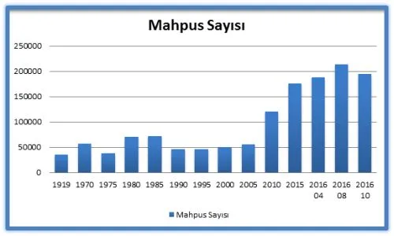

Hapishanelerin bugünkü durumu, yıllardır süregelen kapatma politikasından bağımsız düşünülemez ve biliyoruz ki bugün sessiz kalınan hak ihlalleri yarın bir başkasını doğuracak.

[Bianet](https://m.bianet.org/biamag/insan-haklari/181552-turkiye-hapishaneleri-son-10-yil-ve-yakin-donemdeki-gelismeler) [- İdil Aydınoğlu](https://m.bianet.org/yazar/idil-aydinoglu?sec=biamag) \- [Mustafa Eren -](https://m.bianet.org/yazar/mustafa-eren?sec=biamag) İstanbul - 10 Aralık 2016

Türkiye, kimi zaman hak ihlalleri, kimi zamansa tanınmış isimler ya da toplu tutuklamalar sebebiyle hapishanelerin sık sık gündeme geldiği bir ülke. Ancak konuya ilişkin, özellikle basın aracılığıyla yürütülen tartışmalar, hapishanelerin yapısal sorunlarına yönelik olmaktan çok bu sorunları yaşamak durumunda kalan kişilerin yargılamalarının ve yaşadıklarının değerlendirilmesine yönelik olarak ilerledi. Hapishane koşulları ise hakkında konuşulan kişinin maruz kaldığı haksızlıklar ya da düzeltilmesinin gerekliliği vurgulanarak atiye bırakılan sıkıntılar olarak yansıdı. Öte yandan hak ihlallerine ilişkin tartışma zeminini yaratan sivil toplum ve insan hakları aktivistlerinin ana akım medyada diğerleri kadar yer aldığını söylemek ise ne yazık ki mümkün gözükmüyor. Dolayısıyla bu yazıda kısmen değinmeye çalışacağımız yapısal sorunların geniş kitlelere ulaşmadığını ve belki de ulaşamayacağını kabul etmemiz gerekiyor. Yine de Türkiye’deki mahpusları, hatta ceza infaz sisteminin içinde yer alan ya da daha önce yer almış kişileri ve onların çevrelerini göz önüne alırsak çok büyük bir topluluktan bahsettiğimizi öne sürebiliriz. Yalnızca bu topluluğun hapishane koşulları hakkındaki eleştiri ve tavsiyeleri dahi önemli katkılar sunabilecek bir zemin oluşturabilir. Ancak öncelikle bu topluluğun tamamına yönelik hak temelli bir kavrayışla yola çıkmak ve sorunları bu çerçevede değerlendirmek gerekiyor.

## 2005’ten beri…

Öncelikle mahpus nüfusundaki önemli değişimden başlamak faydalı olabilir. CİSST/TCPS paylaştığı **\[1\]** sayılara ve grafiğe baktığımızda özellikle son 10 yılda ciddi bir artışı gözlemlemek mümkün. Bu artış, ceza kanununda suç olarak tasnif edilen her tür fiile ve bu fiillerin zeminini oluşturan toplumsal sorunlara yönelik olarak faili kapatmanın öne çıktığı bir politikaya işaret etmektedir.

Türkiye’de 2005 yılına kadar mahpus sayısı 50 bin civarında seyretmişti. Grafikte de görüldüğü üzere bunun tek istisnası mahpus sayısının 79 bine yükseldiği 1980 darbesi ve sonrasındaki birkaç yıldır. Bu dönemde nüfusu yaklaşık 45 milyon olan ülkenin % 0.18’i hapsedilmişti. 2000 yılında 49 bin, 2005’te 55 bin 870 olan mahpus sayısı düzenli bir artış ile Nisan 2016’da 187 bine ulaştı. Türkiye’de mahpus sayısında 10 yıllık zaman dilimi içinde 3 katı aşan bir artış gerçekleşti.

Ağustos 2016’ya gelindiğinde, darbe girişiminin ardından yapılan tutuklamalarla birlikte bu sayı kısa sürede 214 bine çıktı. Mahpus sayısının kısa sürede artması nedeniyle düzenlenen 17 Ağustos 2016 tarihli 671 Sayılı KHK ile getirilen düzenlemeler sonucunda bugün Türkiye’deki mahpus sayısı 195 bine **\[2\]** gerilemiş durumda **\[3\]**. Bu gerilemeye rağmen nüfusu yaklaşık 79 milyon olan Türkiye’nin 0.25’i hapsedilmiş durumda ve bu oran bu dönemden önce en yüksek mahpus sayısının bulunduğu 1980 döneminden daha yüksek.

Her ne kadar düzenleme yapılmasına sebebiyet vermiş olsa da hapishane kapasitesini arttırmaya yönelik uzun yıllardır istikrarlı bir politika olduğunu da biliyoruz. 2000 sonunda 73 bin 769 olan kapasite, 2016 başında 180 bin 256’ya çıkarılmıştır. Adalet Bakanlığı, CİSST/TCPS’in bilgi edinme başvurusunu cevapladığı 7 Ocak 2014 tarihli belgesinde 2017 yılı sonuna kadar 118 bin kapasiteli 199 yeni hapishane açılacağını belirtmişti. Bu açıklama hapishanelerin kapasitesinin 2017 yılı sonuna kadar 250 binin üzerine çıkarılacağını ifade ediyor. Dolayısıyla yukarıda işaret edilen mahpus popülasyonundaki artışın devam edeceğini öngörmek mümkün gözüküyor.

Kapasite artışıyla ters orantılı olarak hapishane sayısı 651’den 361’e kadar düştü. Zira 2006 yılından itibaren planlı bir şekilde küçük kapasiteli ilçe hapishaneleri kapatılmaya ve daha fazla kapasiteli, “oda sistemi”ne dayalı hapishaneler açılmaya başlandı. Adalet Bakanlığı’nın açıklamalarına göre 2000-2015 tarihleri arasında 121 yeni hapishane ile 34 ek bina inşa edilirken **\[4\]** çok sayıda hapishane de kapatıldı. Bu rakamlar hapishanelerin önemli bir yapısal dönüşümden geçtiğini ve yeniden inşa süreci içerisinde olduğunu gösteriyor.

## Yakın Dönem

Son zamanlarda hapishanede tutulanlar açısından daha zor bir döneme girildi. OHAL henüz ilan edilmemişken bazı mahpusların firar etmesi sebep gösterilerek yürürlüğe sokulan yeni uygulamalar Türkiye geneline yansıtıldı ve Mayıs ayındaki bir talimat ile mahpusların çamaşırlarını yıkadıkları leğenler yedi kişi için bir tane olmak üzere sınırlandırıldı, temizlik için tek araç olan çekpas sapları 50 cm’e getirildi ve bulundurulabilecek kitap sayısı düşürüldü. Mahpusların yaşamlarını olumsuz etkileyen ve bir genelge ya da yönetmelik olmayan bu talimat gizli tutuldu ve kamuoyuyla paylaşılmadı.

OHAL dönemi ise başka bir süreci doğurdu. Darbe girişimine katıldığı gerekçesiyle gözaltına alınan ve tutuklanan kişilerin şiddete uğradıklarını gösteren fotoğraflar basında yer aldı. Bu fotoğraflar yalnızca son dönem tutukluları için değil, tüm mahpuslar açısından korkutucu bir gelişme olarak değerlendirildi. Sonrasında KHK’lar ile hapishanelerde önemli dönüşümler yaşandı.

Süregelen sistematik artışın sebeplerinden biri olarak gösterilebilecek 2005 yılında yürürlüğe giren yeni infaz kanunu ile koşullu salıverilme için gereken infaz süresi uzatılmıştı **\[5\].** 671 Sayılı KHK ile 1 Temmuz 2016 öncesi fiiller nedeniyle hapiste olan kişiler için geriye dönük olarak eski haline getirildi ve bu süre yine ½’ye düşürüldü. Aynı KHK’da, denetimli serbestlikle ilgili bir düzenleme yapıldı; mahpusların infazlarının son bir yılında kazandığı bu hak için süre iki yıla çıkarıldı. Bu düzenlemeye ağırlaştırılmış müebbetler, kasten öldürme, yaralama suçunun nitelikli hali, uyuşturucu ve cinsel suçlar, devlete, anayasaya ve millete karşı işlenen suçlar ile terörle mücadele kapsamına giren fiiller dahil edilmedi.Düzenleme kısmi af olarak değerlendirildi ve çokça eleştirildi. Zira bu tip ani ve radikal değişiklikler hukuka güveni sarsabilecek güçtedir. CİSST/TCPS hapishanelerdeki doluluk oranına dayalı olarak gerçekleşen düzenlemenin; eşitlik ilkesini de kapsayacak ve toplumsal konsensüse, toplumsal vicdana dayanabilecek şekilde gözden geçirilip yeniden düzenlenmesi gerektiğini; aksi takdirde günü kurtarmaktan öteye gitmeyecek bir yaptırım olacağına işaret ettİ **\[6\]**.

673 sayılı KHK ile Cezaevleri İzleme Kurulları’nın bütün üyeleri görevlerinden uzaklaştırıldı ve 10 gün içinde seçim yapılması kararı alındı. Ancak bu durum İzleme Kurulları’nın işlevini aksattı ve bazı illerde seçimler aradan geçen iki aya rağmen gerçekleşmedi. 674 sayılı KHK yeni hapishanelerin inşasında yatırım programında yer alma ve ödeneği bulunma şartı kaldırılırken; ihalelerin, Kamu İhale Kanunu’nda yer alan “pazarlık usulüne” göre gerçekleştirilebileceği düzenlendi.

Avukat görüşmelerinde ses kaydı, video görüntüsü almak ve görüşmelerin memurların yanında yapılması OHAL kapsamında yasal oldu. 667 Sayılı KHK ile mahpusların görüş ve telefon hakları kısıtlandı. Mahpusları ziyaret edebilecek kişiler eşi, ikinci dereceye kadar kan ve birinci derece kayın hısımları ile sınırlandırılırken; görüş ve telefon hakları haftada bir kereden; iki haftada bire düşürüldü. Bazı hapishanelerde açık görüş kaldırıldığı için kapalı görüş yapıldı. Son olarak 677 sayılı KHK ile “terör örgütü üyeliği veya bu örgütlerin faaliyeti çerçevesinde işlenen suçlar sebebiyle tutuklu veya hükümlü” olanların merkezi ve örgün eğitim sınavlarına girmeleri engellendi. Böylece yaklaşık 50.000 (FETÖ operasyonları da dahil) mahpusun öğrenim hakkı elinden alındı. Bu düzenlemeler tutuklu ve hükümlü ayrımı yapmadığından masumiyet karinesine aykırı olduğu gibi, belli mahpus gruplarına yönelik olması sebebiyle de eşitlik ilkesine aykırıdır.

Yasal düzenlemelerin yanı sıra hapishane yönetimlerinin kararlarıyla da çok sayıda hak ihlali yaşandı. Düzenlemeye rağmen hapishaneler halen oldukça kalabalık olduğu için üç kişilik odalardaki yataklar ranzaya dönüştürülerek kapasite arttırılmaya çalışıldı ancak bu uygulamalarla mahpusların yaşam alanları daraltılmış oldu. Öte yandan mahpuslar açısından zaman zaman kitlesel ve sürgün olarak nitelendirilebecek yer değiştirmeler yaşandı; zira zorunlu sevkler yoğunlaştı. CİSST/TCPS’e gelen başvurulara göre mahpuslar, Türkiye’nin farklı illerindeki hapishanelere, kimi zaman eşyalarını dahi toplayamadan kimi zamansa birkaç ay içinde birden fazla kez zorunlu olarak sevk edildi. Mektuplara ve yasak olmayan kitaplara el konduğu, gazete ve tv kanallarına sınırlandırma getirildiği mektuplara yansıdı. Çok sayıda mahpus son dönemlerde hastane ve doktor sevklerinin eskisinden de zorlaştığını aktardı. Hapishanelerdeki sosyal aktiviteler kapasite sorunu ve sık yaşanan sevkler nedeniyle önemli oranda kaldırıldı. LGBTİ mahpuslara yönelik davranışlar kötüleşti, mahpuslar cinsiyet kimliklerine saldırıldığını; takı, parfüm, makyaj malzemelerinin verilmediğini ve disiplin cezalarının arttığını belirttiler. Bu dönem öne çıkan bir başka sorun da çıplak aramaydı. Özellikle kadın mahpuslar sevkler esnasında çıplak aramaya maruz kaldıklarını belirttiler. Bazı hapishanelerde ağırlaştırılmış mebbetlerin iyi halli olmalarına rağmen havalandırma saatlerinin 1 saate düşürüldüğü spor ve sosyal aktivitelerin sınırlandığı ya da kaldırıldığı yazıldı. Ağustos ayında polislerin dahil olduğu bir hapishane araması yapıldığı iletildi. Mahpuslar yazdıkları mektuplarda hapishanelerde falakaya yatırıldıklarını, ellerinin arkadan kelepçelendiğini; yerde sürüklendiklerini belirttiler **\[7\]**. 15 Temmuz-14 Kasım tarihleri arasında 16 kişinin hapishanede intihar ettiği öne sürüldü **\[8\]**. Mahpusların intihar ettiğine yönelik haberler halen devam ediyor **\[9\]**.Hapishanelerden gelen işkence ve kötü muamele iddialarının yanı sıra, TBMM Cezaevi Alt Komisyonu Başkanı Mehmet Metiner’in bazı mahpuslar için yapılan işkence başvurularının incelenmeyeceğine ilişkin beyanı **\[10\]** endişe verici olmanın ötesinde. İdam cezasının yeniden getirilmesine ilişkin olarak Ekonomi Bakanı Zeybekçi’nin “ama şunu da unutmayın, keşke ölseydim diyene kadar, onlara gün yüzü göstermeyeceğiz. O iki metrelik yerde, ilelebet onlara insan yüzü göstermeyeceğiz. Gün yüzü göstermeyeceğiz bunlara. Bu yaptıklarının hesabı bunlardan sorulacak” **\[11\]** ifadeleri, yalnızca hakkında konuşulan kişiler için değil tüm mahpuslar için kaygı yaratacak türden.

Hapishanelerde yaşanan hak ihlalleri ile ilgili bilgi edinme yolunun mektup ya da avukat görüşü olduğu ve bunların denetlendiğini de göz önüne almak durumundayız. Hak ihlali iddialarını içeren mektupların hapishanelerden çıkıyor olması olumlu olsa da, birçok mahpusun mektuplarının engellendiğini öne sürdüğünü de belirtmek gerekiyor. Dolayısıyla mektup ya da avukat aracılığıyla yaşadıklarını kamuoyuna duyuramayan mahpusların varlığını tahmin etmek güç değil. Ancak bunlara rağmen hak ihlallerine ilişkin idari ve hukuki süreçleri işletmek ve tüm mahpusları kapsayan hak temelli bir perspektifle hapishaneleri tartışmaya ve gündemleştirmeye devam etmek gerekiyor. Zira hapishanelerin bugünkü durumu, yıllardır süregelen kapatma politikasından bağımsız düşünülemez ve biliyoruz ki bugün sessiz kalınan hak ihlalleri yarın bir başkasını doğuracak. (İA-ME/EA)

\---

\[1\] [http://www.tcps.org.tr/sites/default/files/kitaplar/LGBT%C4%B0-kitap-web.pdf](http://www.tcps.org.tr/sites/default/files/kitaplar/LGBT%C4%B0-kitap-web.pdf)

\[2\] Ceza ve Tevkifevleri Genel Müdürü Enis Yavuz Yıldırım’ın 14 Ekim 2016 tarihinde basına yansıyan açıklamasından.

\[3\] Bu düzenleme ile Türkiye’deki mahpus mevcudunun yaklaşık 5’te 1’inin tahliyesi öngörülüyor. Adalet Bakanı Bekir Bozdağ’ın yaptığı açıklamaya göre tahliye edilecek mahpusların sayısı ilk aşamada 38, toplamada ise 93 bin civarındadır.

\[4\] Adalet Bakanlığı’nın CİSST/TCPS’in bilgi edinme başvurusuna verdiği 7 Ocak 2014 tarihli bilgi edinme başvurusunun cevabından.

\[5\] 2005 yılında yürürlüğe giren 5275 Sayılı Ceza Güvenlik Tedbirlerinin İnfazı Hakkında Kanun, 1 Haziran 2005 ile şartlı salıverme için gerekli infaz süresi cezanın ½’sinden (647 Sayılı Ceza İnfaz Kanunu md. 19/1) 2/3’üne ( CGTİK md. 107/2) çıkarılmıştır. Örneğin 6 yıl hapis cezası almış olan bir mahpusun koşullu salıverilme hakkından faydalanması için hapishanede kalması gereken süre 3 yıl iken 2005 tarihli infaz kanunu ile 4 yıla çıkmıştır. Dolayısıyla cezaların infaz süresi uzamış bu da hapishanedeki kişi sayısının artmasına sebep olmuştur.

\[6\] [http://www.tcps.org.tr/?q=node/317](http://www.tcps.org.tr/?q=node/317)

\[7\] [https://anfturkce.net/guncel/90-larin-iskence-yontemi-falaka-cezaevine-geri-dondu](https://anfturkce.net/guncel/90-larin-iskence-yontemi-falaka-cezaevine-geri-dondu)

\[8\] [http://bianet.org/bianet/siyaset/180723-agbaba-cezaevlerinde-intiharlari-sordu](http://bianet.org/bianet/siyaset/180723-agbaba-cezaevlerinde-intiharlari-sordu)

\[9\] [http://www.milliyet.com.tr/cezaevinde-intihar-siyaset-2264440/](http://www.milliyet.com.tr/cezaevinde-intihar-siyaset-2264440/)

\[10\] [http://www.cumhuriyet.com.tr/haber/turkiye/608880/AKP\_li\_Metiner\_den\_vahim\_sozler\_\_iskenceye\_inceleme\_yok.html](http://www.cumhuriyet.com.tr/haber/turkiye/608880/AKP_li_Metiner_den_vahim_sozler__iskenceye_inceleme_yok.html)

\[11\] [http://www.iha.com.tr/haber-zeybekci-bu-hainler-keske-olseydim-diyecekler-575221/](http://www.iha.com.tr/haber-zeybekci-bu-hainler-keske-olseydim-diyecekler-575221/)
