BirGün - 16 Şubat 2014 Tarihler 1969 Şubat’ını gösterdiğinde 6. Filo Türkiye’nin karasularına bir kez daha girecek ve Dolmabahçe’ye demirleyecektir. 6. Filo, o yıllarda ABD’nin Akdeniz’deki gezici karakolu olarak görev yapmaktadır. Amerikan donanmalarının Türkiye’nin karasularına ilk girişi 1946’yılında gerçekleşir. Türkiye’nin Washington Büyükelçisi Münir Ertegün yaşamını yitirdiğinde cenazesi Amerikan Missouri Zırhlısı ile Türkiye getirilir. Ertegün’ün cenazesi sadece bir bahanedir. Adeta bir panayıra hazırlanır gibi çalışmalar yapılır. Gezi İsyanı sırasında müezzininin sürgünüyle gündeme gelen Dolmabahçe Sarayı’nın hemen yanı başındaki Bezm-i Alem Valide Sultan Camii’nin minareleri arasına “Welcome” mahyası astırılır; Kız Kulesi’nin üzerine “Welcome Missouri” yazılır;PTT üzerinde Missouri’nin resmi olan özel seri pul bastırır; Tekel, Amerikan zırhlısıyla gelen her bir Amerikan askerine verilmek üzere, üzerinde ABD ve Türkiye bayraklarının yer aldığı, adı Missouri olan özel bir sigara hazırlatır. Hazırlıklar bununla da sınırlı değildir, boyası yapılan yerler arasında genelev de vardır. Genelevin boyanması da yeterli görülmez, genelevdeki seks işçisi kadınlar muayeneden geçirilirler ve sağlıklı oldukları teyit edilmiş olur. Tüm bu hazırlıklar Amerikan donanması ve Amerikan askerleri içindir. 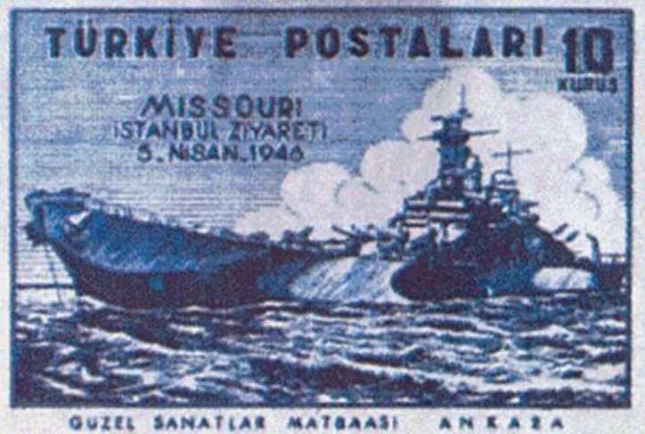 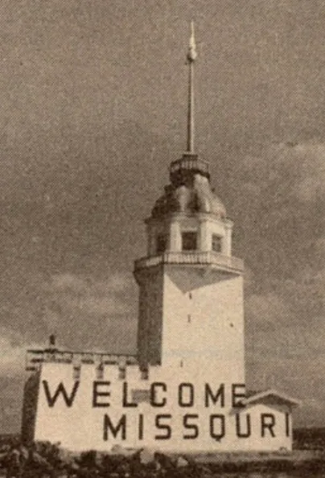 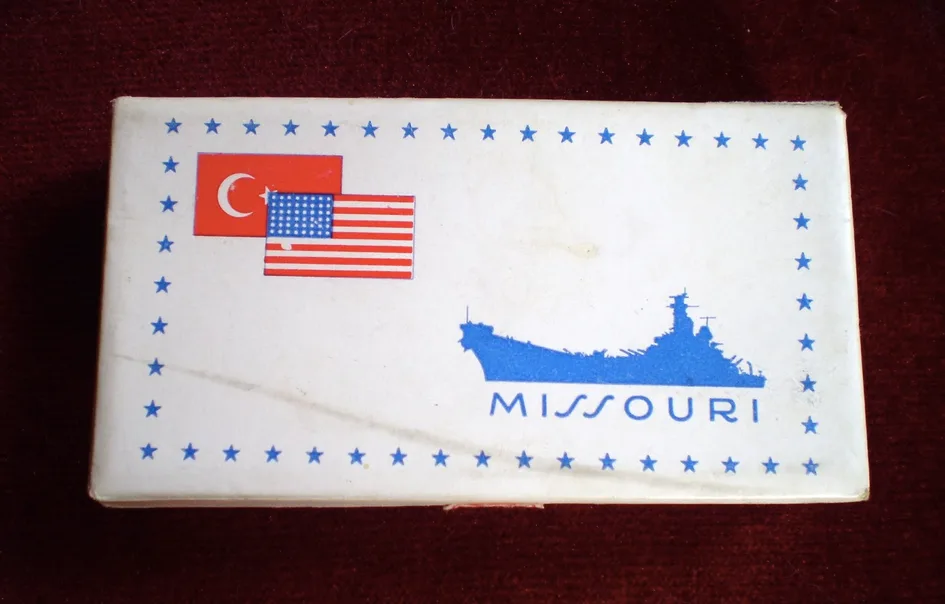 Missouri için bastırılan pul, Tekel tarafından hazırlanan sigaranın kapağı ve Kız Kulesi üzerine yazılan yazı. Bu yaşanılanlar, aradan 20 sene geçtikten sonra yaşanılacakların habercisidir. 1967 ve 1968 yıllarında 6. Filo birçok defa Türkiye’nin limanlarına demir atar ve her gelişi protestolara neden olur. 1968 yılı Temmuz ayında Filo’nun durağı yeniden Dolmabahçe’dir. 6. Filo’ya bağlı adı ironik bir biçimde “Independence” (Bağımsızlık) olan uçak gemisi ile beş destroyer Dolmabahçe’ye demir atar. Filo’nun gelişi 21 pare top atışıyla selamlanırken İTÜ öğrencileri Filo’yu protesto eylemleri yaparlar. 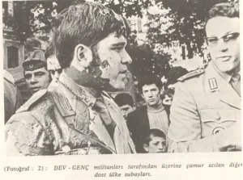 Özellikle,  ABD Başkanı Johnson’un Türkiye’nin Kıbrıs’a müdahalesine engel olmak için Türkiye Başbakan’ı İsmet İnönü’ye azarlar bir üslupla yazdığı ve “Johnson Mektubu” olarak anılan mektubun ardından Türkiye’de gençliğin ABD karşıtı eylemleri artmıştır. Gençlik, 6. Filo’nun her gelişini protestolarla karşılamaktadır ve artık bu konuda tecrübe de kazanmıştır. Temmuz 1968 ziyareti sırasında da 76 örgüt 15 Temmuz 1968’de İstanbul Teknik Üniversitesi’nde bir toplantı düzenler ve alınacak tavrı konuşurlar. Bundan bağımsız olarak gençler Dolmabahçe’deki gemilerden çıkıp Beyoğlu’ndaki eğlence mekanlarına doluşan ABD askerlerinin keplerini başlarından alıp yere atmak, üniformalarını jiletlemek, üzerlerine kırmızı mürekkep atmak gibi eylemler gerçekleştirmektedir.[\[1\]](#_ftn1) Bu eylemler karşısında polisin tavrı ise öğrencileri göz altına almak olur. 16 Temmuz’da 6. Filo’ya karşı protesto eylemi düzenleyen 29 öğrenci gözaltına alınır. 16 Temmuz’u 17 Temmuz’a bağlayan gece ise saat 04:30 civarında İTÜ’nün öğrenci yurdu basılır. Yataklarındayken saldırıya uğrayan öğrenciler yerlerde sürüklenerek gözaltına alınırlar. Bu operasyon sonrasında 47 öğrenci de hastaneye kaldırılır. Hastaneye kaldırılan öğrencilerden Vedat Demircioğlu’nun durumu ağırdır. Arkadaşlarının, polis tarafından pencereden atıldığını söylediği Vedat Demircioğlu kaldırıldığı hastanede yaşamını yitirir. Böylece, 6. Filo protestoları sırasında ilk defa bir ölüm yaşanır. 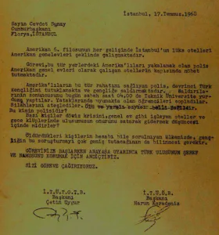 16 Temmuz’u 17 Temmuz’a bağlayan gece İTÜ’nün öğrenci yurdunun polis tarafından basılmasının ardından öğrencilerin Cumhurbaşkanı Cevdet Sunay’a yazdıkları dilekçe. Demircioğlu’nun ölümünü 27 Temmuz 1968’de Atalay Savaş’ın ölümü izler. Savaş, Demircioğlu’nun ölümünü protesto eylemlerinde gözaltına alınanların Ankara Adliyesi’ndeki duruşmalarını izlemek için toplanan kalabalığa polisin müdahalesi sırasında bir minibüsün altında kalarak yaşamını yitirir. 1969 yılında 6. Filo tekrar Dolmabahçe’ye demirlemek istediğinde solcu, sosyalist, devrimci öğrenciler ve işçi örgütleri bir önceki yıl yaşamını yitirenlerden dolayı günlere yayılan bir dizi protesto eylemi planlamak için bir araya gelirler. Henüz Filo gelmeden aralarında FKF, DÖB ve İTÜ ÖB’in de bulunduğu 22 gençlik örgütü 28 Ocak günü bir araya gelerek eylemleri organize edecek “Dayanışma Kurulu” oluştururlar. 22 gençlik örgütünün bir araya gelmesiyle oluşturulan 6. Filo karşıtı birlik, yeni katılımlarla 76 örgütü kapsar hale gelecektir. Solcu, sosyalist, devrimci kesimler 6. Filo’yu protesto için bir araya gelirken milliyetçi, muhafazakar, sağcı kesimler ise Amerika’yı savunma telaşındadır. Milliyetçi muhafazakar, sağcı kesimin o dönemki ruh halini yazar ve siyasetçi Orhan Seyfi Orhon’un Son Havadis adlı gazetedeki şu yazısından anlayabilmek mümkün: “Bence tek çare, komünist tahriklerine aynı silahla karşı koymaktır. Onlar Dolmabahçe’ye dost ve müttefik Amerikan amiralini çıkarmamak için oturum mitingi mi yapıyor? Milliyetçi gençler de ellerinde dostluk dövizleriyle karşılama gösterisi yapar! ‘Amerikalı it, evine git!’e karşılık, ‘Amerikalı dostlarımız hoş geldiniz!’ Amerikalı öğrencilere hücum mu? Amerikalı öğrencileri müsamereye davet. Taş mı atıyorlar, buket veririz! Küfür mü ediyorlar, alkışlarız… Solculara karşı milliyetçi gençlik… ” [\[2\]](#_ftn2) 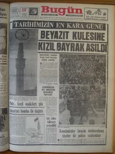 Orhan Seyfi Orhon’un çizdiği bu tablo o dönemin gerçeğini yansıtmaktadır. Solcu sosyalist gençlik anti-Amerikan bir tavır içerisindeyken milliyetçi muhafazakar, sağcı gençlik ise “Welcome Amerika” tutumu takınmıştır. Bu karşıtlık, 6. Filo’nun Dolmabahçe’de demirlediği günle r boyunca giderek tırmanır. Gerilimi tırmandıranlar arasında o dönem muhafazakar bası nın önde gelen siması Mehmet Şevket Eygi ve onun çıkardığı Bugün gazetesi vardır. Gerilimin tırmandırılmasında “Beyazıt Kulesini Kızıl Bayrak Astılar” provokasyonunun önemli rolü olur. Solcu sosyalist gençlik Filo’nun gelişini protesto etmek ve aynı zamanda bir sene önce Filo protestoları sırasında yaşamını yitiren Vedat Demircioğlu’nu anmak için üzerinde Demircioğlu’nun resmi bulunan flamaları İstanbul’un bir çok yerine asarlar, bu yerlerden birisi de Beyazıt’taki yangın kulesidir. Ancak sağcı basın, 12 Şubat günü, bu olayı “Beyazıt Kulesine Kızıl Bayrak Çektiler” manşetleriyle verir. Bu manşetlerin ardından Kanlı Pazar’ın gerçekleşeceği 16 Şubat gününe kadar adım adım katliama giden yolun taşları döşenir. Bu hazırlığı Bugün ve Babıalide Sabah gazetelerinin manşetlerinden takip edebilmek mümkün: 13 Şubat Bugün: “Milletin Sabrı Tükenmek Üzeredir” 14 Şubat Bugün: “Kızıl Bayrak Asanlara Son İhtar” 15 Şubat Bugün: “Kızılları Boğmanın Vakti Geldi” 15 Şubat Babıalide Sabah: “Ya Tam Susturacağız Ya Kan Kusturacağız” 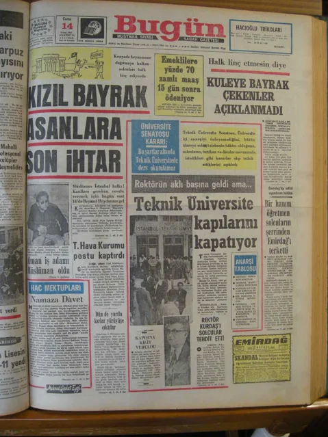 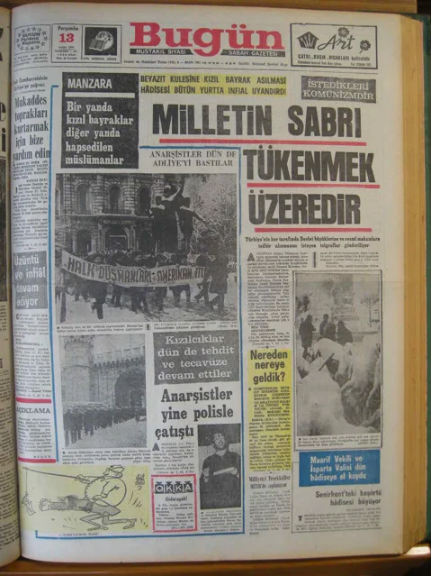 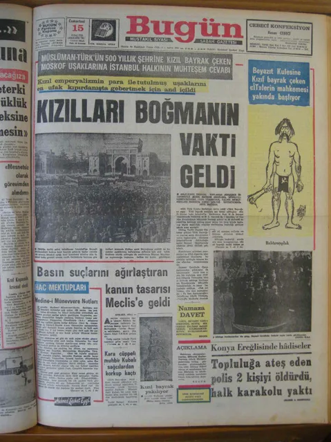 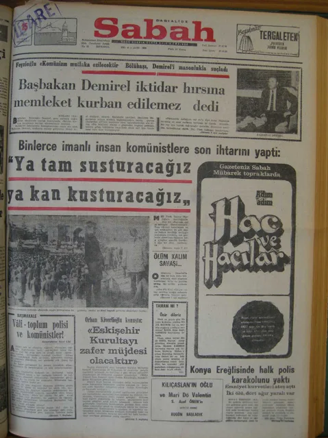 12 Şubat günü gerçekleştirilen kızıl bayrak provokasyonun ardından adım adım tırmandırılan gerilim ve 15 Şubat günü atılan manşetler boşuna değildir. Solcu sosyalist gençlik ve işçi örgütleri, 6. Filo’yu protesto eylemlerinin son günü olan 16 Şubat’ta Beyazıt’tan Taksim’e kadar bir yürüyüş gerçekleştirmeyi planlamış ve bunun çağrısını yapmıştır. Milliyetçi muhafazakar gençlik ise bu yürüyüşe saldırı hazırlığı içerisindedir. O dönem sağcı gençlik içerisinde yer alan Yaşar Okuyan bu hazırlıkları yıllar sonra şöyle anlatır: “ O zaman İstanbul’da öğrenciydim. Milli Türk Talebe Birliği ve Komünizmle Mücadele Derneği’nin yöneticileri arkadaşımız, ağabeylerimizdi. İç içeydik. Kanlı Pazar öncesi olayların gizlisi saklısı yoktu. Her şey gözler önünde, orta yerde cereyan etti. Hazırlıklar açıkta yapıldı. Mesela Milli Türk Talebe Birliğine kamyonlarla sopalar geldi. Gelenin geçenin gözü önünde kamyonlar boşaltıldı. Sonra dövüşeceklere dağıtıldı. Büyük kavga için her türlü hazırlık yapılmıştı.  Olaylar sırasında yanlışlık olmasın, kimse birbirine zarar vermesin ve polis dost kuvvetleri tanısın, yardımcı olsun diye mavi kurdeleler dağıtıldı. Mavi kurdeleyi takan dost kuvvetten sayılıyordu.” [\[3\]](#_ftn3) Milliyetçi muhafazakar sağcı gençlik kamyonlarla sopalar dağıtıp saldırı hazırlığı yaparken solcu gençlik ve işçi örgütleri 16 Şubat sabahı, Beyazıt’ta toplanarak “Emperyalizme ve Sömürüye Karşı İşçi Yürüyüşü” adını verdikleri yürüyüşe başlarlar. Sayıları 40 bini bulan kitle Taksim’e vardığında, henüz alana çok azı girebilmişken polis kuvvetleri kitlenin geri kalanının önünü keser ve alanın çevresinde biriken ve hazırlık yapmış olan milliyetçi muhafazakar sağcı kesimlerin saldırısı başlar. Saldırı sırasında onlarca kişi yaralanırken Duran Erdoğan ve Ali Turgut Aytaç aldıkları bıçak darbeleri ile yaşamlarını yitirirler. 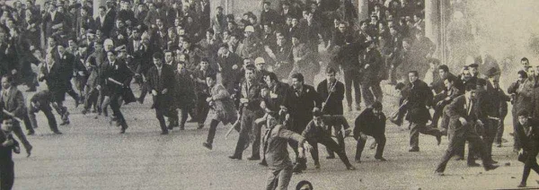 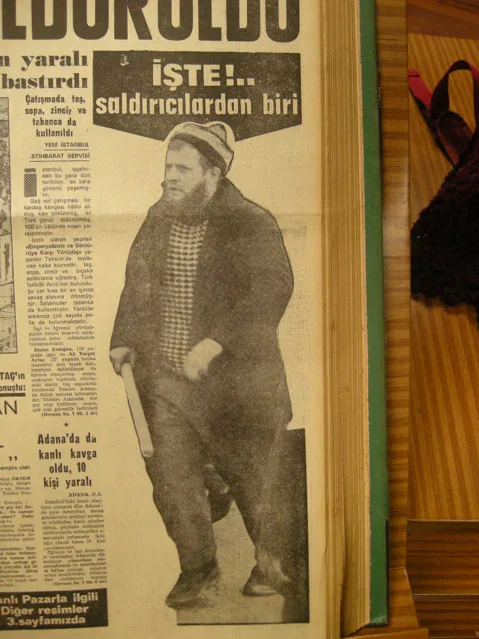 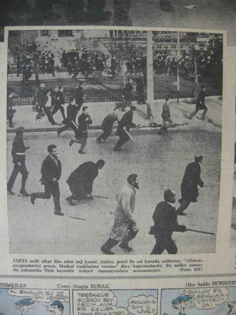 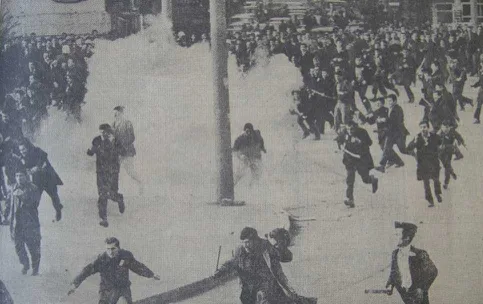 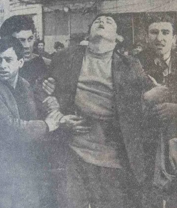 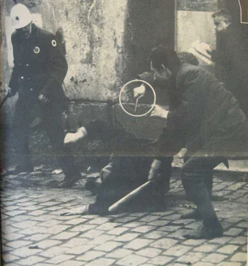 Saldırının organize olduğu Yaşar Okuyan’ın “Nitekim olaylar sırasında bu kurdelelerin çok faydası oldu. Polis, bizimkilere ilişmedi. Ama kazara kurdelesini düşüren, polis tarafından yaka paça götürüldü. Bu gibi olaylara hemen müdahale edip, bizimkileri kurtardık.” [\[4\]](#_ftn4)  Sözlerinden anlaşılmaktadır. O dönemin askeri yetkililerinden Celal Küçük’ün anlatımları da saldırının organize olduğu tespitini doğruluyor: “Olay günü sabah dokuzda Taksim’e gittim. Osman Gülkılık ve İhsan Kuraner filan inzibat kulübesinde toplanmışlardı. Ben gittim, durumu söyledim. Kuraner’e ‘önlem alın’ dedim. Korkunç bir sessizlik vardı. Olay çıktı çıkacak. Adamların ellerinde tesbih, demirler, sopalar, Dolmabahçe’de sabah namazını kılmışlar, tıklım tıklım meydana doluyorlar. Taksim Alanı’nın etrafına açılıyorlar. Orta boş kalıyor. Giren öldürülecek. Toplum polisi de Opera’nın önünden Vakıf İşhanı’na doğru bir kama atıp gelen irtibatı kesiyor ve girenlerin üzerine aletli hücum başlıyor. Kitle silahsız, canını kurtaran Sıraselviler’e, Kazancı’ya kaçıyor. Sonuç 2 ölü, 200 yaralı. Polisin hiçbir müdahalesi olmadığı gibi yere düşen silahı alıp sahibine veriyor.” [\[5\]](#_ftn5) Organize olduğu anlatımlarla açığa çıkmış olan bu katliamın ardından saldırıda kullanılan araçların plakaları dahi verilmesine rağmen bu konuda bir soruşturma yürütülmeyecek, İçişleri Bakanı Faruk Sükan yapılan soruşturma sonucu suçlu olduklarını tespit ettikleri 48 kişinin ismini açıklayacaktır.[\[6\]](#_ftn6) Açıklanan isimler arasında olaylar sırasında hapishanede olan Deniz Gezmiş’in de olduğu bir çok solcu, sosyalist, sendikalarda görev yapan isim yer almaktadır. Olaylar sonrasında, gazetelerde çıkan fotoğraflarda ellerinde bıçaklarla görülen iki kişi tutuklanır ve ikisi bu tutuklular olmak üzere 4 kişi hakkında dava açılır. Devlete göre Kanlı Pazar’ın tek sorumlusu bu 4 kişidir. Kanlı Pazar, Türkiye’nin ilk kitlesel katliamıdır. Kanlı Pazar’ı 70’li yıllarda Maraş ve Çorum gibi diğer katliamlar silsilesi izlemiş ve bu bir türlü hesaplaşması yapılamayan bu zincir Hrant Dink’in katledilmesine ve Gezi’ye kadar uzanmıştır. Kanlı Pazar’dan Gezi’ye uzanan sürecin farklı benzerlikleri de söz konusudur. Okuyan’ın yukarıdaki alıntıda, katliamın organize edildiği toplantıların yapıldığı yer olarak andığı Milli Türk Talebe Birliği (MTTB), AKP’nin kurucu kadrolarının önemli bir kısmını içerisinden çıkarmış bir oluşumdur. Katliam gerçekleştiği yıllarda günümüzün Cumhurbaşkanı Abdullah Gül MTTB’nin önemli isimlerinden birisidir ve hatta Deniz Gezmiş ve arkadaşları tarafından “Faşisttir Okula Giremez” diye afişleri asılan birkaç kişi arasında yer almaktadır.[\[7\]](#_ftn7) O yıllarda ortaokula gitmesine rağmen günümüzün Başbakanı Recep Tayyip Erdoğan ise MTTB’nin ortaöğrenim bölümünde görev almaktadır.[\[8\]](#_ftn8) 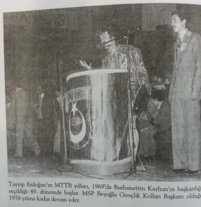[\[9\]](#_ftn9) Diğer tüm katliamlar gibi Kanlı Pazar da yeniden soruşturulmalı, sorumluları açığa çıkarılıp yargılanabilmelidir. Bu katliamlar sorgulanamadığı için Kanlı Pazar’dan Maraşlar’a, Gazi’den Hrant Dink’e yeni katliamlar gündeme gelebilmiştir. Yeni katliamların yaşanmaması için Kanlı Pazar’dan günümüze tüm katliamları yeniden mercek altına alabilmeliyiz. ... [\[1\]](#_ftnref1) Türkiye’nin Gerçekleri ve Terörizm (1973) Ankara, 23. Kitapta, “Başbakanlığın Emri İle Bakanlıklararası Bir Kurul Tarafından Hazırlanmıştır” ibaresi yer almaktadır. [\[2\]](#_ftnref2) Orhan Seyfi Orhon, Son Havadis, 18 Ekim 1967 [\[3\]](#_ftnref3) Parlar, S. (2006), Kontrgerilla Kıskacında Türkiye, İstanbul: Mephisto, 477-478 [\[4\]](#_ftnref4) Parlar, S. (2006), Kontrgerilla Kıskacında Türkiye, İstanbul: Mephisto, 477-478 [\[5\]](#_ftnref5) Nokta, 1 Şubat 1987 [\[6\]](#_ftnref6) Feyizoğlu, T. (2011-b), 61 [\[7\]](#_ftnref7) Bayhan, F. (2007), Kayseri’den Çankaya Köşkü’ne Abdullah Gül, İstanbul: Pegasus Yayınları Çelen, T. (2011), Denizler’den Terzi Fikri’ye Türkiye, İstanbul: İmge Kitabevi [\[8\]](#_ftnref8) Yılmaz, T. (2001), Tayyip-Kasımpaşa’dan Siyasetin Ön Saflarına, Ankara: Ümit Yayıncılık, 37-38 [\[9\]](#_ftnref9) Besli, H. ve Özbay Ö. (2010) Recep Tayyip Erdoğan-Bir Liderin Doğuşu, İstanbul, Meydan Yayıncılık, 360
